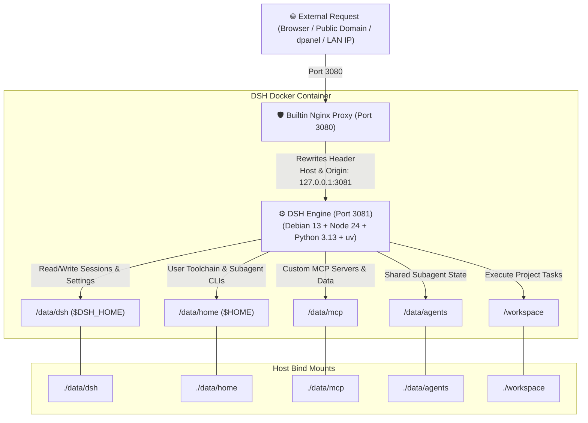

<div align="center">

# 🤖 DeepSeek Harness Docker (DSH-Docker)

<p align="center">
  <b>Production Docker containerization & local build solution for DeepSeek Harness</b><br>
  1-Line Instant Installer · Multi-Arch · Full Persistence · Zero-Tunnel Proxy · Debian 13 + Python 3 + uv/MCP
</p>

[]()
[](https://opensource.org/licenses/MIT)
[-A81D33?style=flat-square&logo=debian&logoColor=white)](https://www.debian.org/)
[-339933?style=flat-square&logo=node.js&logoColor=white)](https://nodejs.org/)
[](https://www.python.org/)
[](https://astral.sh/uv)
[-2496ED?style=flat-square&logo=docker&logoColor=white)](https://www.docker.com/)
[](https://github.com/univers629/dsh-docker-dev/pulls)

<p align="center">
  <a href="README.md"><b>简体中文</b></a> | <a href="README.en.md"><b>English</b></a>
</p>

</div>

---

> [!NOTE]
> **Disclaimer**: This is an independent, community-driven production containerization project for DeepSeek Harness (Unverified Community Edition), and is not officially affiliated with or endorsed by DeepSeek. It builds from official open-source repositories and is licensed under the MIT License.

---

## ⚡ 1-Line Instant Installation (Recommended)

No manual repository cloning required. Copy and paste one command to automatically download, build, and launch:

### 🪟 Windows (PowerShell)
```powershell
irm https://raw.githubusercontent.com/univers629/dsh-docker-dev/main/install.ps1 | iex
```

### 🐧 Linux / 🍏 macOS (Bash)
```bash
curl -fsSL https://raw.githubusercontent.com/univers629/dsh-docker-dev/main/install.sh | bash
```

Run DSH as UID 0 inside the Linux container (this does not grant host-root access):
```bash
curl -fsSL https://raw.githubusercontent.com/univers629/dsh-docker-dev/main/install.sh | bash -s -- --root
```

Restore the default unprivileged `node` mode:
```bash
curl -fsSL https://raw.githubusercontent.com/univers629/dsh-docker-dev/main/install.sh | bash -s -- --user
```

Windows has no Linux-style root mode; the Windows installation uses the container user defined by the image.

> [!TIP]
> **⏱️ Build Duration Note**:
> - **Initial Clean Build**: Because the build compiles the complete DSH monorepo, web frontend, and native extensions from scratch, it typically takes **300 ~ 360 seconds (5~6 minutes)** on standard VPS or ARM64 instances (e.g. Oracle ARM). Please allow it to complete.
> - **Subsequent Runs & Restarts**: Thanks to Docker BuildKit cache layers and persistent storage, daily starts and restarts take only **1 ~ 3 seconds**!

---

## 💡 Design Philosophy

This project delivers a solid, zero-friction, production-grade deployment runtime for **DeepSeek Harness (DSH)** based on four core design principles:

1. **Immutable OS & Two-Root Persistence**:
   - Base system libraries (Debian 13 + Node 24 + Python 3.13 + uv + procps) are baked into an immutable container layer.
   - All user assets and toolchains live strictly under `./data` (environment/sessions/configs/MCP/subagents) and `./workspace` (project code). Host backup and migration only require archiving these two directories.
2. **100% Local Self-Contained Build**:
   - Free from external pre-built registry dependencies. Docker builds straight from upstream official source with automated sandbox patches.
3. **Transparent Loopback Shield**:
   - Built-in Nginx proxy automatically rewrites external host headers to local loopback (`127.0.0.1`), eliminating blank settings pages and credential persistence issues on public domains.
4. **Autonomous Agent Governance & Security Guard**:
   - Container startup automatically corrects mount volume permissions (running securely as `node` via `gosu`), guards `.credentials.yaml` (`600`) and SSH key permissions, preinstalls `procps` (`pkill`/`pgrep`), and whitelists `/data` in all sandboxes.

5. **Built-in Docker control and stable Web UI**:
   - The settings page includes built-in “Restart DSH” and “Open configuration file” actions without relying on the plugin market. The editor is fixed to `/data/dsh/settings.yaml`, validates YAML before saving, and uses a revision token to prevent overwriting concurrent edits.
   - The editor uses a portal and fixed-height scroll region so nested backdrop layers do not make the textarea jump, blink, or blank the settings page.
   - A built-in WebSocket keepalive patch reduces event-stream disconnects behind idle public proxies.

---

## 🏗️ Architecture & Request Flow



---

## 🚦 User Flow & Routing Guide

| User Scenario | OS | Recommended Action | Notes |
|---|---|---|---|
| **1-Line Instant Install** | **Windows** | `irm https://raw.githubusercontent.com/univers629/dsh-docker-dev/main/install.ps1 \| iex` | Auto-downloads, builds locally, runs container, opens browser |
| **1-Line Instant Install** | **Linux / macOS** | `curl -fsSL https://raw.githubusercontent.com/univers629/dsh-docker-dev/main/install.sh \| bash` | Auto-downloads and starts container in background |
| **Daily Management** | **Windows** | Double-click **`dsh.bat`** or `.\dsh.bat [start\|stop\|logs]` | Unified management CLI |
| **Daily Management** | **Linux / macOS** | `./dsh.sh [start\|stop\|logs\|status]` | Unified management CLI |
| **Sync Official Updates** | **All OS** | `.\dsh.bat update` or `./dsh.sh update` | Pulls latest master, rebuilds locally in seconds, prunes cache |
| **Reverse Proxy (dpanel/1Panel)** | **All OS** | Target: `http://127.0.0.1:3080` | Forward to host static port: proxy **never breaks across rebuilds** |

---

## 📂 Project Hierarchy

```text
dsh_docker/
├── 📄 docker-compose.yml     # Compose definition (static ports, persistence mounts, healthcheck)
├── 📄 Dockerfile             # Debian 13 + Python 3 + uv + procps + multi-stage lean build
├── 🚀 dsh.bat                # Windows unified manager (double-click default start & open browser)
├── 🚀 dsh.sh                 # Linux / macOS unified management script
├── ⚡ install.ps1            # Windows 1-line instant installer
├── ⚡ install.sh             # Linux / macOS 1-line instant installer
├── 📂 bin/
│   ├── dsh                   # DSH core CLI wrapper
│   └── entrypoint.sh         # Entrypoint (permission guard, credentials 600 lock, SSH fix)
├── 📂 dsh-home/
│   ├── cordis.patch.yml      # Machine-level network and config overrides
│   └── skills/               # Preinstalled skills (container-environment SOP)
├── 📂 nginx/
│   └── dsh-nginx.conf        # Built-in loopback rewrite reverse proxy config
├── 📂 data/                  # 💾 Persistent data roots (gitignored)
│   ├── dsh/                  # Sessions history (sessions/), profiles, .credentials.yaml, settings.yaml
│   ├── home/                 # Linux user home (~/.local, ~/.npm-global, ~/.ssh, ~/.cache)
│   ├── mcp/                  # 🌟 Custom MCP server source code, venvs, and data
│   └── agents/               # Subagent shared memory & state
└── 📂 workspace/             # 💻 Project development workspace
```

Linux also enables `docker-compose.system.yml`, persisting Debian packages at their normal container paths:

| Container path | Host path |
| --- | --- |
| `/usr/bin`, `/usr/lib`, `/usr/share` | `data/system/usr/bin`, `data/system/usr/lib`, `data/system/usr/share` |
| `/usr/include`, `/usr/libexec`, `/usr/games` | `data/system/usr/include`, `data/system/usr/libexec`, `data/system/usr/games` |
| `/etc`, `/var/lib`, `/var/cache` | `data/system/etc`, `data/system/var/lib`, `data/system/var/cache` |

`/usr/local` and `/usr/sbin` remain in the image/runtime layer. Docker injects `/sbin/docker-init` through the `/usr/sbin` path, so it must not be shadowed. Clearing these `data/` directories removes plugins, toolchains, and apt-installed packages, but does not remove `data/dsh/sessions/` unless that directory is explicitly deleted.

---

## 🔐 Production-Grade Permission Guard & Process Management

Lessons learned from real-world deployments and integrated out of the box:

### 1. Strict Credential File Protection (Mode 600 Guard)
- **Official Assertion**: `@deepseek-ai/dsh-credentials-local` strictly enforces that `/data/dsh/.credentials.yaml` must not be readable beyond its owner. If permissions are `660`, DSH refuses to start;
- **Automated Guard Lock**: [`bin/entrypoint.sh`](bin/entrypoint.sh) corrects host volume ownership while **strictly locking all `*credentials*.yaml` files to `600`**, satisfying DSH security assertions seamlessly on every boot.

### 2. Preinstalled `procps` (`pkill` / `pgrep`)
- `procps` is preinstalled in the runtime image. When subagents or users trigger hot-reloads via `pkill -f "apps/cli/lib/bin.js"`, the command executes reliably without missing package errors.

---

## 🔧 Technical Deep Dive: Solving the Blank Settings Page Under Reverse Proxy

### 1. Root Cause Analysis
Upstream frontend contains an explicit loopback check in `packages/client/ui-settings/lib/client.js`:
```javascript
settingsScope: connection.isLoopback ? "host" : "memory"
```
When accessing DSH through **public domains, external IPs, or reverse proxy panels**, `connection.isLoopback` evaluates to `false`, causing the settings scope to downgrade to volatile memory mode (`"memory"`).
- **Symptoms**: Blank settings UI, inability to persist API keys, and failing plugin configurations.

### 2. Dual-Layer Resolution
1. **Code-level Patch**: During Docker build, `connection.isLoopback ? "host" : "memory"` is patched directly to `"host"`, enforcing persistence to `/data/dsh/settings.yaml`.
2. **Network-level Loopback Shield**: In-container Nginx rewrites incoming request headers to `Host: 127.0.0.1:3081` and `Origin: http://127.0.0.1:3081`, ensuring all backend loopback assertions pass seamlessly.

### 3. Built-in control plugin initialization

`dsh-docker-control` is shipped in the image at `/opt/dsh-docker-control`. On first boot, the entrypoint creates the official `web` profile manifest when `/data/dsh/profiles/web` is empty, then adds the control plugin to its bundle. This restores the settings actions after a clean persistence reset without overwriting an existing custom profile manifest.

---

## 🛡️ Sandbox Permission Modes & Error-Free Guarantee

In `docker-compose.yml`:
```yaml
environment:
  DSH_PERMISSION_MODE: "danger-full-access"
```
- **Upstream Issue**: By default in `workspace-write` mode, writes to `/data/dsh/profiles` or `$HOME` throw `PermissionDenied` or `not strictly wider` escalation errors.
- **Deep Whitelisting**: This image patches Landlock, bwrap, and in-process fs-fences so `/data` is natively included in allowed writable roots. Even under standard `workspace-write` mode, **plugin installs, session prunes, and MCP server deployment run 100% error-free.**

---

## 🔌 Subagent CLI & MCP Server Ecosystem Guide

### 1. Persistent Subagent CLIs
The container includes preconfigured `PATH`: `$HOME/.local/bin` and `$HOME/.npm-global/bin`.
- **Python-based tools (e.g. aider, goose)**: `uv tool install <pkg>` or `pip install --user <pkg>`, binaries saved persistently in `/data/home/.local/bin`.
- **Node-based tools (e.g. claude-code)**: `npm install -g <pkg>`, binaries saved in `/data/home/.npm-global/bin`.
- **Subagent storage**: Subagents store memory and state in dedicated `/data/agents/`.

### 2. Running MCP (Model Context Protocol) Servers
- **Open-source Stdio MCPs (Instant Execution with uvx / npx)**:
  ```bash
  uvx mcp-server-fetch
  uvx mcp-server-sqlite --db-path /data/mcp/sqlite.db
  npx -y @modelcontextprotocol/server-filesystem /workspace
  ```
- **Custom Local MCP Servers**:
  Place code in `./data/mcp/<server-name>/` (with its own virtualenv or node_modules). Accessible directly in DSH configuration and persistent across container updates.

---

## 🌐 Reverse Proxy & dpanel Stability Guide

### 1. Fixing dpanel Re-forwarding After Rebuilds
- **Recommended**: Point dpanel forward address to host static port: **`http://127.0.0.1:3080`**.
- **Principle**: Host port 3080 is static. Regardless of container rebuilds, the forward rule remains permanently valid.

> 💡 **dpanel 1-Line Reconnection**: If using `dsh.pod.dpanel.local` and encountering 502 after recreating a container, reconnect the bridge in 1 second:
> ```bash
> sudo docker network connect --alias dsh.pod.dpanel.local dpanel-local dsh
> ```

### 2. Standard Host Nginx Configuration

```nginx
server {
    listen 80;
    server_name dsh.yourdomain.com;
    client_max_body_size 0;

    location / {
        proxy_pass http://127.0.0.1:3080;
        proxy_http_version 1.1;
        proxy_set_header Upgrade $http_upgrade;
        proxy_set_header Connection "upgrade";
        proxy_set_header Host $host;
        proxy_set_header X-Forwarded-Host $host;
        proxy_set_header X-Forwarded-For $proxy_add_x_forwarded_for;
        proxy_set_header X-Forwarded-Proto $scheme;
        proxy_read_timeout 3600s;
    }
}
```

---

## 🔒 Security Hardening for Public Access

> [!WARNING]
> DeepSeek Harness does not have native authentication. Use one of the following methods when exposing port 3080 to the public:

1. **Cloudflare Zero Trust Tunnels (Recommended)**: Point tunnel to `http://localhost:3080` and enable GitHub/Email OAuth access.
2. **HTTP Basic Auth**: Add `.htpasswd` authentication at host reverse proxy.
3. **Tailscale / Private VPN**: Restrict Web UI access to private VPN subnet.

---

## 🧩 Autonomous Plugin Installation SOP

The container includes a built-in `container-environment` skill. In Web UI, simply prompt:

> 💬 *"Help me install the session management plugin and prune archived sessions"*

Agent will automatically:
1. Run `dsh plugin --profile web add <pkg>`;
2. Validate `cordis.patch.yml` configuration;
3. Manage session data in `/data/dsh/sessions/`;
4. Send completion notice and smoothly restart the service.

---

## 📄 License

This project is licensed under the [MIT License](LICENSE).
