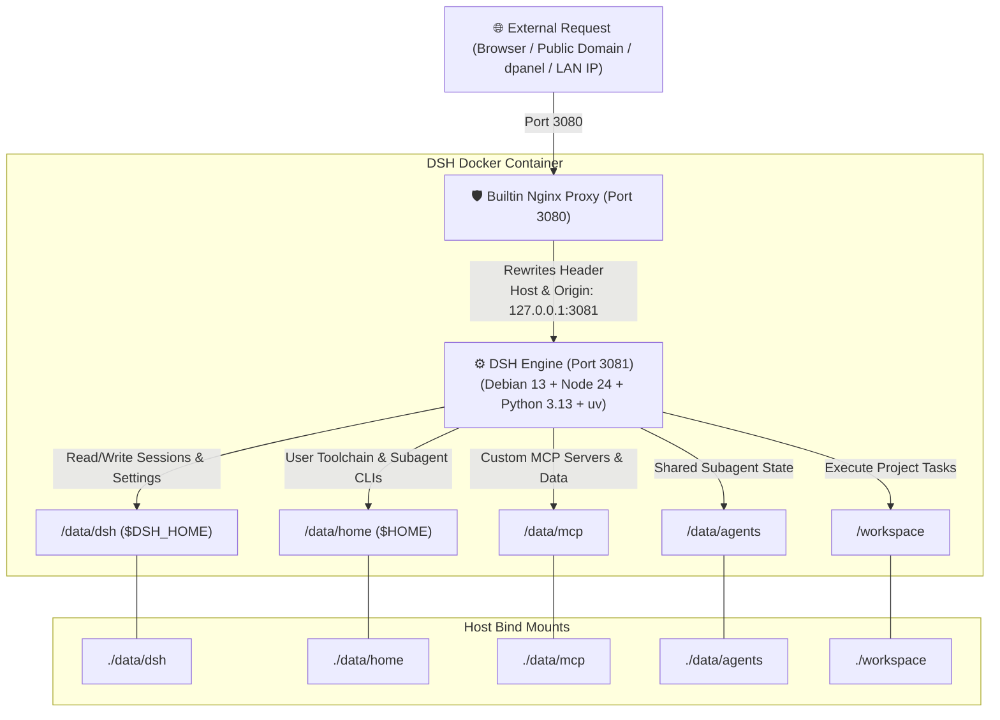

<div align="center">

# 🤖 DeepSeek Harness Docker (DSH-Docker)

<p align="center">
  <b>Production Docker containerization & local build solution for DeepSeek Harness</b><br>
  1-Click Local Build · Multi-Arch · Full Persistence · Zero-Tunnel Proxy · Debian 13 + Python 3 + uv/MCP
</p>

[](https://opensource.org/licenses/MIT)
[-A81D33?style=flat-square&logo=debian&logoColor=white)](https://www.debian.org/)
[-339933?style=flat-square&logo=node.js&logoColor=white)](https://nodejs.org/)
[](https://www.python.org/)
[](https://astral.sh/uv)
[-2496ED?style=flat-square&logo=docker&logoColor=white)](https://www.docker.com/)
[]()
[](https://github.com/smallsinger/dsh-docker/pulls)

<p align="center">
  <a href="README.md"><b>简体中文</b></a> | <a href="README.en.md"><b>English</b></a>
</p>

</div>

---

## 💡 Design Philosophy

This project delivers a solid, zero-friction, production-grade deployment runtime for **DeepSeek Harness (DSH)** based on four core design principles:

1. **Immutable OS & Two-Root Persistence**:
   - Base system libraries (Debian 13 + Node 24 + Python 3.13 + uv) are baked into an immutable container layer.
   - All user assets and toolchains live strictly under `./data` (environment/sessions/configs/MCP/subagents) and `./workspace` (project code). Host backup and migration only require archiving these two directories.
2. **100% Local Self-Contained Build**:
   - Free from external pre-built registry dependencies. Docker builds straight from upstream official source with automated sandbox patches.
3. **Transparent Loopback Shield**:
   - Built-in Nginx proxy automatically rewrites external host headers to local loopback (`127.0.0.1`), eliminating blank settings pages and credential persistence issues on public domains.
4. **Autonomous Agent Governance**:
   - Container startup automatically corrects mount volume permissions (running securely as `node` via `gosu`). Sandboxes are whitelisted to give agents 100% authority to clean old sessions, install toolchains, and configure MCP servers.

---

## 🏗️ Architecture & Request Flow



---

## 🚦 User Flow & Routing Guide

| User Scenario | OS | Recommended Action | Notes |
|---|---|---|---|
| **First Launch / Daily Run** | **Windows** | Double-click **`start.bat`** | Auto-checks Docker, builds locally, runs container, and opens browser |
| **First Launch / Daily Run** | **Linux / macOS** | Run **`./start.sh`** | Auto-builds locally and starts container in background |
| **Sync Official Upstream Updates** | **Windows** | Double-click **`update.bat`** | Pulls latest official master, rebuilds smoothly, preserves all sessions |
| **Sync Official Upstream Updates** | **Linux / macOS** | Run **`./update.sh`** | 1-click rebuild without cache, cleans up dangling build cache |
| **Reverse Proxy (dpanel/1Panel)** | **All OS** | Target: `http://127.0.0.1:3080` | Forward to host static port: proxy **never breaks across rebuilds** |

---

## 📂 Project Hierarchy

```text
dsh_docker/
├── 📄 docker-compose.yml     # Compose definition (static ports, persistence mounts, healthcheck)
├── 📄 Dockerfile             # Debian 13 + Python 3 + uv + multi-stage lean build
├── 🚀 start.bat              # Windows 1-click build & launch (auto browser popup)
├── 🚀 start.sh               # Linux / macOS 1-click launch script
├── 🔄 update.bat             # Windows 1-click upstream update & rebuild
├── 🔄 update.sh              # Linux / macOS 1-click upstream update & rebuild
├── 📂 bin/
│   ├── dsh                   # DSH core CLI wrapper
│   └── entrypoint.sh         # Entrypoint (permission guard, SSH fix, gosu drop-privileges)
├── 📂 dsh-home/
│   ├── cordis.patch.yml      # Machine-level network and config overrides
│   └── skills/               # Preinstalled skills (container-environment SOP)
├── 📂 nginx/
│   └── dsh-nginx.conf        # Built-in loopback rewrite reverse proxy config
├── 📂 data/                  # 💾 Persistent data roots (gitignored)
│   ├── dsh/                  # Sessions history (sessions/), profiles, settings.yaml
│   ├── home/                 # Linux user home (~/.local, ~/.npm-global, ~/.ssh, ~/.cache)
│   ├── mcp/                  # 🌟 Custom MCP server source code, venvs, and data
│   └── agents/               # Subagent shared memory & state
└── 📂 workspace/             # 💻 Project development workspace
```

---

## 🚀 Quick Start

### Windows Users
1. Download or clone this repository.
2. Double-click **`start.bat`**.
3. Browser will automatically open `http://127.0.0.1:3080`.

### Linux / macOS Users
```bash
git clone https://github.com/smallsinger/dsh-docker.git
cd dsh-docker
./start.sh
```

Or directly:
```bash
docker compose up -d --build
```

---

## 🔄 1-Click Upstream Source Updates

- **Windows Users**: Double-click **`update.bat`**.
- **Linux / macOS Users**: Run **`./update.sh`**.

> **Reliability Guarantee**: Scripts pull latest official master code, build cleanly, hot-replace the container, and prune temporary build caches. **All your sessions, profiles, and MCP configurations are 100% preserved.**

---

## 🔧 Technical Deep Dive: Solving the Blank Settings Page Under Reverse Proxy

### 1. Root Cause Analysis
Upstream frontend contains an explicit loopback check in `packages/client/ui-settings/lib/client.js`:
```javascript
settingsScope: connection.isLoopback ? "host" : "memory"
```
When accessing DSH through **public domains, external IPs, or reverse proxy panels**, `connection.isLoopback` evaluates to `false`, causing the settings scope to downgrade to volatile memory mode (`"memory"`).
- **Symptoms**: Blank settings UI, inability to persist API keys, and failing plugin configurations.

### 2. Dual-Layer Resolution
1. **Code-level Patch**: During Docker build, `connection.isLoopback ? "host" : "memory"` is patched directly to `"host"`, enforcing persistence to `/data/dsh/settings.yaml`.
2. **Network-level Loopback Shield**: In-container Nginx rewrites incoming request headers to `Host: 127.0.0.1:3081` and `Origin: http://127.0.0.1:3081`, ensuring all backend loopback assertions pass seamlessly.

---

## 🔌 Subagent CLI & MCP Server Ecosystem Guide

### 1. Persistent Subagent CLIs
The container includes preconfigured `PATH`: `$HOME/.local/bin` and `$HOME/.npm-global/bin`.
- **Python-based tools (e.g. aider, goose)**: `uv tool install <pkg>` or `pip install --user <pkg>`, binaries saved persistently in `/data/home/.local/bin`.
- **Node-based tools (e.g. claude-code)**: `npm install -g <pkg>`, binaries saved in `/data/home/.npm-global/bin`.
- **Subagent storage**: Subagents store memory and state in dedicated `/data/agents/`.

### 2. Running MCP (Model Context Protocol) Servers
- **Open-source Stdio MCPs (Instant Execution with uvx / npx)**:
  ```bash
  uvx mcp-server-fetch
  uvx mcp-server-sqlite --db-path /data/mcp/sqlite.db
  npx -y @modelcontextprotocol/server-filesystem /workspace
  ```
- **Custom Local MCP Servers**:
  Place code in `./data/mcp/<server-name>/` (with its own virtualenv or node_modules). Accessible directly in DSH configuration and persistent across container updates.

---

## 🌐 Reverse Proxy & dpanel Stability Guide

### 1. Fixing dpanel Re-forwarding After Rebuilds
- **Recommended**: Point dpanel forward address to host static port: **`http://127.0.0.1:3080`**.
- **Principle**: Host port 3080 is static. Regardless of container rebuilds, the forward rule remains permanently valid.

### 2. Standard Host Nginx Configuration

```nginx
server {
    listen 80;
    server_name dsh.yourdomain.com;
    client_max_body_size 0;

    location / {
        proxy_pass http://127.0.0.1:3080;
        proxy_http_version 1.1;
        proxy_set_header Upgrade $http_upgrade;
        proxy_set_header Connection "upgrade";
        proxy_set_header Host $host;
        proxy_set_header X-Forwarded-Host $host;
        proxy_set_header X-Forwarded-For $proxy_add_x_forwarded_for;
        proxy_set_header X-Forwarded-Proto $scheme;
        proxy_read_timeout 3600s;
    }
}
```

---

## 🔒 Security Hardening for Public Access

> [!WARNING]
> DeepSeek Harness does not have native authentication. Use one of the following methods when exposing port 3080 to the public:

1. **Cloudflare Zero Trust Tunnels (Recommended)**: Point tunnel to `http://localhost:3080` and enable GitHub/Email OAuth access.
2. **HTTP Basic Auth**: Add `.htpasswd` authentication at host reverse proxy.
3. **Tailscale / Private VPN**: Restrict Web UI access to private VPN subnet.

---

## 🧩 Autonomous Plugin Installation SOP

The container includes a built-in `container-environment` skill. In Web UI, simply prompt:

> 💬 *"Help me install the session management plugin and prune archived sessions"*

Agent will automatically:
1. Run `dsh plugin --profile web add <pkg>`;
2. Validate `cordis.patch.yml` configuration;
3. Manage session data in `/data/dsh/sessions/`;
4. Send completion notice and smoothly restart the service.

---

## 📄 License

This project is licensed under the [MIT License](LICENSE).
