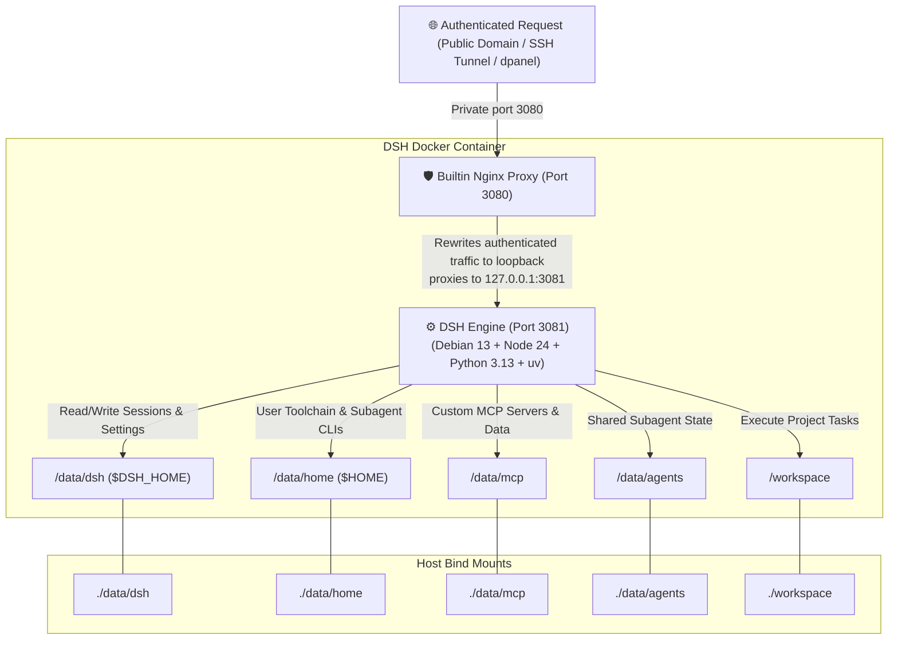

<div align="center">

# 🤖 DeepSeek Harness Docker (DSH-Docker)

<p align="center">
  <b>Production Docker containerization & local build solution for DeepSeek Harness</b><br>
  1-Line Instant Installer · Multi-Arch · Full Persistence · Zero-Tunnel Proxy · Debian 13 + Python 3 + uv/MCP
</p>

[]()
[](https://opensource.org/licenses/MIT)
[-A81D33?style=flat-square&logo=debian&logoColor=white)](https://www.debian.org/)
[-339933?style=flat-square&logo=node.js&logoColor=white)](https://nodejs.org/)
[](https://www.python.org/)
[](https://astral.sh/uv)
[-2496ED?style=flat-square&logo=docker&logoColor=white)](https://www.docker.com/)
[](https://github.com/univers629/dsh-docker-dev/pulls)

<p align="center">
  <a href="README.md"><b>简体中文</b></a> | <a href="README.en.md"><b>English</b></a>
</p>

</div>

---

> [!NOTE]
> **Disclaimer**: This is an independent, community-driven production containerization project for DeepSeek Harness (Unverified Community Edition), and is not officially affiliated with or endorsed by DeepSeek. It builds from official open-source repositories and is licensed under the MIT License.

---

## ⚡ 1-Line Instant Installation (Recommended)

No manual repository cloning required. Copy and paste one command to automatically download, build, and launch:

### 🪟 Windows (PowerShell)
```powershell
irm https://raw.githubusercontent.com/univers629/dsh-docker-dev/main/install.ps1 | iex
```

### 🐧 Linux / 🍏 macOS (Bash)
```bash
curl -fsSL https://raw.githubusercontent.com/univers629/dsh-docker-dev/main/install.sh | bash
```

To run the DSH Agent as UID 0 inside the container, explicitly opt in at install time:

```bash
curl -fsSL https://raw.githubusercontent.com/univers629/dsh-docker-dev/main/install.sh | bash -s -- --root
```

To keep or restore the default unprivileged `node` mode:

```bash
curl -fsSL https://raw.githubusercontent.com/univers629/dsh-docker-dev/main/install.sh | bash -s -- --user
```

Windows PowerShell passes the switch through a script block:

```powershell
& ([scriptblock]::Create((irm https://raw.githubusercontent.com/univers629/dsh-docker-dev/main/install.ps1))) -Root
```

`--root` changes only the DSH process UID inside the container. It does not add Docker Socket access, `privileged`, or host-root capabilities; Nginx still runs as `node`. The installer force-recreates the `dsh` container after writing `.env`, so the selected mode is applied immediately. The default remains unprivileged `node` (container UID 1000, not the host's current login user). Root mode can create host-root-owned files in bind mounts; starting again with `--user` makes the entrypoint repair ownership under `/data` and `/workspace`. The choice is persisted as `DSH_RUN_AS_ROOT` in the project `.env` for later updates and restarts.

> [!TIP]
> **⏱️ Build Duration Note**:
> - **Initial Clean Build**: Because the build compiles the complete DSH monorepo, web frontend, and native extensions from scratch, it typically takes **300 ~ 360 seconds (5~6 minutes)** on standard VPS or ARM64 instances (e.g. Oracle ARM). Please allow it to complete.
> - **Subsequent Runs & Restarts**: Thanks to Docker BuildKit cache layers and persistent storage, daily starts and restarts take only **1 ~ 3 seconds**!

---

## 💡 Design Philosophy

This project delivers a solid, zero-friction, production-grade deployment runtime for **DeepSeek Harness (DSH)** based on four core design principles:

1. **Immutable OS & Two-Root Persistence**:
   - Base system libraries (Debian 13 + Node 24 + Python 3.13 + uv + procps) are baked into an immutable container layer.
   - All user assets and toolchains live strictly under `./data` (environment/sessions/configs/MCP/subagents) and `./workspace` (project code). Host backup and migration only require archiving these two directories.
2. **100% Local Self-Contained Build**:
   - Free from external pre-built registry dependencies. Docker builds straight from upstream official source with automated sandbox patches.
3. **Authenticated Public-Local Mode**:
   - The public entry must be protected by Cloudflare Access, Basic Auth, or a private tunnel. The outer proxy sends authenticated traffic to a private DSH port, and the container proxy presents it to the official server as loopback. Official settings, credentials, and plugin pages therefore use the same host persistence path without changing the upstream privileged-method set.
4. **Autonomous Agent Governance & Security Guard**:
   - Container startup automatically corrects mount volume permissions (running securely as `node` via `gosu`), guards `.credentials.yaml` (`600`) and SSH key permissions, preinstalls `procps` (`pkill`/`pgrep`), and whitelists `/data` in all sandboxes.

---

## 🏗️ Architecture & Request Flow



---

## 🚦 User Flow & Routing Guide

| User Scenario | OS | Recommended Action | Notes |
|---|---|---|---|
| **1-Line Instant Install** | **Windows** | `irm https://raw.githubusercontent.com/univers629/dsh-docker-dev/main/install.ps1 \| iex` | Auto-downloads, builds locally, runs container, opens browser |
| **1-Line Instant Install** | **Linux / macOS** | `curl -fsSL https://raw.githubusercontent.com/univers629/dsh-docker-dev/main/install.sh \| bash` | Auto-downloads and starts container in background |
| **Daily Management** | **Windows** | Double-click **`dsh.bat`** or `.\dsh.bat [start\|stop\|logs]` | Unified management CLI |
| **Daily Management** | **Linux / macOS** | `./dsh.sh [start\|stop\|logs\|status]` | Unified management CLI |
| **Sync Official Updates** | **All OS** | `.\dsh.bat update` or `./dsh.sh update` | Pulls latest master, rebuilds locally in seconds, prunes cache |
| **Reverse Proxy (dpanel/1Panel)** | **All OS** | Prefer joining dsh to dpanel's Docker network and proxying to `http://dsh:3080`; otherwise use `http://127.0.0.1:3080` and keep `DSH_BIND_HOST` private | Rebuilds replace only dsh; persistent data remains mounted |

---

## 📂 Project Hierarchy

```text
dsh_docker/
├── 📄 docker-compose.yml     # Compose definition (static ports, persistence mounts, healthcheck)
├── 📄 Dockerfile             # Debian 13 + Python 3 + uv + procps + multi-stage lean build
├── 🚀 dsh.bat                # Windows unified manager (double-click default start & open browser)
├── 🚀 dsh.sh                 # Linux / macOS unified management script
├── ⚡ install.ps1            # Windows 1-line instant installer
├── ⚡ install.sh             # Linux / macOS 1-line instant installer
├── 📂 bin/
│   ├── dsh                   # DSH core CLI wrapper
│   └── entrypoint.sh         # Entrypoint (permission guard, credentials 600 lock, SSH fix)
├── 📂 dsh-home/
│   ├── cordis.patch.yml      # Machine-level network and config overrides
│   └── skills/               # Preinstalled skills (container-environment SOP)
├── 📂 nginx/
│   └── dsh-nginx.conf        # Built-in boundary-preserving reverse proxy config
├── 📂 data/                  # 💾 Persistent data roots (gitignored)
│   ├── dsh/                  # Sessions history (sessions/), profiles, .credentials.yaml, settings.yaml
│   ├── home/                 # Linux user home (~/.local, ~/.npm-global, ~/.ssh, ~/.cache)
│   ├── mcp/                  # 🌟 Custom MCP server source code, venvs, and data
│   └── agents/               # Subagent shared memory & state
└── 📂 workspace/             # 💻 Project development workspace
```

---

## 🔐 Production-Grade Permission Guard & Process Management

Lessons learned from real-world deployments and integrated out of the box:

### 1. Strict Credential File Protection (Mode 600 Guard)
- **Official Assertion**: `@deepseek-ai/dsh-credentials-local` strictly enforces that `/data/dsh/.credentials.yaml` must not be readable beyond its owner. If permissions are `660`, DSH refuses to start;
- **Automated Guard Lock**: [`bin/entrypoint.sh`](bin/entrypoint.sh) corrects host volume ownership while **strictly locking all `*credentials*.yaml` files to `600`**, satisfying DSH security assertions seamlessly on every boot.

### 2. Safe plugin lifecycle management
- `procps` remains available for diagnostics, and `/usr/local/bin/manage-dsh-plugin` handles plugin installation, updates, removal, and profile validation.
- If container-level system operations are genuinely required, use the explicit `--root` installer option above. The mode remains inside Docker isolation and is still constrained by `no-new-privileges`, the image capabilities, and the mounted paths; keep the default unprivileged mode whenever possible.
- The helper shows staged package-manager and validation status, then gracefully restarts DSH only after the current Agent turn is durable. Its single pre-restart notice says that the package is persisted but the frontend is not yet verified, that restart begins after the turn ends, that no post-restart notice will follow, and that users should wait 30–60 seconds (complex plugins may take about a minute) before refreshing. If it is still absent after 90 seconds, inspect the recent logs and the plugin's own entry point.

---

## 🔧 Technical Deep Dive: Settings Permissions Under a Reverse Proxy

### 1. Permission boundary
The upstream frontend selects the settings scope based on whether the connection is loopback:
```javascript
settingsScope: connection.isLoopback ? "host" : "memory"
```
Loopback access can use the official host settings scope. Public access enters that scope only after an authenticated, source-restricted proxy has reached the private 3080 bridge; the container Nginx then presents the request as loopback. The browser receives `DSH_PUBLIC_LOCAL_MODE=1` and selects the same host settings mirror. The cookie is not an authentication credential, and the backend still receives only internal loopback requests.

Vision Router exposes its own controlled RPC for capability and permission status; that is separate from the DSH generic settings API. Plugins do not need per-plugin public-host adaptations.

When using a public tunnel or reverse proxy, copy `.env.example` to `.env` and set `DSH_TRUSTED_HOSTS`. The variable accepts comma-separated `host[:port]` entries, for example `agent.example.com,admin.example.com`. This trusted-host list only satisfies the browser request authority fence; it does not enable remote plugin settings writes. Vision Router's "allow trusted Host remote settings" switch remains an explicit security setting in its own settings page. It can be left empty for loopback-only access.

`allowRemoteSettings` is a user authorization choice. The Agent does not enable or disable it on the user's behalf; use the DSH machine's loopback UI or an SSH tunnel port forward to make that choice in Vision Router settings. After a plugin update or DSH restart, close stale pages and load the current page before checking whether the toggle persisted.

---

## 🛡️ Sandbox Permission Modes & Error-Free Guarantee

In `docker-compose.yml`:
```yaml
environment:
  DSH_PERMISSION_MODE: "danger-full-access"
```
- **Upstream Issue**: By default in `workspace-write` mode, writes to `/data/dsh/profiles` or `$HOME` throw `PermissionDenied` or `not strictly wider` escalation errors.
- **Deep Whitelisting**: This image patches Landlock, bwrap, and in-process fs-fences so `/data` is natively included in allowed writable roots. Even under standard `workspace-write` mode, **plugin installs, session prunes, and MCP server deployment run 100% error-free.**

---

## 🔌 Subagent CLI & MCP Server Ecosystem Guide

### 1. Persistent Subagent CLIs
The container includes preconfigured `PATH`: `$HOME/.local/bin` and `$HOME/.npm-global/bin`.
- **Python-based tools (e.g. aider, goose)**: `uv tool install <pkg>` or `pip install --user <pkg>`, binaries saved persistently in `/data/home/.local/bin`.
- **Node-based tools (e.g. claude-code)**: `npm install -g <pkg>`, binaries saved in `/data/home/.npm-global/bin`.
- **Subagent storage**: Subagents store memory and state in dedicated `/data/agents/`.

### 2. Running MCP (Model Context Protocol) Servers
- **Open-source Stdio MCPs (Instant Execution with uvx / npx)**:
  ```bash
  uvx mcp-server-fetch
  uvx mcp-server-sqlite --db-path /data/mcp/sqlite.db
  npx -y @modelcontextprotocol/server-filesystem /workspace
  ```
- **Custom Local MCP Servers**:
  Place code in `./data/mcp/<server-name>/` (with its own virtualenv or node_modules). Accessible directly in DSH configuration and persistent across container updates.

---

## 🌐 Reverse Proxy & dpanel Stability Guide

### 1. Fixing dpanel Re-forwarding After Rebuilds
- **Docker dpanel**: Join dsh to dpanel's Docker network and proxy to **`http://dsh:3080`** (or a stable alias in that network). If a host-gateway route is required, set `DSH_BIND_HOST=172.17.0.1` in `.env`; never use `0.0.0.0`.
- **Nginx/SSH tunnel on the host**: Point the proxy to **`http://127.0.0.1:3080`**.
- **Principle**: Port 3080 is private. Rebuilding dsh replaces only the image; `data/` and `workspace/` remain mounted.

> 💡 **dpanel network connection**: If using a separate dpanel network, attach the running container (use the actual network name):
> ```bash
> sudo docker network connect --alias dsh dpanel-local dsh
> ```

### 2. Standard Host Nginx Configuration

```nginx
server {
    listen 80;
    server_name dsh.yourdomain.com;
    client_max_body_size 0;

    location / {
        proxy_pass http://127.0.0.1:3080;
        proxy_http_version 1.1;
        proxy_set_header Upgrade $http_upgrade;
        proxy_set_header Connection "upgrade";
        proxy_set_header Host $host;
        proxy_set_header X-Forwarded-Host $host;
        proxy_set_header X-Forwarded-For $proxy_add_x_forwarded_for;
        proxy_set_header X-Forwarded-Proto $scheme;
        proxy_read_timeout 3600s;
    }
}
```

---

## 🔒 Security Hardening for Public Access

> [!WARNING]
> DeepSeek Harness has no native authentication. Keep 3080 private and expose it only through an authenticated reverse proxy; never set `DSH_BIND_HOST=0.0.0.0`.

1. **Cloudflare Access (Recommended)**: Keep the Access policy and allow only Cloudflare source ranges plus local tunnel traffic at the origin for this hostname.
2. **Cloudflare Zero Trust Tunnel**: Point the tunnel to `http://localhost:3080` and enable an Access policy.
3. **HTTP Basic Auth or private VPN**: Protect the host reverse proxy and keep the DSH port private.

---

## 🧩 Autonomous Plugin Installation SOP

The container includes a built-in `container-environment` skill. In Web UI, simply prompt:

> 💬 *"Help me install the session management plugin and prune archived sessions"*

Agent will automatically:
1. Run `dsh plugin --profile web add <pkg>`;
2. Validate `cordis.patch.yml` configuration;
3. Manage session data in `/data/dsh/sessions/`;
4. Send a clear completion notice; DSH restarts gracefully after the current reply finishes so profile bundle membership changes take effect.

For an explicit DSH restart, tell the Agent "restart DSH". The bundled skill invokes `manage-dsh-plugin restart`, which restarts only the DSH process after the current reply and leaves other Docker containers untouched.

---

## 📄 License

This project is licensed under the [MIT License](LICENSE).
