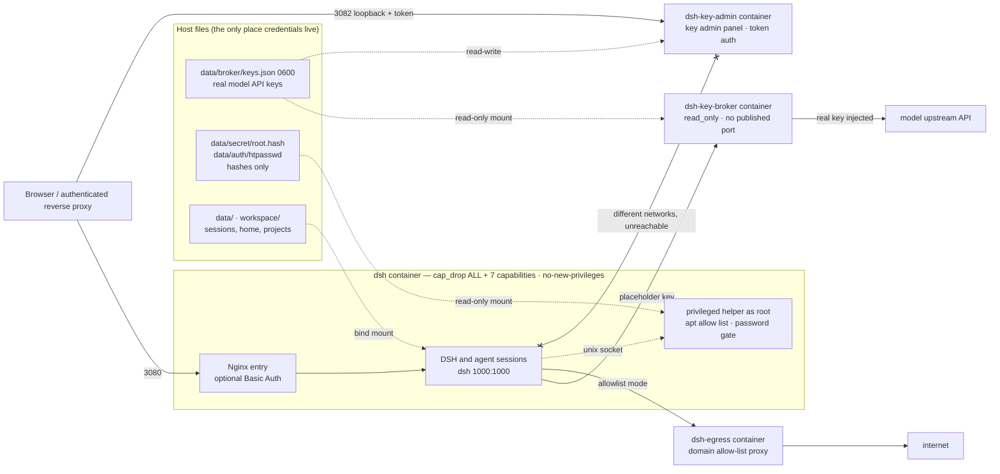

# dsh-docker

Run DeepSeek Harness in Docker: a prebuilt Debian 13 environment where the agent can keep installing toolchains with apt and develop long term, with model API keys stored outside the container.

[](https://www.kernel.org/)
[](https://www.microsoft.com/windows)
[](https://www.debian.org/releases/trixie/)
[](https://www.docker.com/)
[](LICENSE)

[简体中文](README.md) · [English](README.en.md) · [Security model](docs/security.en.md)

## Features

- **One-line install**: Linux and Windows share the same interactive menu and write the configuration to `.env`.
- **Persistent toolchains**: software the agent installs with apt stays in the container writable layer; start, stop, restart, and DSH updates never recreate the container.
- **Keys stay out of the container**: real API keys live only in a host file and a separate broker container, while DSH is configured with a placeholder key.
- **Unprivileged runtime**: DSH and the agent run as `dsh` (1000:1000) with `cap_drop: ALL` plus seven ordinary capabilities, and apt still works.
- **Optional egress allow list**: outbound traffic can be forced through a domain allow-list forward proxy.
- **Multi-arch prebuilt image**: `ghcr.io/univers629/dsh-docker:latest` covers `linux/amd64` and `linux/arm64`, falling back to a local build when the pull fails.

> Update DSH inside the container (the "DSH environment" settings page, or `./dsh.sh update`). Recreating the container or chasing image updates is unnecessary.

## Installation

1 vCPU / 2 GB of RAM / 10 GB of disk is enough to start; plan on 2 vCPU / 4 GB / 20 GB if the agent will keep installing toolchains inside the container.

Linux:

```bash
curl -fsSL https://raw.githubusercontent.com/univers629/dsh-docker/main/install.sh | bash
```

Windows PowerShell (requires Docker Desktop in Linux containers mode):

```powershell
irm https://raw.githubusercontent.com/univers629/dsh-docker/main/install.ps1 | iex
```

The installer asks what to do, where the image comes from, how access is protected, where the reverse proxy runs, which domain and port binding to use, which model-key-broker upstreams to configure, and which outbound mode to use, then writes `.env`. The key step only asks for an upstream name and its key (plus a base_url for self-hosted gateways); the API shape, model list, and request headers are inferred or queried from the upstream. Model keys can be left empty and added later with menu item 9 or `./install.sh model-key`, which does not recreate the container. The container root password is stored only as a sha512crypt hash in `data/secret/root.hash` and the Basic Auth password only as a bcrypt hash in `data/auth/htpasswd`; neither is written to `.env`. Nothing in this flow uses a privileged container, mounts a Docker socket, or grants host root.

| Menu item | What it does |
| --- | --- |
| 1 Fresh install | Becomes "reconfigure and recreate the container (mounted data kept)" when the project directory already exists |
| 2 Update DSH inside the container | Installs the new version from npm in the running container, reapplies the patch set, and restarts only the DSH process |
| 3 Start / 4 Stop / 5 Restart | Acts on the existing container only, keeping apt-installed toolchains |
| 6 Logs / 7 Status | Forwarded to `./dsh.sh logs` and `status` |
| 8 Delete | Removes the container, images, mounts, networks, build cache, and project directory after a `DELETE` confirmation |
| 9 Add model API keys | Writes the keys and starts the broker container for an existing deployment without recreating `dsh` |

Only item 1 asks for the image source; the others act on the existing container.

Unattended installation:

```bash
curl -fsSL https://raw.githubusercontent.com/univers629/dsh-docker/main/install.sh | bash -s -- install --access local --image-source prebuilt --non-interactive
```

A password on the command line ends up in shell history and in `ps`; prefer an environment variable:

```bash
DSH_ROOT_PASSWORD='at-least-12-characters' bash install.sh install --access local --non-interactive
```

Run `bash install.sh --help` for the full option list; on Windows use `powershell -ExecutionPolicy Bypass -File .\install.ps1`.

## Daily management

```text
Linux:   ./dsh.sh  [start|update|stop|restart|logs [service]|status|shell|root-shell|verify|keys|key-panel|egress|remove]
Windows: .\dsh.bat [start|update|stop|restart|logs [service]|status|shell|root-shell|verify|keys|key-panel|egress|remove]
```

- `start` prepares the image only when the container does not exist and reuses it afterwards; `stop`, `restart`, and in-container `apt install` all keep the writable layer.
- `update` only reinstalls the DSH npm package inside the container; it is not a project or image update. `remove` deletes the writable layer while bind mounts remain.
- `shell` enters the unprivileged `dsh` account; `root-shell` is a host-side administration channel that cannot be reached from inside the container.
- `verify` runs 24 hardening checks inside the container; `keys` and `egress` print the status of the key broker and the egress proxy, and `key-panel` prints the key admin panel URL and access token.
- The healthcheck probes both the Nginx entry and DSH's own port, so a DSH crash loop shows the container as `unhealthy`.

To remove the project completely, run menu item 8 from the project directory or `./install.sh delete` (Windows: `powershell -ExecutionPolicy Bypass -File .\install.ps1 -DshAction delete`). Deletion targets this project's container, images, mounts, networks, and directory by exact name; it never uses substring matching and never removes external shared networks.

## Public access and authentication

DSH provides no login authentication of its own, and the installer binds port 3080 to `127.0.0.1` by default. Public access must go through HTTPS and an authenticated entry point; do not use wildcard binds such as `0.0.0.0` or `::`. Three access modes are available:

1. `local`: local browser or SSH tunnel only.
2. `trusted-proxy`: Cloudflare Access, a Docker panel, host Nginx, a VPN, or another outer entry point authenticates requests; trusted hosts and an external Docker network can be recorded.
3. `basic`: the container Nginx authenticates against a bcrypt password file. It has no MFA, and public deployments still need HTTPS at the outer proxy.

Host Nginx example:

```nginx
server {
    listen 443 ssl;
    server_name dsh.example.com;
    ssl_certificate /path/to/fullchain.pem;
    ssl_certificate_key /path/to/privkey.pem;

    location / {
        proxy_pass http://127.0.0.1:3080;
        proxy_http_version 1.1;
        proxy_set_header Upgrade $http_upgrade;
        proxy_set_header Connection "upgrade";
        proxy_set_header Host $host;
        proxy_set_header X-Forwarded-Host $host;
        proxy_set_header X-Forwarded-For $proxy_add_x_forwarded_for;
        proxy_set_header X-Forwarded-Proto $scheme;
        proxy_read_timeout 3600s;
    }
}
```

When a Docker panel proxies the traffic, give the installer the external network the proxy container runs on and use `http://dsh:3080` upstream; a host proxy or SSH tunnel uses `http://127.0.0.1:3080`. The external network must already exist, or the installer can create it after confirmation.

## Architecture



Real keys move only between the host file, `dsh-key-broker`, and `dsh-key-admin`. None of them shares a volume with the `dsh` container, and the panel is not on any Docker network the `dsh` container joins, so the container holds neither the key literal nor a route to the panel that stores it.

Persistent directories:

| Container path | Host path | Contents |
| --- | --- | --- |
| `/data/dsh` | `data/dsh` | Sessions, settings, credentials, profile, built-in plugins |
| `/data/home` | `data/home` | Home directory, SSH, npm/uv toolchains and caches |
| `/data/mcp` | `data/mcp` | Custom MCP sources, virtualenvs, data |
| `/data/agents` | `data/agents` | Shared sub-agent state |
| `/workspace` | `workspace` | Agent workspace |
| `/usr`, `/etc`, `/var` | Container writable layer | Debian system and apt-installed software; lost only when the container is deleted |

The Debian system directories stay in the container writable layer with no overlay on top, so apt-installed software and system configuration survive stopping and starting the same container.

## Security model

Layered controls, most to least effective: **trusted input > keys outside the container > egress allow list > escape hardening**.

| Layer | Implementation | Risk covered |
| --- | --- | --- |
| Keys outside | A separate `dsh-key-broker` container injects the key, strips client credentials, and enforces a path allow list, rate limit, and daily quota | Key exfiltration through prompt injection or arbitrary command execution |
| Egress control | In `allowlist` mode the container only joins an internal network and reaches the internet through a domain allow-list proxy with DNS result validation | Data sent to arbitrary destinations, bypassing the key broker |
| Runtime identity | DSH, agent sessions, and Nginx workers run as 1000:1000; only PID 1, the Nginx master, and the privileged helper are root | Processes running directly as root in the container |
| Capability set | `cap_drop: ALL` plus only `CHOWN`, `DAC_OVERRIDE`, `FOWNER`, `FSETID`, `SETGID`, `SETUID`, `KILL`; `no-new-privileges` kept on; seccomp and AppArmor left enabled | `CAP_SYS_ADMIN` mount escapes, cgroup `release_agent`, kernel module loading, cross-process ptrace |
| Isolation surface | No privileged mode, no Docker socket, no shared host PID/network/IPC namespace, and `pids_limit` set | Docker API escape, host process visibility, fork bombs |
| Escalation gate | apt goes through allow-listed wrappers; any other privileged command requires the container root password, with incremental delay and lockout on failure | Escalation from `dsh` to root inside the container |
| Boot-chain integrity | Entry script, Supervisor, privileged helper, and wrappers are root-write-only; packages the runtime depends on cannot be removed | Breaking the boot chain from inside the container |
| Escape blast radius | Host user namespace remap is supported, with `install.sh --userns-preflight` for detection and ownership alignment | A kernel or runtime escape landing as host root |

Known limits:

- The container shares the host kernel, so kernel and runtime vulnerabilities cannot be blocked by in-container hardening; keep the host kernel and Docker updated.
- Passwordless apt is the default, which means the container root identity is reachable from inside the container. `DSH_PRIVILEGED_APT=password` tightens it.
- The key broker only keeps the key literal out of the container; it protects neither the quota nor the data, so quotas and the egress allow list bound the damage.
- The egress allow list matches domains and performs no TLS interception, so every path under an allowed domain is reachable.
- The first line of defense is still not feeding untrusted content to the agent; every layer above only reduces the impact of a successful injection.

The threat model, per-layer configuration, the broker `keys.json` schema, egress details, and the trade-offs of user namespace remap and rootless Docker are documented in [docs/security.en.md](docs/security.en.md).

## Model API keys

Real keys are written only to `data/broker/keys.json` (0600) on the host and mounted read-only into `dsh-key-broker`, never into the DSH container. The installer writes the DSH-side provider configuration into `data/dsh/settings.yaml` in DSH's own format (base_url pointing at `http://dsh-key-broker:8080/u/<upstream>`, api key set to a placeholder), so models can be picked directly under Settings → Models once the install finishes.

- At install time: the wizard asks only for an upstream name and its key (never echoed); built-in upstreams such as `deepseek`, `openai`, `anthropic`, `google`, and `nvidia` do not even ask for a base_url. The API shape is inferred from the name, no fixed headers are added by default, and the model list is queried from the upstream before saving. `--model-keys-file` with a 0600 `keys.json` also works.
- Non-interactively: `--model-api NAME=PROFILE` and `--model-header NAME=HEADER=VALUE` (repeatable), for example the `originator` / `version` / `User-Agent` trio a Codex client expects. The profile decides the auth header, the allowed endpoints, and the protocol written into DSH; see [docs/security.en.md](docs/security.en.md).
- Model list: upstream names that match DSH's built-in catalog (`deepseek`, `openai`, `anthropic`, `google`, `nvidia`, and others) reuse the catalog's full model list. An upstream outside the catalog must carry at least one model id, otherwise DSH rejects the whole provider entry and the Models page shows no card, so the installer queries the upstream's `/models` with the key and fills the list automatically; if that fails it prints the reason and the ids can be supplied with `--model-id NAME=ID[,ID]` or in the admin panel. `--no-model-settings-seed` skips writing the configuration and leaves it to the WebUI.
- A `deepseek` upstream configures DSH's own DeepSeek provider (`llm-deepseek`), so the Models page does not gain a second row; a duplicate `llm-pi-ai.providers.deepseek` left by an older installer is removed on the next write.
- Upstream name: must start with a lowercase letter and may then contain lowercase letters, digits, and single hyphens, up to 32 characters — the same rule as DSH's "Add custom provider". A non-conforming name is dropped silently, which looks like a missing card on the Models page.
- base_url: type the real upstream address including its version segment (an OpenAI-compatible gateway is usually `https://<host>/v1`; Anthropic-compatible ones usually have none). The DSH-side URL is derived by the installer, so adding the segment on both sides produces `/v1/v1/...`. Built-in catalog upstreams can just accept the default.
- Afterwards: `./install.sh model-key` (Windows: `.\install.ps1 -DshAction model-key`) adds the broker container without recreating `dsh`.
- Status: `./dsh.sh keys` prints upstreams, quotas, today's usage, and allow/deny counters, never the keys.

### Key admin panel

The panel is the browser alternative to typing keys in a terminal: add or remove upstreams, enter keys, pick the API shape, list model ids, set fixed request headers, and fetch an upstream's model list once. Saving writes both `data/broker/keys.json` and DSH's `settings.yaml` and `.credentials.yaml`; both sides hot-reload, so no container restart is needed. The panel has no rate-limit or quota fields (neither does DSH's Models page); values already present in an existing configuration are preserved, and changing them needs `--model-keys-file`.

- Enable: the fresh-install wizard asks. An existing deployment runs `./install.sh key-panel` (Windows: `.\install.ps1 -DshAction key-panel`), which adds the `dsh-key-admin` container without recreating `dsh`. `--no-key-admin` turns it off.
- Access: `http://127.0.0.1:3082/` by default, with the token in `data/broker/admin.token` (0600). For remote use, tunnel it: `ssh -N -L 3082:127.0.0.1:3082 <user@host>`. `DSH_KEY_ADMIN_BIND_HOST` and `DSH_KEY_ADMIN_HOST_PORT` control the published address.
- The panel deliberately is not part of DSH's WebUI: that page runs inside the DSH container, so anything typed into it lands where the agent can read it. The panel is a separate container joined only to the `dsh-admin` network, which `dsh` is not on, and the installer proves from inside `dsh` that the connection fails before it reports success.
- Repeated wrong tokens trigger incremental delay and lockout. The panel container itself is `read_only`, `cap_drop: ALL`, runs as 1000:1000, and can only touch `data/broker` and `data/dsh`.
- An empty `keys.json` is a valid state: install without any key, accept 503 for model requests in the meantime, and enter the first key in the panel.
- With both the broker and the panel skipped, entering keys in the WebUI still works, at the cost of this protection.

### No card on the Models page

DSH renders only providers that actually exist in its configuration, and a rejected entry produces no error — just a missing card. Check in order:

1. On the host, `cat data/dsh/settings.yaml` and look for the upstream under `llm-pi-ai.providers`. If it is absent the configuration never landed: check `docker logs dsh-key-admin` (panel) or the installer's warnings (wizard).
2. Present but with an empty `models`: an upstream outside the catalog needs at least one model id, or DSH drops the whole route. Add one and save again.
3. A non-conforming name (uppercase, underscore, leading digit) is dropped too. Rename and save again.
4. The DeepSeek card comes from DSH's own first-party provider and is always there; it is not something the installer added.
5. If the key field already contains something when the settings page opens and it matches a key entered elsewhere, that is the browser's password manager autofilling. DSH never echoes a stored key; the field starts empty.

## Outbound modes

`DSH_EGRESS_MODE` in `.env` selects how the container reaches the network:

- `open` (default): the container connects directly, which is simpler but lets a compromised agent send data anywhere.
- `allowlist`: the container joins a gateway-less internal network and must use the `dsh-egress` forward proxy, which allows 15 built-in domains covering Debian, npm, PyPI, GitHub, and GHCR. `DSH_EGRESS_ALLOWED_HOSTS` adds domains on top of that list, and `DSH_EGRESS_ALLOWED_HOSTS_MODE=replace` swaps it out instead. Anything outside the list gets a 403, including web pages and search APIs the agent tries to reach.

## Publishing the image

[.github/workflows/publish-image.yml](.github/workflows/publish-image.yml) builds each architecture on a native amd64 or arm64 runner and merges them into one multi-arch manifest. It triggers three ways: a daily check at 03:17 UTC that builds when the `latest` dist-tag of `@deepseek-ai/dsh` has no image tag yet, a manual dispatch with an explicit version or dist-tag, and a `v*` tag push. Every publish tags `latest`, `dsh-<DSH version>`, and `<date>-<commit>`. When an upstream change invalidates a patch anchor the build fails instead of publishing an unpatched image. New GHCR packages are private by default; switch the package to public once after the first publish, otherwise an anonymous pull returns `denied`.

## License

[MIT License](LICENSE)
