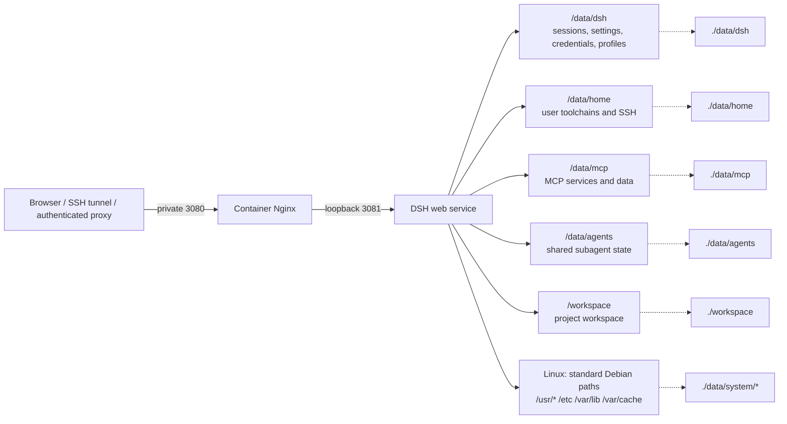

# dsh-docker

A local Docker build and persistent runtime for DeepSeek Harness.

[](https://www.kernel.org/)
[](https://www.microsoft.com/windows)
[](https://www.docker.com/)
[](LICENSE)

[简体中文](README.md) · [English](README.en.md)

## Installation and configuration

The installer asks what to do, which in-container user to run, how access is protected, where the reverse proxy runs, which hosts are trusted, and where the host port is bound. It writes `.env` automatically. Built-in Basic Auth stores only a bcrypt hash in `data/auth/htpasswd`.

Linux / macOS:

```bash
curl -fsSL https://raw.githubusercontent.com/univers629/dsh-docker/main/install.sh | bash
```

Windows PowerShell:

```powershell
irm https://raw.githubusercontent.com/univers629/dsh-docker/main/install.ps1 | iex
```

Run the same command again to update, start, stop, restart, view logs/status, or reconfigure. The default is the unprivileged `node` user. Linux users may select in-container root, which does not grant host root, a Docker socket, or privileged-container capabilities.

Unattended installation example:

```bash
curl -fsSL https://raw.githubusercontent.com/univers629/dsh-docker/main/install.sh | bash -s -- install --user --access local --non-interactive
```

Run `bash install.sh --help` inside the downloaded project directory for all options.

## Daily management

Rerun the installer command to use its menu, or run the local management script directly:

```text
Linux/macOS: ./dsh.sh [start|update|stop|restart|logs|status]
Windows:     .\dsh.bat [start|update|stop|restart|logs|status]
```

Updates sync this project and rebuild the official DSH source. Image rebuilds do not remove `data/` or `workspace/`.

## Public access and authentication

DSH does not provide native login authentication. The installer binds port 3080 to `127.0.0.1` by default. Public access must use HTTPS and an authenticated entry point; do not use `0.0.0.0`, `::`, or another wildcard bind.

The installer provides three access modes:

1. `local`: local browser or SSH tunnel only.
2. `trusted-proxy`: Cloudflare Access, dPanel, host Nginx, a private VPN, or another outer entry point authenticates requests. The installer can record trusted hosts and an external Docker network.
3. `basic`: the container Nginx authenticates against a bcrypt password file. It does not provide MFA, and public deployments still require HTTPS at the outer proxy.

Cloudflare Access/OIDC with MFA is stronger than Basic Auth alone. The proxy performance difference between Caddy, Nginx, and the container Nginx is negligible for this workload.

Host Nginx example (replace the certificate paths and add authentication required by the selected mode):

```nginx
server {
    listen 443 ssl;
    server_name dsh.example.com;
    ssl_certificate /path/to/fullchain.pem;
    ssl_certificate_key /path/to/privkey.pem;

    location / {
        proxy_pass http://127.0.0.1:3080;
        proxy_http_version 1.1;
        proxy_set_header Upgrade $http_upgrade;
        proxy_set_header Connection "upgrade";
        proxy_set_header Host $host;
        proxy_set_header X-Forwarded-Host $host;
        proxy_set_header X-Forwarded-For $proxy_add_x_forwarded_for;
        proxy_set_header X-Forwarded-Proto $scheme;
        proxy_read_timeout 3600s;
    }
}
```

For a Docker-based panel, select Docker container/panel in the installer, enter the panel network name (usually `dpanel-local`), and use `http://dsh:3080` as the upstream. Host proxies and SSH tunnels use `http://127.0.0.1:3080`.

## Architecture and persistence



Persistent paths:

The first five mounts apply on every platform. The Linux installer additionally enables `data/system`; Windows uses the system layer in the image.

| Container path | Host path | Contents |
| --- | --- | --- |
| `/data/dsh` | `data/dsh` | Sessions, settings, credentials, profiles, and the built-in plugin |
| `/data/home` | `data/home` | User home, SSH, npm/uv toolchains, and caches |
| `/data/mcp` | `data/mcp` | Custom MCP source, environments, and data |
| `/data/agents` | `data/agents` | Shared subagent state |
| `/workspace` | `workspace` | Agent workspace |
| `/usr/bin`, `/usr/lib`, `/usr/share`, `/usr/include`, `/usr/libexec`, `/usr/games` | `data/system/usr/*` | Debian package files |
| `/etc`, `/var/lib`, `/var/cache` | `data/system/etc`, `data/system/var/*` | Debian configuration, package databases, and apt cache |

`/usr/local`, `/usr/sbin`, and Docker init remain in the image layer and are not shadowed. Removing `data/system` removes software installed with apt inside the container. Removing `data/dsh` removes DSH configuration and sessions.

## Project-specific behavior

<details>
<summary>Built-in controls, permissions, and stability notes</summary>

### Built-in control plugin

The image includes `dsh-docker-control` and restores it when the web profile is empty on first boot. The settings page provides Restart DSH and a WebUI editor for `/data/dsh/settings.yaml`. The editor validates YAML and protects against concurrent overwrites.

### WebUI and reverse-proxy stability

The editor uses an isolated portal and a fixed-height scroll region to prevent settings-page flicker, textarea height jumps, and blank pages. A WebSocket keepalive patch reduces UI stalls caused by idle proxy disconnects.

For public domains, the container Nginx presents traffic to DSH as internal loopback only after built-in Basic Auth or a trusted outer authentication layer has accepted it. `DSH_TRUSTED_HOSTS` validates browser authority; it is not login authentication and does not enable remote plugin settings writes. Those permissions remain explicit settings owned by each plugin.

### Permission boundary

The container runs as `node` by default. The entrypoint corrects mounted-directory ownership and protects credential and SSH private-key permissions. `DSH_RUN_AS_ROOT=true` changes only the DSH process UID inside the container; it does not enable privileged mode, mount the Docker socket, or grant host root.

### Plugins and toolchains

The sandbox permits the `/data` writes required for plugins, session management, and MCP deployments. On Linux, apt packages use standard Debian paths persisted under `data/system`. Python and Node user toolchains live under `/data/home/.local` and `/data/home/.npm-global`.

</details>

## License

[MIT License](LICENSE)
