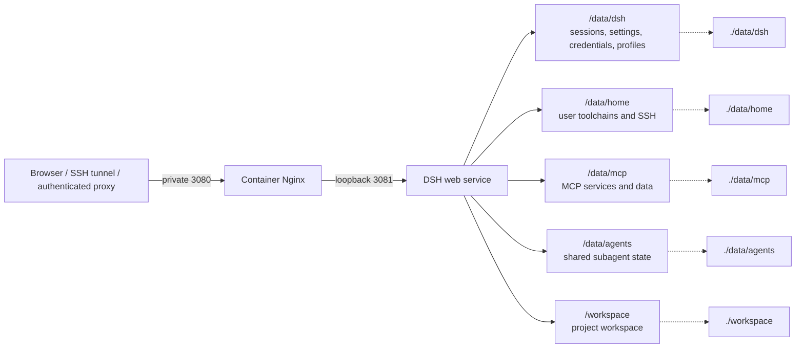

# dsh-docker

A local Docker build and persistent runtime for DeepSeek Harness, with a prebuilt Debian 13 environment where the Agent can keep installing software and developing.

[](https://www.kernel.org/)
[](https://www.microsoft.com/windows)
[](https://www.debian.org/releases/trixie/)
[](https://www.docker.com/)
[](LICENSE)

[简体中文](README.md) · [English](README.en.md)

> Update DSH inside the container (the "DSH environment" settings page, or `./dsh.sh update`). Recreating the container or chasing image updates is unnecessary and discards the toolchains the agent installed with apt.

## Installation and configuration

1 vCPU / 2 GB of RAM and 10 GB of disk are enough to start; plan on 2 vCPU / 4 GB and 20 GB if the agent will keep installing toolchains inside the container. The default source is the multi-arch prebuilt image `ghcr.io/univers629/dsh-docker:latest` (covering `linux/amd64` and `linux/arm64`); when the pull fails the installer falls back to building from the `Dockerfile` in this checkout and records the real source in `.env` as `DSH_IMAGE` and `DSH_IMAGE_SOURCE`. Unattended runs use `--image-source prebuilt|build` and `--image REF`; the Windows equivalents are `-ImageSource` and `-Image`.

The installer asks what to do, where the image comes from, how access is protected, where the reverse proxy runs, which hosts are trusted, and where the host port is bound. It writes `.env` automatically. Built-in Basic Auth stores only a bcrypt hash in `data/auth/htpasswd`. DSH and the Agent always run as container root so they can manage development tools with apt; this does not grant host root, a Docker socket, or privileged-container capabilities.

Linux:

```bash
curl -fsSL https://raw.githubusercontent.com/univers629/dsh-docker/main/install.sh | bash
```

Windows PowerShell (requires Docker Desktop in Linux containers mode):

```powershell
irm https://raw.githubusercontent.com/univers629/dsh-docker/main/install.ps1 | iex
```

The Linux and Windows installers fetch the project, prepare the Debian 13 image (pulling the prebuilt one by default), and start the same container runtime. The Windows installer starts the Docker Desktop Linux Engine when necessary.

Both one-line commands open the same interactive menu:

| Option | What it does |
| --- | --- |
| 1 Fresh install | Becomes "reconfigure and recreate the container (mounted data kept)" when the project directory exists; asks for the image source, access protection, proxy location, domain, and port binding |
| 2 Update DSH inside the container | Installs the new version from npm in the running container, reapplies the patch set, and restarts only the DSH process |
| 3 Start / 4 Stop / 5 Restart | Acts on the existing container only; nothing is recreated and apt-installed toolchains are kept |
| 6 Logs / 7 Status | Forwarded to `./dsh.sh logs` and `status` |
| 8 Delete | Fully removes the container, images, mounts, networks, build cache, and project directory after a `DELETE` confirmation |

Only option 1 asks for the Debian 13 image source (prebuilt or local build); options 2 through 8 act on the existing container.

Unattended installation example:

```bash
curl -fsSL https://raw.githubusercontent.com/univers629/dsh-docker/main/install.sh | bash -s -- install --access local --image-source prebuilt --non-interactive
```

Run `bash install.sh --help` inside the downloaded project directory for Linux options. On Windows, run `powershell -ExecutionPolicy Bypass -File .\install.ps1` directly.

### Publishing the image

[.github/workflows/publish-image.yml](.github/workflows/publish-image.yml) builds each architecture on a native GitHub amd64 or arm64 runner and merges them into one multi-arch manifest. It publishes in three ways:

- **Following upstream automatically**: a daily check at 03:17 UTC reads the `latest` dist-tag of `@deepseek-ai/dsh` on npm and builds only when that version has no image tag yet, so several upstream releases on the same day still produce at most one image.
- **Manual dispatch**: run the workflow from the Actions page with an npm version or dist-tag (`latest` by default). Use it to republish immediately after changing project files or patches.
- **Tag push**: push a `v*` tag.

Every publish tags `latest`, `dsh-<DSH version>`, and `<date>-<commit>`, so the package page shows which DSH is inside the image. When an upstream change invalidates an artifact patch anchor the build fails instead of publishing an unpatched image. Standard runners are not billed for public repositories, and storage plus egress for public GHCR packages are not billed either. New GHCR packages are private by default: after the first publish, switch the package to public once (repository -> Packages -> Package settings -> Change visibility), otherwise an anonymous pull on a server returns `denied`.

## Daily management

After the first install, manage the same container directly:

```text
Linux: ./dsh.sh [start|update|stop|restart|logs|status|shell|remove]
Windows: .\dsh.bat [start|update|stop|restart|logs|status|shell|remove]
```

`start` prepares the Debian 13 image only when the container does not exist, pulling or building it according to the source recorded in `.env`; later starts reuse the same container. `stop`, `restart`, and `apt install` performed by an in-container agent keep the container writable layer. `remove`/`down` deletes that layer, while `/data` and `/workspace` bind mounts remain. The `update` action reinstalls the DSH npm package inside the container and swaps `/app/dsh`; it is not a project or image rebuild. The container healthcheck probes both the Nginx entry and DSH's own port, so a DSH crash loop shows as `unhealthy` in `docker ps` instead of being hidden behind a healthy gateway.

To completely clear this project before a fresh install on a server, run the installer from the project directory and choose `delete` (menu item 8), or run:

```bash
./install.sh delete
```

Windows PowerShell:

```powershell
powershell -ExecutionPolicy Bypass -File .\install.ps1 -DshAction delete
```

Deletion precisely removes the `dsh` container, the DSH images (`dsh:*` plus the prebuilt reference recorded in `.env`), project mounts and networks, the global Docker build cache, and the project directory after a `DELETE` confirmation. It does not use a substring `name=dsh` filter and does not remove external shared networks such as `dpanel-local`. It works from inside the project directory or from its parent: the installer copies itself to a temporary file first, so the running script and the current directory never block the removal.

## Public access and authentication

DSH does not provide native login authentication. The installer binds port 3080 to `127.0.0.1` by default. Public access must use HTTPS and an authenticated entry point; do not use `0.0.0.0`, `::`, or another wildcard bind.

The installer provides three access modes:

1. `local`: local browser or SSH tunnel only.
2. `trusted-proxy`: Cloudflare Access, dPanel, host Nginx, a private VPN, or another outer entry point authenticates requests. The installer can record trusted hosts and an external Docker network.
3. `basic`: the container Nginx authenticates against a bcrypt password file. It does not provide MFA, and public deployments still require HTTPS at the outer proxy.

Cloudflare Access/OIDC with MFA is stronger than Basic Auth alone. The proxy performance difference between Caddy, Nginx, and the container Nginx is negligible for this workload.

Host Nginx example (replace the certificate paths and add authentication required by the selected mode):

```nginx
server {
    listen 443 ssl;
    server_name dsh.example.com;
    ssl_certificate /path/to/fullchain.pem;
    ssl_certificate_key /path/to/privkey.pem;

    location / {
        proxy_pass http://127.0.0.1:3080;
        proxy_http_version 1.1;
        proxy_set_header Upgrade $http_upgrade;
        proxy_set_header Connection "upgrade";
        proxy_set_header Host $host;
        proxy_set_header X-Forwarded-Host $host;
        proxy_set_header X-Forwarded-For $proxy_add_x_forwarded_for;
        proxy_set_header X-Forwarded-Proto $scheme;
        proxy_read_timeout 3600s;
    }
}
```

For a Docker-based panel, select Docker container/panel in the installer, enter the network the proxy container is attached to (`dpanel-local` for dPanel), and use `http://dsh:3080` as the upstream. Host proxies and SSH tunnels use `http://127.0.0.1:3080`.

External networks must already exist because Compose never creates them. If the proxy panel is not deployed yet, enter a new name such as `dsh-proxy` and the installer offers to create it; attach the proxy later with `docker network connect dsh-proxy <proxy-container>`. `dsh-private` is the network DSH manages itself and cannot be used as an external network.

## Architecture and persistence



Persistent paths:

These directories are bind-mounted. The Debian system itself, including `/usr`, `/etc`, and `/var`, stays in the container writable layer; no overlay mounts shadow system directories. Packages and configuration installed with `apt` therefore survive stop, start, and restart of the same container.

| Container path | Host path | Contents |
| --- | --- | --- |
| `/data/dsh` | `data/dsh` | Sessions, settings, credentials, profiles, and the built-in plugin |
| `/data/home` | `data/home` | User home, SSH, npm/uv toolchains, and caches |
| `/data/mcp` | `data/mcp` | Custom MCP source, environments, and data |
| `/data/agents` | `data/agents` | Shared subagent state |
| `/workspace` | `workspace` | Agent workspace |
| `/usr`, `/etc`, `/var` | Container writable layer (not separately mounted) | Debian system, agent-installed apt packages, configuration, and apt cache; `/bin`, `/sbin`, and `/lib` follow `/usr` under Debian usr-merge |

Removing the container with `docker rm` or `docker compose down` removes the system writable layer; the next `start` creates a fresh Debian 13 system. `/data`, `/workspace`, and the image are not automatically deleted.

## Project-specific behavior

<details>
<summary>Built-in controls, permissions, and stability notes</summary>

### Built-in control plugin

The image includes `dsh-docker-control` and restores it when the web profile is empty on first boot. It adds a DSH environment page to the settings left nav, beside General, Models, Plugins, and Agent presets. The page shows the installed and latest DSH versions and provides Check for updates, Update now, and a Desktop UI / Phone UI layout selector. Opening settings never reaches the network; only the check button queries the npm registry for the latest version. The phone layout makes the settings panel full screen, turns its left nav into a horizontally scrollable top tab strip, and turns the home sidebar into a drawer: closed it gives the whole width to the conversation and a floating button in the top-left corner opens it, open it floats over the conversation instead of squeezing it. The first visit picks a layout from the browser user agent. The update installs the target version from npm inside the container, reapplies the current patch set to the published artifacts, and atomically swaps the app; failures leave the old version running. No SSH session is required. Updates and Restart DSH replace only the DSH child managed by the Supervisor; neither action restarts the Debian container or Nginx. The settings header also provides a WebUI editor for `/data/dsh/settings.yaml`. The editor validates YAML and protects against concurrent overwrites.

In-container Agents should install, update, and remove plugins through `manage-dsh-plugin`. It creates a same-volume temporary profile under `/data/dsh/profiles`, permits the build scripts required by pnpm packages, validates configuration plus runtime resolution and import, then atomically replaces the live profile. Normal completion immediately removes the temporary profile and pnpm Git-build directories created by that transaction; the next DSH start or plugin operation recovers and cleans transactions or backups left by power loss or forced termination. The content-addressable pnpm store under `/data/home` is an intentional persistent download cache and can be reclaimed explicitly with `pnpm store prune`.

### WebUI and reverse-proxy stability

The editor uses an isolated portal and a fixed-height scroll region to prevent settings-page flicker, textarea height jumps, and blank pages. A WebSocket keepalive patch reduces UI stalls caused by idle proxy disconnects.

For public domains, the container Nginx presents traffic to DSH as internal loopback only after built-in Basic Auth or a trusted outer authentication layer has accepted it. `DSH_TRUSTED_HOSTS` validates browser authority; it is not login authentication and does not enable remote plugin settings writes. Those permissions remain explicit settings owned by each plugin.

### Permission boundary

DSH and the Agent always run as container `root`, and the entrypoint protects credential and SSH private-key permissions. The container is not privileged, does not mount the Docker socket, and container root does not grant administrator access on the host.

### Plugins and toolchains

The sandbox permits the `/data` writes required for plugins, session management, and MCP deployments. Apt packages use standard Debian paths persisted in the container writable layer. Python and Node user toolchains live under `/data/home/.local` and `/data/home/.npm-global`. At startup, the container renders the deployed `container-environment` skill from the detected system, architecture, and permission variables.

</details>

## License

[MIT License](LICENSE)
