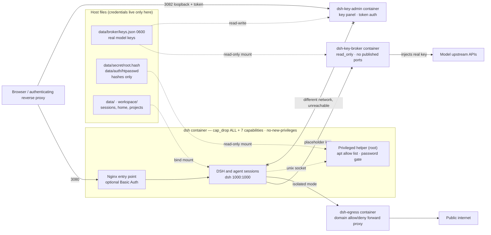

# dsh-docker

Run DeepSeek Harness in Docker: a prebuilt Debian 13 environment where the agent can keep installing toolchains with apt and develop long term, with model API keys stored outside the container.

[](https://www.kernel.org/)
[](https://www.microsoft.com/windows)
[](https://www.debian.org/releases/trixie/)
[](https://www.docker.com/)
[](LICENSE)

[简体中文](README.md) · [English](README.en.md) · [Security model](docs/security.en.md)

## Features

- **One-line install**: Linux and Windows share the same interactive menu and write the configuration to `.env`.
- **Persistent toolchains**: software the agent installs with apt stays in the container writable layer; start, stop, restart, and DSH updates never recreate the container.
- **Keys stay out of the container**: real API keys live only in a host file and a separate broker container, while DSH is configured with a placeholder key.
- **Unprivileged runtime**: DSH and the agent run as `dsh` (1000:1000) with `cap_drop: ALL` plus seven ordinary capabilities, and apt still works.
- **Optional egress allow list**: outbound traffic can be forced through a domain allow-list forward proxy.
- **Multi-arch prebuilt image**: `ghcr.io/univers629/dsh-docker:latest` covers `linux/amd64` and `linux/arm64`, falling back to a local build when the pull fails.

> Update DSH inside the container (the "DSH environment" settings page, or `./dsh.sh update`). Recreating the container or chasing image updates is unnecessary.

## Installation

1 vCPU / 2 GB of RAM / 10 GB of disk is enough to start; plan on 2 vCPU / 4 GB / 20 GB if the agent will keep installing toolchains inside the container.

Linux:

```bash
curl -fsSL https://raw.githubusercontent.com/univers629/dsh-docker/main/install.sh | bash
```

Windows PowerShell (requires Docker Desktop in Linux containers mode):

```powershell
irm https://raw.githubusercontent.com/univers629/dsh-docker/main/install.ps1 | iex
```

> The Linux one-liner above **opens the installation wizard by default**: even though stdin is curl's pipe, the wizard runs whenever the process still has a controlling terminal (`/dev/tty` is available). A genuinely terminal-less environment (CI, cron) does not silently install; it fails with two escape hatches: `install --non-interactive ...` (unattended) or `install --quick` (quick install). Quick install is no longer the implicit no-TTY default — it is one option inside the wizard's install branch: Basic Auth with a random `dsh` user, a random password, and a random container root password, with the model-key broker and outbound isolation left off, zero prompts, printing the access URL and those credentials once at the end.

The installer asks what to do, where the image comes from, how access is protected, where the reverse proxy runs, which domain and port binding to use, which model-key-broker upstreams to configure, and which outbound mode to use, then writes `.env`. The key step only asks for an upstream name and its key (plus a base_url for self-hosted gateways); the API shape, model list, and request headers are inferred or queried from the upstream. Model keys can be left empty and added later with menu item 10 or `./install.sh model-key`, which does not recreate the container. The container root password is stored only as a sha512crypt hash in `data/secret/root.hash` and the Basic Auth password only as a bcrypt hash in `data/auth/htpasswd`; neither is written to `.env`. Nothing in this flow uses a privileged container, mounts a Docker socket, or grants host root.

| Menu item | What it does |
| --- | --- |
| 1 Fresh install | Becomes "reconfigure and recreate the container (mounted data kept)" when the project directory already exists |
| 2 Update | Branches in two: update DSH inside the container (`update`) or move to a new image and recreate (`upgrade`) |
| 3 Start / 4 Stop / 5 Restart | Acts on the existing container only, keeping apt-installed toolchains |
| 6 Logs / 7 Status | Forwarded to `./dsh.sh logs` and `status` |
| 8 Delete | Asks for the data scope first (sessions, workspace, and plugins can be kept), then removes the container, images, mounts, networks, build cache, and project directory after a `DELETE` confirmation |
| 9 Fill in model API keys | Writes keys for an existing deployment and starts the broker container without recreating `dsh` |
| 10 Model key management panel | Fill in keys and fetch model lists in the browser without recreating `dsh` |

Only item 1 asks about the image source; the rest act on the existing container.

Non-interactive install:

```bash
curl -fsSL https://raw.githubusercontent.com/univers629/dsh-docker/main/install.sh | bash -s -- install --access local --image-source prebuilt --non-interactive
```

Passwords on the command line land in shell history and `ps`; prefer an environment variable:

```bash
DSH_ROOT_PASSWORD='a password of at least 12 characters' bash install.sh install --access local --non-interactive
```

Full options are in `bash install.sh --help`; on Windows use `powershell -ExecutionPolicy Bypass -File .\install.ps1`.

### Updating or uninstalling an existing deployment

On an installed deployment `install` is refused because the container already exists (that protects the apt-installed software in the container writable layer). To update or uninstall, enter the main menu and pick the entry:

```bash
curl -fsSL https://raw.githubusercontent.com/univers629/dsh-docker/main/install.sh | bash -s -- --menu
```

Inside the project directory you can also run `./install.sh --menu` directly.

### Paging through the wizard

The interactive installer is a **one-question-per-page** wizard that takes over the terminal's **alternate screen buffer**: the whole terminal switches to a separate canvas, pages never scroll into the scrollback, and the original screen is restored on exit. The main menu lists every lifecycle action, and any option with follow-up branches opens a new page instead of falling back to log output.

```text
       ▄▄▄▄▄▄▄▄     █▄
   ▄███████████▄    ███▄ ▄▄▄▄█   ██████████    █████████  █████   █████
 ▄███████████████▄  ▀████████▀  ░░███░░░░███  ███░░░░░███░░███   ░░███
▄██████████████████▄  ████▀▀     ░███   ░░███░███    ░░░  ░███    ░███
██     ▀▀███████▀▀███████        ░███    ░███░░█████████  ░███████████
██        ▀██████  ▀█████        ░███    ░███ ░░░░░░░░███ ░███░░░░░███
███         ▀█████▄▄████         ░███    ███  ███    ░███ ░███    ░███
 ███          █████████          ██████████  ░░█████████  █████   █████
  ▀██▄    █▄▄  ▀█████▀          ░░░░░░░░░░    ░░░░░░░░░  ░░░░░   ░░░░░
   ▀▀███▄▄████▄▄▄██████▄
      ▀▀███████▀▀▀

  DeepSeek Harness - Choose an action (1)

  ▸ Install / reconfigure (keep mounted data)
      Install DSH or rebuild the container from a new configuration
    Update
      Upgrade DSH in the container, or move to a new image and recreate
    Uninstall
      Remove containers, images, mounts, networks, and the project directory

  ↑/↓ select | Enter confirm | Esc back | Ctrl+C exit
```

The header is redrawn on every page as `DeepSeek Harness - <page title> (<page number>)`; the number accumulates along the branch, so no total is hard-coded.

- **Quick install** is chosen explicitly inside the install branch (equivalent to `--quick`): basic auth with random credentials and the key broker off, zero prompts, printing the access URL and credentials at the end. It is no longer decided implicitly by whether a TTY is present.
- The install flow asks page by page about image source, access protection, user mode, registration gate, idle threshold, disk quota, egress mode, model keys, reverse proxy, domain and port, and the container root password. The last page is a pre-execution confirmation summary (yes / no); answering no leaves the run with nothing written.
- Small terminals degrade in three steps: below 71 columns only the DSH wordmark is drawn (dropping the 30-column whale); below 22 rows only the title line remains, so artwork never pushes the options off screen.
- When a container already exists, the main menu marks install as unavailable and says to run `./dsh.sh remove` first, instead of failing only after the choice.
- Terminals that cannot page (piped input, `TERM=dumb`, CI) fall back to numbered input, so scripted calls are unaffected.

### Building behind a restricted network

If the official Debian and npm mirrors are unreliable, build against local mirrors instead. The build arguments come from the Dockerfile, so the installer needs no changes:

```sh
docker build \
  --build-arg APT_MIRROR=https://mirrors.aliyun.com/debian \
  --build-arg NPM_REGISTRY=https://registry.npmmirror.com \
  -t dsh:local .
```

- `APT_MIRROR`: replaces the Debian sources. The build first fetches the CA bundle over plain HTTP (the image has no certificates yet, so an HTTPS source would fail verification), then switches to HTTPS for the remaining packages. Some networks truncate large files over the plain channel, which shows up as repeated 500s on a single .deb.
- `NPM_REGISTRY`: replaces the npm registry and is written into the image config, so it also applies when the agent installs plugins later.

Retries for both apt and npm are enabled during the build (`Acquire::Retries`, `fetch-retries`), so transient failures no longer break the build outright.

## Day-to-day operations

```text
Linux:   ./dsh.sh  [start|update|stop|restart|logs [service]|status|shell|root-shell|verify|keys|key-panel|egress|remove]
Windows: .\dsh.bat [start|update|stop|restart|logs [service]|status|shell|root-shell|verify|keys|key-panel|egress|remove]
```

- `start` prepares the image only when the container is missing and reuses the same container afterwards; `stop`, `restart`, and in-container `apt install` all keep the writable layer.
- `update` reinstalls the DSH npm package inside the container only — not a project or image update; `remove` drops the container writable layer and keeps bind mounts.
- Menu item 2 ("Update") branches in two: update DSH inside the container (equivalent to `./install.sh update`; neither container nor image changes) or move to a new image and recreate the container (equivalent to `./install.sh upgrade`). The latter reuses the existing `.env` without re-asking anything, keeps sessions, plugins, `workspace/`, and model keys, and only requires reinstalling system packages from `apt` in the writable layer; the project label is used to reclaim the replaced dangling images, leftover containers, and empty networks without touching other host projects.
- `shell` enters the unprivileged `dsh` account; `root-shell` is a host-side administration channel (it cannot be used to escalate inside the container).
- `verify` runs the full hardening self-check inside the container; `keys` and `egress` print broker and egress-proxy status; `key-panel` prints the panel URL and its access token.
- The health check probes both the Nginx entry point and the DSH port itself, so a crash-looping DSH reports `unhealthy`.
- In-container updates pre-flight profile plugin compatibility before replacing `/app/dsh`: DSH disables plugins whose peer range does not satisfy the new version, and that disablement neither stops the process nor shows up in liveness or rollback, so the result is written to the container log and the update status. See the [DSH 0.2.0-rc.2 migration note](docs/dsh-0.2.0-rc.2-migration.en.md) before moving to a new DSH version.

### Deleting

To clear the project completely, run menu item 8 in the project directory or `./install.sh delete` (Windows: `powershell -ExecutionPolicy Bypass -File .\install.ps1 -DshAction delete`). Deletion cleans the project's containers, images, mounts, networks, and directory by exact name — no substring matching, and no shared external networks are removed.

Deletion asks for the data scope first and only then requires typing `DELETE`:

- Delete everything: containers, images, `.env`, model keys, the root password hash, and everything under `data/` and `workspace/`.
- Keep sessions, workspace, and plugins: only `workspace/`, `data/dsh/sessions/`, and `data/dsh/profiles/` survive; the rest is still deleted (including the project source and the toolchain in `data/home`), leaving a `.dsh-preserved` marker file. When you reinstall into the same directory, the installer recognises that file, refetches the project source, and keeps those three in place. Ownership is re-aligned at container start, so no manual `chown` is needed.

For scripted deletion, `DSH_DELETE_KEEP=1` selects the "keep" branch (the confirmation prompt still applies).

## Public access and authentication

DSH itself provides no login, and the installer binds 3080 to `127.0.0.1` by default. Public access must go through HTTPS and an authenticating entry point; never use wildcard bindings such as `0.0.0.0` or `::`.

### Access modes

The installer offers four access modes:

1. `local`: local or SSH-tunnel access only.
2. `trusted-proxy`: an outer layer (Cloudflare Access, a Docker panel, host Nginx, a VPN) authenticates; trusted hosts and an external Docker network can be recorded. **In this mode the container does not authenticate: connecting to the origin IP and having the request forwarded into the DSH container bypasses the outer layer entirely, which is equivalent to having no lock.** Self-check: `curl -k -i -H "Host: <your-domain>" https://<origin-IP>/` returning `200` means it is bypassable. This mode must be stacked with a credential that does not depend on IP or Host (a Cloudflare Tunnel, or switch to `basic`); see "trusted-proxy boundaries and self-check" in `docs/security.en.md`. Note that `DSH_TRUSTED_HOSTS` is only a cookie binding key, **not an access allow list**.
3. `basic`: the in-container Nginx authenticates against a bcrypt password file, without MFA; public deployments still need outer HTTPS. This is the only application-layer lock that does not depend on source IP or Host.
4. `password`: the built-in auth gateway (`dsh-auth`) handles login and supports account registration, TOTP two-step verification, and passkeys. Multi-user mode always uses this one; a single admin can also choose it for a graphical login page.

Exposed or not, set `DSH_AUTH_INGRESS_TOKEN` (a shared secret between the entry point and the auth gateway, generated with `openssl rand -hex 32`). With it set, the gateway's `/__dsh_auth/verify` decision endpoint only accepts requests carrying the same value, so other components on the container network cannot trade a session cookie for identity headers; when it is empty only the network boundary protects it.

### Multi-user mode

Choosing item 4 for access protection in the custom installer (or passing `--multi-user`) deploys multi-user mode: **account registration plus one dedicated DSH container per account**. Sessions, files, and model context are isolated per account, and only the initial administrator can reach the admin panel and the model-key panel.

It adds three containers over single-admin mode:

| Container | Role |
| --- | --- |
| `dsh-auth` | Auth gateway: serves the login, registration, and instance-waiting pages and answers the entry point's `auth_request` decision |
| `dsh-instances` | Instance orchestration: **the only component holding `docker.sock`**, creating, starting, stopping, and removing each account's container on demand |
| `dsh-ingress` | Layer-7 entry point: routes a request to the account's own instance by session identity, and handles logout redirects and wake-up jumps |

- **Authentication**: Argon2id passwords, TOTP two-step verification with recovery codes, and passkeys. Multi-user mode fixes the access mode to `password` (authentication happens at the gateway; the in-container Nginx no longer does Basic Auth). Passkeys need a fixed HTTPS domain and are enabled by setting `DSH_PUBLIC_ORIGIN`.
- **Resources**: 200MB memory cap per instance by default; instances stop automatically after 30 minutes idle (memory goes to zero, data is retained), and a returning user sees a waiting page while it starts in 10–30 seconds. Adjust with `DSH_INSTANCE_MEMORY_MB` and `DSH_IDLE_TIMEOUT_SECONDS`.
- **Registration gate**: `DSH_REGISTER_GATE=open` allows anyone who can reach the entry point; `invite` requires a single-use invite code (printed once at install time and rotatable in the admin panel).
- **Account data**: `data/users/<uid>/`, owned by that instance's uid. Deleting an account can also purge its data from the admin panel.
- **Admin panel**: `http://<bind-address>:<port>/admin`, reachable only by the initial administrator, for disabling or deleting accounts, resetting passwords, rotating the invite code, and viewing audit records and instance watermarks.
- **Operational boundary**: `dsh-instances` holding the Docker socket is the inherent cost of this mode, so it holds no user data, runs no agent, and accepts token-authenticated calls only on the control-plane network; user instances publish no host ports. See the "Multi-user mode" section of `docs/security.en.md` for the threat model and self-checks.

Switching from single-admin to multi-user is just rerunning the wizard: the existing dsh container becomes the administration workspace (network alias `dsh-admin`), admin data stays in place, and new users register. Switching back stops all user instances and requires a second confirmation.

#### Captcha (bulk-registration protection)

With registration open in multi-user mode, bulk account creation consumes disk and memory quotas. The auth gateway has a built-in captcha switch that requires completing a challenge before the login and registration forms can be submitted:

- In the admin panel (`/admin`) under "Captcha", pick a provider and fill in the key pair (site key / secret key); saving takes effect immediately with no restart. Keys are sealed with AES-256-GCM before hitting disk, so `state.json` holds only ciphertext.
- Three providers are supported: Cloudflare Turnstile, hCaptcha, and reCAPTCHA v2 (the list is built into the code). The on/off state is published to the login page via `/api/auth/status`, which loads the matching provider script; when it is off the forms are unchanged.
- Verification happens on the gateway side (the server calls the provider's siteverify endpoint), so agent containers cannot read the secret.

#### Per-user model access

In multi-user mode the administrator decides which upstreams are available to ordinary users: "Model access" in the admin panel ticks the allowed upstreams per account and saves them to `data/auth/broker-grants.json` (callers are identified by the SHA-256 digest of their instance token). Model requests from accounts without a granted upstream are rejected by the broker outright.

- Users configure nothing: granted upstreams are written into the instance's DSH `settings.yaml` when it is created (pointing at the broker's placeholder address) and are visible and usable under "Settings → Models" after login. When the administrator changes the grant later, the instance follows the new grant after its next idle reclaim and rebuild.
- Single-admin (non-multi-user) mode has no such table: every configured upstream is available to the one user.
- Disabling or deleting an account recomputes the grant table immediately, and the revoked instance token stops working at once.

### Reverse proxy configuration

Host Nginx reverse-proxy example:

```nginx
server {
    listen 443 ssl;
    server_name dsh.example.com;
    ssl_certificate /path/to/fullchain.pem;
    ssl_certificate_key /path/to/privkey.pem;

    location / {
        proxy_pass http://127.0.0.1:3080;
        proxy_http_version 1.1;
        proxy_set_header Upgrade $http_upgrade;
        proxy_set_header Connection "upgrade";
        proxy_set_header Host $host;
        proxy_set_header X-Forwarded-Host $host;
        proxy_set_header X-Forwarded-For $proxy_add_x_forwarded_for;
        proxy_set_header X-Forwarded-Proto $scheme;
        proxy_read_timeout 3600s;
    }
}
```

With a Docker-panel reverse proxy, give the installer the external network that proxy container is on and use `http://dsh:3080` as the upstream; for a host proxy or SSH tunnel use `http://127.0.0.1:3080`. The external network must already exist or be created by the installer after confirmation.

## Architecture


```mermaid
flowchart LR
    client["Browser / authenticating reverse proxy"]

    subgraph hostfs["Host files (credentials live only here)"]
        keys["data/broker/keys.json 0600<br/>real model keys"]
        hashes["data/secret/root.hash<br/>data/auth/htpasswd<br/>hashes only"]
        mounts["data/ · workspace/<br/>sessions, home, projects"]
    end

    subgraph dsh["dsh container — cap_drop ALL + 7 capabilities · no-new-privileges"]
        nginx["Nginx entry point<br/>optional Basic Auth"]
        agent["DSH and agent sessions<br/>dsh 1000:1000"]
        helper["Privileged helper (root)<br/>apt allow list · password gate"]
    end

    broker["dsh-key-broker container<br/>read_only · no published ports"]
    admin["dsh-key-admin container<br/>key panel · token auth"]
    egress["dsh-egress container<br/>domain allow/deny forward proxy"]
    upstream["Model upstream APIs"]
    internet["Public internet"]

    client -->|3080| nginx --> agent
    client -->|3082 loopback + token| admin
    agent -->|placeholder key| broker -->|injects real key| upstream
    agent -->|isolated mode| egress --> internet
    agent -.->|unix socket| helper
    keys -.->|read-only mount| broker
    keys -.->|read-write| admin
    hashes -.->|read-only mount| helper
    mounts -.->|bind mount| agent
    agent x-- different network, unreachable --x admin
```

The diagram shows the single-admin topology (multi-user mode adds `dsh-auth`, `dsh-instances`, and `dsh-ingress`; see "Multi-user mode"). Real keys move only between the host file, `dsh-key-broker`, and `dsh-key-admin`, none of which shares a volume with the `dsh` container; the panel and `dsh` are also on different Docker networks, so the `dsh` container holds no key literal and cannot reach the panel that does.

Persisted directories:

| Container path | Host path | Contents |
| --- | --- | --- |
| `/data/dsh` | `data/dsh` | sessions, settings, credentials, profiles, bundled plugins |
| `/data/home` | `data/home` | home directory, SSH, npm/uv toolchains and caches |
| `/data/mcp` | `data/mcp` | custom MCP sources, virtualenvs, and data |
| `/data/agents` | `data/agents` | shared sub-agent state |
| `/workspace` | `workspace` | agent workspace |
| `/usr`, `/etc`, `/var` | container writable layer | Debian system and apt-installed software; lost only if the container is deleted |

Debian system directories stay in the container writable layer with no overlay, so software and system configuration installed with apt survive stopping and starting the same container.

## Security model

Layered controls, most effective first: **trustworthy input > keys outside > egress allow list > escape hardening**.

| Layer | Implementation | Risk covered |
| --- | --- | --- |
| Keys outside | A separate `dsh-key-broker` container injects keys, strips client auth headers, and enforces a path allow list, rate limits, and a daily quota | Key exfiltration after prompt injection or arbitrary command execution |
| Egress control | In isolated mode the container joins a gateway-less internal network; outbound traffic goes through a domain allow/deny proxy that also validates DNS results | Exfiltrating data anywhere, or bypassing the key broker |
| Run identity | DSH, the agent, and Nginx workers run as 1000:1000; only PID 1, the Nginx master, and the privileged helper are root | Running processes as root inside the container |
| Capability reduction | `cap_drop: ALL` with only `CHOWN`, `DAC_OVERRIDE`, `FOWNER`, `FSETID`, `SETGID`, `SETUID`, `KILL` restored; `no-new-privileges` kept; seccomp and AppArmor left alone | `CAP_SYS_ADMIN` mount escapes, cgroup `release_agent`, kernel module loading, cross-process ptrace |
| Isolation surface | No privileged mode, no Docker socket, no shared host PID/network/IPC namespace, `pids_limit` set | Docker API escape, host process visibility, fork bombs |
| Escalation gate | apt goes through an allow-list wrapper; other privileged commands need the container root password and trigger increasing delay plus lockout on failure | Arbitrary escalation from `dsh` to root in the container |
| Boot-chain integrity | Entrypoint, supervisor, privileged helper, and wrappers are root-write-only; packages needed at runtime cannot be uninstalled | Breaking the boot chain so the service cannot recover |
| Escape blast radius | Host user namespace remap is supported, with `install.sh --userns-preflight` and ownership alignment | Landing on host root after a kernel or runtime escape |

Known limitations:

- The container shares the host kernel, so kernel and container-runtime vulnerabilities cannot be stopped from inside; keep the host kernel and Docker updated.
- Passwordless apt by default means the container can reach container root via the allow-list proxy; tighten it with `DSH_PRIVILEGED_APT=password`.
- The key broker guarantees only that key literals never enter the container; it does not protect quota or data, which needs request limits and the egress allow list.
- The egress allow list matches on domain and does not perform TLS interception, so any path under an allowed domain is reachable.
- The egress deny list is a heuristic; it only lowers the chance of casual abuse and will not stop tunnels on self-owned domains. The allow list is the real boundary.
- The first line of defence is still not handing untrusted content to the agent; the layers above only shrink the consequences after a successful injection.

For the threat model, per-layer configuration, the broker's `keys.json` structure, egress allow-list details, and the trade-offs of user namespace remap and rootless Docker, see [docs/security.en.md](docs/security.en.md).

## Model keys

Real keys are written only to the host's `data/broker/keys.json` (0600) and mounted read-only into `dsh-key-broker`, never into the DSH container. The DSH-side provider configuration is written by the installer into `data/dsh/settings.yaml` (base_url pointing at `http://dsh-key-broker:8080/u/<upstream>`, with a placeholder API key), so models can be selected under "Settings → Models" right after install.

- At install time: the wizard asks only for a name and a key per upstream (no echo); built-in upstreams such as `deepseek`, `openai`, `anthropic`, `google`, and `nvidia` do not even ask for a base_url. The API shape is inferred from the name, fixed headers are off by default, and the model list is queried from the upstream before saving. You can also point `--model-keys-file` at a 0600 `keys.json`.
- Non-interactive shape and headers: `--model-api NAME=PROFILE` and `--model-header NAME=HEADER=VALUE` (repeatable), for example the `originator`, `version`, and `User-Agent` headers a Codex client needs. The shape decides the auth header, allowed endpoints, and the protocol written into DSH; see [docs/security.en.md](docs/security.en.md).
- Model list: an upstream whose name matches DSH's built-in catalogue (`deepseek`, `openai`, `anthropic`, `google`, `nvidia`, …) reuses the entire list from that catalogue. Gateways outside the catalogue need at least one model id, or DSH rejects the whole provider entry and no card appears on the models page, so the installer first requests `/models` from the upstream with the key to fill one in; if that fails it prints the reason, and you can supply ids with `--model-id NAME=ID[,ID]` or in the panel. `--no-model-settings-seed` skips writing the configuration so you can add it manually in the WebUI.
- The `deepseek` upstream configures DSH's own first-party DeepSeek provider (`llm-deepseek`) and does not add a row; a duplicate `llm-pi-ai.providers.deepseek` written by older installers is removed the next time the configuration is written.
- Upstream names: start with a lowercase letter, then only lowercase letters, digits, and single hyphens, up to 32 characters — matching DSH's "add custom provider" rule. Non-conforming names are silently dropped by DSH, which shows up as a missing card.
- base_url: the real upstream address including the version segment (OpenAI-compatible gateways usually want `https://<domain>/v1`; Anthropic-compatible ones usually do not). What DSH writes is computed by the installer; adding it on both sides produces `/v1/v1/...`. Upstreams in the built-in catalogue can just accept the default. If you forget the version segment, the installer and the panel detect it while fetching the model list and add it automatically — OpenAI-compatible clients do not add it themselves, and without it every request lands on the upstream root path.
- Adding keys afterwards: `./install.sh model-key` (Windows: `.\install.ps1 -DshAction model-key`), which only adds the broker container and does not recreate `dsh`.
- Checking status: `./dsh.sh keys` prints upstreams, quota, today's usage, and allow/deny counts, without printing keys.

### Key management panel

If you would rather not fill keys in a terminal, use the panel: add or remove upstreams, fill keys, choose the API shape, tick the model list plus per-model capabilities and reasoning levels, set fixed headers, set request limits, and fetch the model list per upstream. Saving writes both `data/broker/keys.json` and DSH's `settings.yaml` / `.credentials.yaml`; both hot-reload, so no container restarts. The panel also manages the container egress policy (see "Outbound modes").

- Enabling: the fresh-install wizard asks; for an existing deployment run `./install.sh key-panel` (Windows: `.\install.ps1 -DshAction key-panel`), which only adds the `dsh-key-admin` container and does not recreate `dsh`. Disable with `--no-key-admin`.
- Access: `http://127.0.0.1:3082/` by default, with the token in `data/broker/admin.token` (0600). For remote use, tunnel it: `ssh -N -L 3082:127.0.0.1:3082 <user@host>`. Address and port come from `DSH_KEY_ADMIN_BIND_HOST` and `DSH_KEY_ADMIN_HOST_PORT`.
- The panel is deliberately not part of the DSH WebUI: that page runs inside the DSH container, so keys entered there would land where the agent can read them. The panel runs as a separate container attached only to the `dsh-admin` network, which the `dsh` container is not on; the installer verifies from inside the `dsh` container that this connection fails, and fails the install otherwise.
- Repeated wrong tokens trigger increasing delay and lockout; the panel container itself is `read_only`, `cap_drop: ALL`, runs as 1000:1000, and can only read and write `data/broker` and `data/dsh`.
- Model list and per-model levels: the panel's "Model list" is a table; only models ticked on the left are saved to `keys.json` and written into DSH's `settings.yaml` (the saved list is authoritative, so unticking a model removes it from the DSH provider configuration; ticking none for a catalogued upstream falls back to the catalogue's full list). Each row carries that model's own call capability (`text` is the default and display-only; `image` must be ticked to write `input: [text, image]`) and reasoning level (`off`, `minimal`, `low`, `medium`, `high`, `xhigh`, `max`; the wire value for `off` is `null`). Both are inherently per-model: in the same gateway `gpt-5` accepts `reasoning_effort` while an image model does not. Ticking none means "not declared", so the DSH model page shows no "reasoning level" dropdown for that model — ticking a level for a model that does not support `reasoning_effort` gets rejected upstream, so tick only what the upstream actually supports. The header row is a bulk action applied to ticked rows (or to the current filter when nothing is ticked).
- Request limits: a per-minute request cap plus a daily request quota (reset at UTC midnight), counted in requests rather than tokens or money; hitting a limit returns 429 from the broker. `0` means unlimited and blank keeps the current value. Limiting by token or cost would require per-provider usage parsing and a price table, which the panel does not do; to cap by money, set a budget on that key in the upstream platform's console.
- An empty `keys.json` is a valid state: you can install without keys, during which model requests return 503, and fill in the first key later in the panel.
- Do not fill keys for broker-managed upstreams in the DSH WebUI card: that field is `type=password`, so a browser password manager will auto-fill a saved password, and saving once writes it in cleartext into `.credentials.yaml` inside the container. The panel swaps such values back to the placeholder every 30 seconds and names them in the log (rotate them), but a key entered that way should still be treated as having been inside the container.
- Skipping the broker and the panel still allows entering keys directly in the WebUI, at the cost of losing this layer.

### No card appears on the models page

The DSH models page only renders providers that really exist in the configuration; a rejected configuration produces no error, just one fewer card. Check in order:

1. On the host, `cat data/dsh/settings.yaml` and look under `llm-pi-ai.providers`. If the upstream is missing, the configuration was never written — check `docker logs dsh-key-admin` (panel saves) or the installer's warnings (wizard).
2. Present but with an empty `models`: upstreams outside the catalogue need at least one model id, or DSH drops the whole route. Add a model id and save again.
3. A non-conforming upstream name (uppercase, underscores, leading digit) is also dropped; rename and resave.
4. The DeepSeek card uses DSH's own first-party provider and always exists; it is not something newly added.
5. If the key field already has content when you open the settings page and copying it out yields a key you entered before, that is your browser's password manager auto-filling. DSH never back-fills stored keys; the field is always empty.

### Chat returns 403 or "API key is invalid"

You can select the model and the panel can fetch the model list, but every chat returns 403 or an invalid-key error — usually a missing version segment in the base_url: the panel tries both `<base>/models` and `<base>/v1/models` and reports success on the second, while DSH does not add the segment when sending requests, so they land on the upstream root path.

- The panel's upstream list flags such upstreams; click "Edit" and save again to fix it automatically.
- To tell which side returned the 403: `docker logs dsh-key-broker` — `event:"deny"` is the broker rejecting by allowed endpoint, while `event:"forward"` carries the `status` from the upstream.

## Outbound modes

`DSH_EGRESS_MODE` in `.env` decides how the container reaches the network:

- `open` (default): the container reaches the public internet directly. Simple, but an injected agent can send data anywhere.
- `blocklist`: the container joins a gateway-less internal network and outbound traffic must pass through the `dsh-egress` forward proxy, which allows by default and only denies listed domains. The built-in deny list covers common one-click public tunnel services (cloudflared quick tunnels, ngrok, cpolar, and similar) that can publish container ports to the internet. The agent's web browsing, search APIs, and third-party downloads keep working.
- `allowlist`: also routes through `dsh-egress`, but only allows listed domains; the built-in allow list covers Debian, npm, PyPI, GitHub, GHCR, and 15 domains in total. Anything else returns 403, including pages and search APIs the agent tries to reach.

The mode and both lists live in `data/egress/policy.json` (written by the panel, read by the proxy, hot-reloaded by modification time). Switching between `blocklist` and `allowlist`, and editing either list, happens in the panel's "Container outbound policy" and takes effect in 5 seconds; only switching between `open` and an isolated mode needs a rerun of the installer, because that changes the compose overlay. None of the three modes affects model requests: that route leaves through `dsh-key-broker` independently.

## Image publishing

Prebuilt images are built by [.github/workflows/publish-image.yml](.github/workflows/publish-image.yml) on native amd64 and arm64 runners and merged into a multi-arch manifest. Three triggers: a daily 03:17 UTC check of `@deepseek-ai/dsh` `latest` on npm that builds when the matching tag is missing; a manual version or dist-tag run from the Actions page; and pushing a `v*` tag. Each release is tagged `latest`, `dsh-<DSH version>`, and `<date>-<commit>`; if upstream changes invalidate a patch anchor, the build fails rather than publishing an unpatched image. New GHCR packages are private by default, so after the first release change visibility to public in Package settings — otherwise anonymous pulls return `denied`.

## License

[MIT License](LICENSE)
