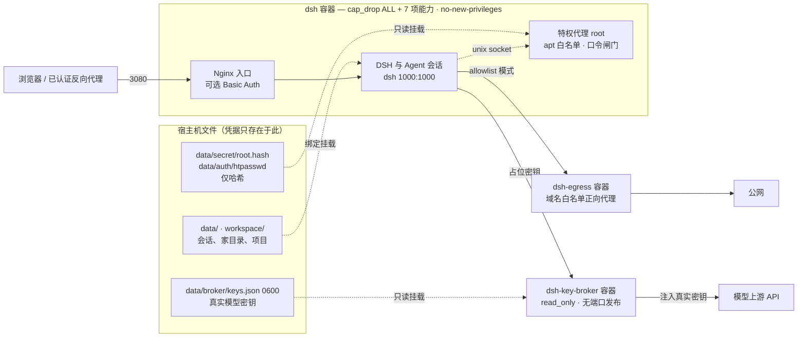

# dsh-docker

在 Docker 里运行 DeepSeek Harness：预制 Debian 13 环境，Agent 可以持续用 apt 安装工具链并长期开发，模型密钥保存在容器之外。

[](https://www.kernel.org/)
[](https://www.microsoft.com/windows)
[](https://www.debian.org/releases/trixie/)
[](https://www.docker.com/)
[](LICENSE)

[简体中文](README.md) · [English](README.en.md) · [安全模型详解](docs/security.md)

## 特性

- **一行命令安装**：Linux 与 Windows 使用同一套交互菜单，配置写入 `.env`。
- **工具链持久化**：Agent 用 apt 安装的软件保留在容器可写层，启动、停止、重启和 DSH 更新都不重建容器。
- **模型密钥不进容器**：真实密钥只存在于宿主文件和独立的代理容器中，DSH 侧填占位串。
- **非特权运行**：DSH 与 Agent 以 `dsh`（1000:1000）身份运行，`cap_drop: ALL` 后只补回 7 项常规能力，apt 依旧可用。
- **可选出站白名单**：容器出网强制经过域名白名单正向代理。
- **多架构预构建镜像**：`ghcr.io/univers629/dsh-docker:latest` 覆盖 `linux/amd64` 与 `linux/arm64`，拉取失败时自动改为本地构建。

> DSH 本体在容器内更新即可（WebUI 的“DSH 环境”页，或 `./dsh.sh update`），不需要重建容器或跟随镜像更新。

## 安装

起步配置 1 vCPU / 2 GB 内存 / 10 GB 磁盘；长期让 Agent 在容器内安装工具链建议 2 vCPU / 4 GB 内存 / 20 GB 磁盘。

Linux：

```bash
curl -fsSL https://raw.githubusercontent.com/univers629/dsh-docker/main/install.sh | bash
```

Windows PowerShell（需要 Docker Desktop 并切换到 Linux containers）：

```powershell
irm https://raw.githubusercontent.com/univers629/dsh-docker/main/install.ps1 | iex
```

安装器依次询问操作类型、镜像来源、访问保护方式、反向代理位置、域名与端口绑定、模型密钥代理的上游与配额、要启用的模型 id、容器出站模式，并写入 `.env`。模型密钥可以留空跳过，之后用菜单第 9 项或 `./install.sh model-key` 补填，该操作不重建容器。容器 root 密码仅以 sha512crypt 哈希写入 `data/secret/root.hash`，Basic Auth 密码仅以 bcrypt 哈希写入 `data/auth/htpasswd`，两者都不写入 `.env`。安装过程不使用特权容器、不挂载 Docker socket、不授予宿主机 root。

| 菜单项 | 作用 |
| --- | --- |
| 1 全新安装 | 工程目录已存在时改为“重新配置并重建容器（保留挂载数据）” |
| 2 在容器内更新 DSH | 在运行中的容器内从 npm 安装新版本并重打补丁，只重启 DSH 进程 |
| 3 启动 / 4 停止 / 5 重启 | 只操作已有容器，不重建，保留 apt 安装的工具链 |
| 6 查看日志 / 7 查看状态 | 转发到 `./dsh.sh logs` 与 `status` |
| 8 删除 | 输入 `DELETE` 确认后清理容器、镜像、挂载、网络、构建缓存与工程目录 |
| 9 补填模型 API 密钥 | 为已有部署写入密钥并启动密钥代理容器，不重建 `dsh` |

只有第 1 项会询问镜像来源，其余各项直接作用于现有容器。

非交互安装：

```bash
curl -fsSL https://raw.githubusercontent.com/univers629/dsh-docker/main/install.sh | bash -s -- install --access local --image-source prebuilt --non-interactive
```

命令行上的密码会进入 shell 历史与 `ps`，建议改用环境变量：

```bash
DSH_ROOT_PASSWORD='至少12位的密码' bash install.sh install --access local --non-interactive
```

完整参数见 `bash install.sh --help`；Windows 对应 `powershell -ExecutionPolicy Bypass -File .\install.ps1`。

## 日常管理

```text
Linux:   ./dsh.sh  [start|update|stop|restart|logs [服务]|status|shell|root-shell|verify|keys|egress|remove]
Windows: .\dsh.bat [start|update|stop|restart|logs [服务]|status|shell|root-shell|verify|keys|egress|remove]
```

- `start` 只在容器不存在时准备镜像，之后复用同一个容器；`stop`、`restart` 与容器内的 `apt install` 都保留可写层。
- `update` 只在容器内重装 DSH 的 npm 包，不是项目或镜像更新；`remove` 会删除容器可写层，绑定挂载保留。
- `shell` 进入非特权 `dsh` 账户，`root-shell` 是宿主机侧的管理通道（容器内部无法以此提权）。
- `verify` 在容器内运行 23 项加固自检，`keys` 与 `egress` 打印密钥代理和出站代理的状态。
- 健康检查同时探测 Nginx 入口与 DSH 自身端口，DSH 崩溃循环时容器状态为 `unhealthy`。

彻底清空本项目：在工程目录运行菜单第 8 项，或执行 `./install.sh delete`（Windows：`powershell -ExecutionPolicy Bypass -File .\install.ps1 -DshAction delete`）。删除按精确名称清理本项目的容器、镜像、挂载、网络和工程目录，不使用子串匹配，也不会删除外部共享网络。

## 公网访问与认证

DSH 自身不提供登录认证，安装器默认把 3080 绑定到 `127.0.0.1`。公网访问必须经过 HTTPS 与认证入口，不要使用 `0.0.0.0`、`::` 等通配绑定。安装器提供三种访问模式：

1. `local`：仅本地或 SSH 隧道访问。
2. `trusted-proxy`：由 Cloudflare Access、Docker 面板、宿主机 Nginx、VPN 等外层入口负责认证，可记录 trusted hosts 与外部 Docker 网络。
3. `basic`：容器内 Nginx 使用 bcrypt 密码文件认证，不含 MFA，公网部署仍需外层 HTTPS。

宿主机 Nginx 反代示例：

```nginx
server {
    listen 443 ssl;
    server_name dsh.example.com;
    ssl_certificate /path/to/fullchain.pem;
    ssl_certificate_key /path/to/privkey.pem;

    location / {
        proxy_pass http://127.0.0.1:3080;
        proxy_http_version 1.1;
        proxy_set_header Upgrade $http_upgrade;
        proxy_set_header Connection "upgrade";
        proxy_set_header Host $host;
        proxy_set_header X-Forwarded-Host $host;
        proxy_set_header X-Forwarded-For $proxy_add_x_forwarded_for;
        proxy_set_header X-Forwarded-Proto $scheme;
        proxy_read_timeout 3600s;
    }
}
```

使用 Docker 面板反代时，在安装器中填写反代容器所在的外部网络名，上游用 `http://dsh:3080`；宿主机反代或 SSH 隧道用 `http://127.0.0.1:3080`。外部网络必须已存在，或由安装器在征得同意后创建。

## 架构



真实密钥只在宿主文件与 `dsh-key-broker` 容器之间流动，两个容器之间只有 HTTP，没有共享卷，因此 `dsh` 容器内不存在密钥字面值。

持久化目录：

| 容器路径 | 宿主机路径 | 内容 |
| --- | --- | --- |
| `/data/dsh` | `data/dsh` | 会话、设置、凭据、profile 与内置插件 |
| `/data/home` | `data/home` | 家目录、SSH、npm/uv 工具链与缓存 |
| `/data/mcp` | `data/mcp` | 自定义 MCP 源码、虚拟环境与数据 |
| `/data/agents` | `data/agents` | 子智能体共享状态 |
| `/workspace` | `workspace` | Agent 工作区 |
| `/usr`、`/etc`、`/var` | 容器可写层 | Debian 系统与 apt 安装的软件；删除容器才会丢失 |

Debian 系统目录留在容器可写层，不使用 overlay 覆盖，因此同一个容器停止再启动后 apt 安装的软件和系统配置仍然存在。

## 安全模型

分层控制，从最有效到最边缘：**可信输入 > 密钥外置 > 出站白名单 > 逃逸加固**。

| 层 | 实现 | 覆盖的风险 |
| --- | --- | --- |
| 密钥外置 | 独立 `dsh-key-broker` 容器注入密钥，剥离客户端认证头，路径白名单、限速与每日配额 | 提示注入或任意命令执行导致的密钥外泄 |
| 出站控制 | `allowlist` 模式下容器只接内部网络，出网经域名白名单代理，并校验 DNS 解析结果 | 数据外发到任意地址、绕过密钥代理 |
| 运行身份 | DSH、Agent 与 Nginx worker 以 1000:1000 运行；仅 PID 1、Nginx 主进程和特权代理为 root | 容器内直接以 root 运行进程 |
| 能力收敛 | `cap_drop: ALL` 后只补回 `CHOWN`、`DAC_OVERRIDE`、`FOWNER`、`FSETID`、`SETGID`、`SETUID`、`KILL`，保持 `no-new-privileges`，不放开 seccomp 与 AppArmor | `CAP_SYS_ADMIN` 挂载逃逸、cgroup `release_agent`、内核模块加载、跨进程 ptrace |
| 隔离面 | 不使用 privileged、不挂载 Docker socket、不共享宿主 PID/network/IPC namespace、设置 `pids_limit` | Docker API 逃逸、宿主进程可见性、fork 炸弹 |
| 提权闸门 | apt 经白名单包装脚本；其他特权命令需容器 root 口令，失败会触发递增延迟与锁定 | 容器内从 `dsh` 到 root 的任意提权 |
| 启动链完整性 | 入口脚本、Supervisor、特权代理与包装脚本为 root 独占写；运行时依赖的包禁止卸载 | 容器内破坏启动链导致服务无法恢复 |
| 逃逸影响面 | 支持宿主机 user namespace remap，并提供 `install.sh --userns-preflight` 预检与属主对齐 | 内核或运行时漏洞逃逸后落到宿主 root |

已知限制：

- 容器与宿主共享内核，内核和容器运行时漏洞无法在容器内加固层面拦住，需要升级宿主内核与 Docker。
- 默认免密 apt 意味着容器内可以通过白名单代理取得容器 root；收紧方式是 `DSH_PRIVILEGED_APT=password`。
- 密钥代理只保证密钥字面值不进入容器，不保护额度和数据，需要靠配额与出站白名单限制损失。
- 出站白名单按域名判定且不做 TLS 中间人，放行域名下的任意路径都可访问。
- 第一道防线仍然是不把不可信内容交给 Agent，上述各层只缩小注入成功后的后果。

威胁模型、每层的具体配置、密钥代理的 `keys.json` 结构、出站白名单细节、user namespace remap 与 rootless Docker 的取舍，见 [docs/security.md](docs/security.md)。

## 模型密钥

真实密钥只写入宿主的 `data/broker/keys.json`（0600），以只读方式挂给 `dsh-key-broker`，不挂进 DSH 容器。DSH 侧的供应商配置由安装器按官方格式写进 `data/dsh/settings.yaml`（base_url 指向 `http://dsh-key-broker:8080/u/<上游名>`，api key 是占位串），装完在 WebUI 的「设置 → 模型」里直接选模型即可。

- 安装时配置：向导逐个输入上游密钥（不回显），并逐个询问 API 形态（OpenAI 兼容 / Responses / Chat Completions / Anthropic Messages / Gemini 原生）、固定请求头与模型 id；也可以用 `--model-keys-file` 指向一份 0600 的 `keys.json`。
- 非交互指定形态与请求头：`--model-api NAME=PROFILE`、`--model-header NAME=HEADER=VALUE`（可重复），例如 Codex 客户端需要的 `originator` / `version` / `User-Agent`。形态决定认证头、放行端点，以及写进 DSH 的协议，详见 [docs/security.md](docs/security.md)。
- 模型清单：上游名命中 DSH 内置目录（`deepseek`、`openai`、`anthropic`、`google`、`nvidia` 等）时自动沿用目录里的整份清单；自建网关要用 `--model-id NAME=ID[,ID]` 或在向导里给出模型 id。`--no-model-settings-seed` 可以跳过写配置，改为在 WebUI 里自己加。
- 装完后补填：`./install.sh model-key`（Windows：`.\install.ps1 -DshAction model-key`），只新增代理容器，不重建 `dsh`。
- 查看状态：`./dsh.sh keys` 输出上游、配额、今日用量与放行/拒绝计数，不输出密钥。
- 密钥本身不能改到 WebUI 里填：WebUI 运行在 DSH 容器内，填入的密钥就落在容器内，容器内的 Agent 可以直接读取文件。跳过密钥代理后 WebUI 直填仍然可用，代价是失去这一层保护。

## 出站模式

`.env` 中的 `DSH_EGRESS_MODE` 决定容器如何出网：

- `open`（默认）：容器直连公网，配置简单，但被注入的 Agent 可以把数据发到任意地址。
- `allowlist`：容器只接入无网关的内部网络，出网必须经过 `dsh-egress` 正向代理，按域名白名单放行；内置白名单覆盖 Debian、npm、PyPI、GitHub、GHCR 等 15 个域名，`DSH_EGRESS_ALLOWED_HOSTS` 在其之上追加域名（写 `DSH_EGRESS_ALLOWED_HOSTS_MODE=replace` 才整体替换）。白名单外的域名一律 403，包括 Agent 要访问的网页与搜索接口。

## 镜像发布

预构建镜像由 [.github/workflows/publish-image.yml](.github/workflows/publish-image.yml) 在原生 amd64 与 arm64 runner 上分别构建后合并为多架构清单，三种触发方式：每天 03:17 UTC 检查 npm 上 `@deepseek-ai/dsh` 的 `latest` 并在缺少对应标签时构建、Actions 页面手动指定版本或 dist-tag、推送 `v*` 标签。每次发布打上 `latest`、`dsh-<DSH 版本>` 和 `<日期>-<提交>` 标签；上游改动导致补丁锚点失效时构建直接失败，不会发布未打补丁的镜像。新建的 GHCR 包默认私有，首次发布后需要在 Package settings 中改为 public，否则匿名拉取返回 `denied`。

## 许可证

[MIT License](LICENSE)
