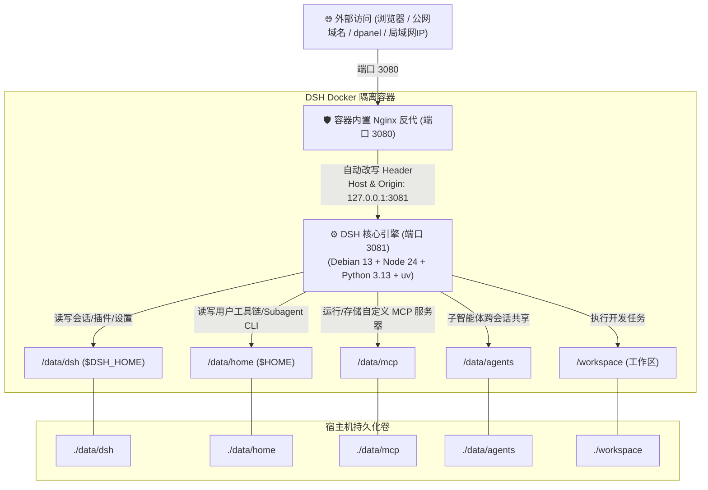

<div align="center">

# 🤖 DeepSeek Harness Docker (DSH-Docker)

<p align="center">
  <b>DeepSeek Harness 生产级 Docker 容器化本地构建与自主数据治理方案</b><br>
  本地一键构建 · 跨平台多架构 · 全数据持久化 · 反代免隧道 · Debian 13 + Python 3 + uv/MCP
</p>

[](https://opensource.org/licenses/MIT)
[-A81D33?style=flat-square&logo=debian&logoColor=white)](https://www.debian.org/)
[-339933?style=flat-square&logo=node.js&logoColor=white)](https://nodejs.org/)
[](https://www.python.org/)
[](https://astral.sh/uv)
[-2496ED?style=flat-square&logo=docker&logoColor=white)](https://www.docker.com/)
[]()
[](https://github.com/smallsinger/dsh-docker/pulls)

<p align="center">
  <a href="README.md"><b>简体中文</b></a> | <a href="README.en.md"><b>English</b></a>
</p>

</div>

---

## 💡 设计理念 (Design Philosophy)

本项目旨在为 **DeepSeek Harness (DSH)** 提供一个极其稳固、开箱即用且高度自主的生产级运行底座，核心遵循四大设计准则：

1. **不可变系统与两根持久化 (Immutable OS & Two-Root Persistence)**：
   - 操作系统、基础运行库（Debian 13 + Node 24 + Python 3.13 + uv）封装为不可变容器层；
   - 用户的所有资产与数据仅集中在 `./data`（环境/会话/配置/MCP/子智能体）与 `./workspace`（项目代码）中，宿主机无任何散碎系统垃圾，备份迁移只需打包两个目录。
2. **纯本地自主闭环构建 (100% Local Self-Contained Build)**：
   - 彻底摆脱对第三方镜像仓库的依赖，本地 Docker 自动抓取官方最新源码、自动注入沙箱补丁并完成编译，确保代码链路 100% 纯净可审计。
3. **无感回环安全反代屏障 (Transparent Loopback Shield)**：
   - 容器内部内置轻量级反代机制，自动将外部域名/IP 请求头伪装为合法的本地回环（`127.0.0.1`），彻底消除公网访问时设置空白与凭据受限问题。
4. **智能体全权限数据治理 (Autonomous Agent Governance)**：
   - 容器启动自动纠正数据卷属主权限（`gosu node` 降权安全运行），沙箱白名单完全放行持久化目录，Agent 拥有对自身会话历史（`sessions/`）、工具链、MCP 服务和插件的 100% 自主管理权限。

---

## 🏗️ 整体架构与请求流向



---

## 🚦 用户场景分流指引

| 用户场景 | 操作系统 | 推荐操作 | 说明 |
|---|---|---|---|
| **首次启动 / 常规运行** | **Windows** | 双击 **`start.bat`** | 自动检查 Docker、本地编译镜像、启动容器并自动打开浏览器 |
| **首次启动 / 常规运行** | **Linux / macOS** | 运行 **`./start.sh`** | 自动完成本地构建并后台启动容器 |
| **同步官方最新源码** | **Windows** | 双击 **`update.bat`** | 在线拉取官方最新 Commit，本地重新编译并秒级重启，自动清理临时缓存 |
| **同步官方最新源码** | **Linux / macOS** | 运行 **`./update.sh`** | 一键无缓存编译更新，自动保留全部会话与配置，清理悬空镜像 |
| **面板反代管理 (dpanel/1Panel)** | **全平台** | 目标填写 `http://127.0.0.1:3080` | 走宿主机静态映射端口，容器无论如何更新重建，**反代永远不失效** |

---

## 📂 项目层级结构

```text
dsh_docker/
├── 📄 docker-compose.yml     # 容器编排定义（固定端口、持久化挂载、健康检查）
├── 📄 Dockerfile             # Debian 13 + Python 3 + uv + 多阶段极致瘦身编译
├── 🚀 start.bat              # Windows 1 键本地构建与启动（带浏览器自动唤起）
├── 🚀 start.sh               # Linux / macOS 1 键启动脚本
├── 🔄 update.bat             # Windows 1 键同步官方源码更新构建
├── 🔄 update.sh              # Linux / macOS 1 键同步官方源码更新构建
├── 📂 bin/
│   ├── dsh                   # DSH 核心 CLI 包装脚本
│   └── entrypoint.sh         # 容器入口（权限守护、SSH 权限修正、配置初始化、降权启动）
├── 📂 dsh-home/
│   ├── cordis.patch.yml      # 机器级网络与服务覆盖配置
│   └── skills/               # 预置技能库（内置 container-environment SOP）
├── 📂 nginx/
│   └── dsh-nginx.conf        # 容器内轻量回环伪装反向代理配置
├── 📂 data/                  # 💾 核心数据持久化目录（Git 忽略数据内容）
│   ├── dsh/                  # 会话历史 (sessions/)、插件 (profiles/)、settings.yaml
│   ├── home/                 # Linux 用户家目录 (~/.local, ~/.npm-global, ~/.ssh, ~/.cache)
│   ├── mcp/                  # 🌟 自定义 MCP 服务器源码、独立虚拟环境与数据
│   └── agents/               # 智能体共享存储与记忆
└── 📂 workspace/             # 💻 Agent 项目开发工作区（挂载宿主代码）
```

---

## 🚀 极简快速上手

### Windows 用户

1. 下载或克隆本仓库到本地；
2. 双击运行 **`start.bat`**；
3. 脚本会自动进行本地 Docker 镜像构建，并在构建完成后自动打开浏览器：`http://127.0.0.1:3080`。

### Linux / macOS 用户

```bash
# 1. 克隆本仓库
git clone https://github.com/smallsinger/dsh-docker.git
cd dsh-docker

# 2. 一键启动
./start.sh
```

或使用标准 Docker Compose 命令：

```bash
docker compose up -d --build
```

---

## 🔄 官方源码一键同步与更新

当 DeepSeek 官方发布新功能或 Bug 修复时：

- **Windows 用户**：直接双击运行 **`update.bat`**；
- **Linux / macOS 用户**：终端执行 **`./update.sh`**。

> **自动化保障**：脚本会自动使用 `--no-cache` 抓取官方 master 分支最新代码重新编译，无缝热替换容器，并自动回收所有临时编译垃圾！**您的所有会话、插件、MCP 配置 100% 完整保留**。

---

## 🔧 核心技术解密：公网/反代下插件与设置页面空白的根治方案

### 1. 痛点根源
DeepSeek Harness 官方前端在 `packages/client/ui-settings/lib/client.js` 中包含一段回环检测逻辑：
```javascript
// 官方原生判断：
settingsScope: connection.isLoopback ? "host" : "memory"
```
当通过 **公网域名、外部 IP 或面板反向代理** 访问时，`connection.isLoopback` 返回 `false`，导致设置作用域被强制降级为纯内存态（`"memory"`）。
- **严重影响**：设置页面直接白屏/空白、输入的 API Key 无法持久化保存、插件配置面板无法加载。

### 2. 本项目的“双保险”根治方案
1. **代码级持久化补丁（Code-level Patch）**：
   在 `Dockerfile` 构建阶段自动将前端产物中的 `connection.isLoopback ? "host" : "memory"` 强制修正为 `"host"`，确保任何网络环境下设置均落盘至 `/data/dsh/settings.yaml`；
2. **网络级回环伪装屏障（Network-level Reverse Proxy）**：
   容器内置 Nginx 将外部请求无感伪装为 `Host: 127.0.0.1:3081` 与 `Origin: http://127.0.0.1:3081`，使得后端核心引擎的安全断言 100% 通过。

---

## 🔌 子智能体 CLI 与 MCP 服务器扩展指南

### 1. 安装子 Agent CLI 工具（容器重建不丢失）
容器内置全局 PATH：`$HOME/.local/bin` 与 `$HOME/.npm-global/bin`。
- **Python 工具 (如 aider, goose)**：`uv tool install aider-chat` 或 `pip install --user <pkg>`，生成命令持久保存在 `/data/home/.local/bin`；
- **Node 工具 (如 claude-cli)**：`npm install -g <pkg>`，生成命令持久保存在 `/data/home/.npm-global/bin`；
- **子 Agent 状态与记忆**：存放在专用挂载点 `/data/agents/`。

### 2. 运行 MCP（Model Context Protocol）服务器
- **开源/标准 MCP（通过内置 uvx / npx 秒级启动）**：
  ```bash
  uvx mcp-server-fetch
  uvx mcp-server-sqlite --db-path /data/mcp/sqlite.db
  npx -y @modelcontextprotocol/server-filesystem /workspace
  ```
- **本地编写的独立 MCP 服务**：
  直接放在挂载目录 `./data/mcp/<服务名>/` 下（内含专属 `venv` 或 `node_modules`），在 DSH 配置中直接调用，升级构建永不丢失。

---

## 🌐 反向代理与 dpanel 固化配置指南

### 1. dpanel / 宝塔 / 1Panel 转发“重建后失效”的根治方案

在各种 Docker 管理面板中添加反向代理时：
- **强烈推荐做法**：代理目标直接填写 **`http://127.0.0.1:3080`**（宿主机本地回环与静态端口）；
- **原理**：本项目已固化宿主机映射端口 `3080:3080`。容器无论怎么重建、销毁、升级，宿主机端口永远固定，**面板反代一次配置终身有效**！

### 2. 标准 Nginx 反向代理配置

```nginx
server {
    listen 80;
    server_name dsh.yourdomain.com;
    client_max_body_size 0;

    location / {
        proxy_pass http://127.0.0.1:3080;
        proxy_http_version 1.1;
        proxy_set_header Upgrade $http_upgrade;
        proxy_set_header Connection "upgrade";
        proxy_set_header Host $host;
        proxy_set_header X-Forwarded-Host $host;
        proxy_set_header X-Forwarded-For $proxy_add_x_forwarded_for;
        proxy_set_header X-Forwarded-Proto $scheme;
        proxy_read_timeout 3600s;
    }
}
```

---

## 🔒 公网访问安全加固指南

> [!WARNING]
> DeepSeek Harness 原生未设登录鉴权，若将 3080 端口直接暴露在公网，存在被他人调用的风险。建议采用以下安全方案之一：

- **方案 A：Cloudflare Zero Trust Tunnels（推荐）**
  - 将 Tunnel 指向 `http://localhost:3080`；
  - 开启 Access 策略，通过 GitHub / Google OAuth 或邮箱验证码验证访问。
- **方案 B：Host Nginx HTTP Basic Auth**
  - 在宿主机反代配置中启用账号密码保护（`auth_basic`）。
- **方案 C：Tailscale / WireGuard 私有内网**
  - 不对外开放任何公网端口，仅限 Tailscale 组网内设备访问。

---

## 🧩 智能体插件自主安装 SOP

本项目内置了 `container-environment` 专属技能。在 Web 界面中，您可以直接对 Agent 说：

> 💬 *“帮我安装会话管理插件，并清理无用的归档会话”*

Agent 会自动遵循预置 SOP：
1. **安装**：自动在 `$DSH_HOME/profiles/web/package.json` 添加依赖并安全执行安装；
2. **配置校验**：自动校验 `cordis.patch.yml` 语法有效性；
3. **数据管理**：直接进入 `/data/dsh/sessions/` 对过期归档文件执行清理；
4. **生效**：向用户发出完成通知并自动触发服务热重载。

---

## 📄 开源许可证

本项目基于 [MIT License](LICENSE) 协议开源。