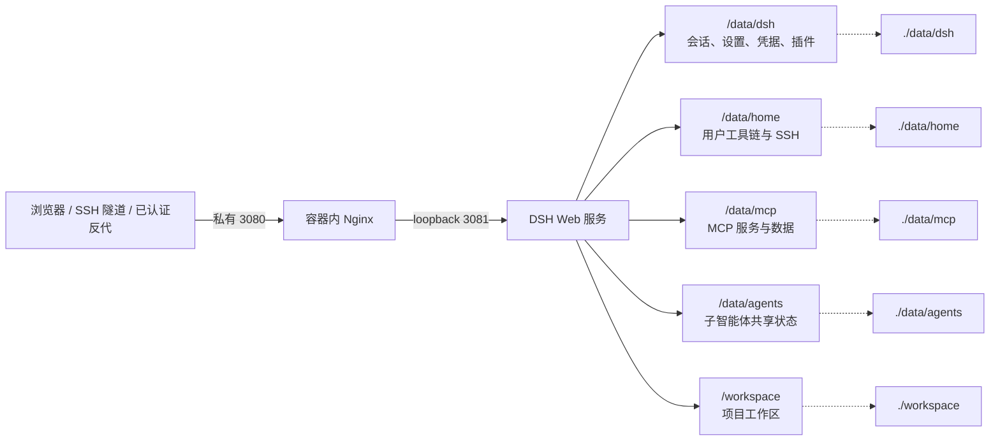

# dsh-docker

DeepSeek Harness 的本地 Docker 构建与持久化运行方案。

[](https://www.kernel.org/)
[](https://www.docker.com/)
[](LICENSE)

[简体中文](README.md) · [English](README.en.md)

## 安装与配置

安装器会询问本次操作、容器内运行用户、访问保护方式、反向代理位置、域名和端口绑定，并自动写入 `.env`。选择内置 Basic Auth 时，密码只以 bcrypt 哈希保存到 `data/auth/htpasswd`。

Linux：

```bash
curl -fsSL https://raw.githubusercontent.com/univers629/dsh-docker/main/install.sh | bash
```

本项目当前只维护 Linux Docker 部署。容器默认使用容器内 `root`，可显式选择 `node`；容器内 root 不会授予宿主机 root、Docker socket 或特权容器权限。

无人值守安装示例：

```bash
curl -fsSL https://raw.githubusercontent.com/univers629/dsh-docker/main/install.sh | bash -s -- install --user --access local --non-interactive
```

在已下载的工程目录中执行 `bash install.sh --help` 可查看全部参数。

## 日常管理

首次安装后，日常只需要管理同一个容器：

```text
Linux: ./dsh.sh [start|update|stop|restart|logs|status|shell|remove]
```

`start` 只在容器尚不存在时构建 Debian 13 镜像；之后只启动原容器。`stop`、`restart` 和容器内 Agent 执行的 `apt install` 都保留在同一个容器可写层。`remove`/`down` 会删除容器可写层，只有 `/data` 和 `/workspace` 绑定挂载会保留。不要把 `update` 当成项目或镜像更新，它只是从容器内源码构建并替换 DSH。

## 公网访问与认证

DSH 本身不提供登录认证。安装器默认将 3080 绑定到 `127.0.0.1`，公网访问必须经过 HTTPS 和认证入口；不要使用 `0.0.0.0`、`::` 或其他通配绑定。

安装器提供三种访问模式：

1. `local`：仅本机或 SSH 隧道访问。
2. `trusted-proxy`：由 Cloudflare Access、dPanel、宿主机 Nginx、私有 VPN 或其他外层入口负责认证；安装器可记录 trusted hosts 和外部 Docker 网络。
3. `basic`：由容器内 Nginx 使用 bcrypt 密码文件认证。它不提供 MFA，公网部署仍应在外层启用 HTTPS。

Cloudflare Access/OIDC + MFA 的安全能力高于单纯 Basic Auth。Caddy、Nginx 和容器内 Nginx 的反代性能差异对 DSH 使用场景可以忽略。

宿主机 Nginx 示例（证书路径替换为实际文件；认证配置按所选模式补充）：

```nginx
server {
    listen 443 ssl;
    server_name dsh.example.com;
    ssl_certificate /path/to/fullchain.pem;
    ssl_certificate_key /path/to/privkey.pem;

    location / {
        proxy_pass http://127.0.0.1:3080;
        proxy_http_version 1.1;
        proxy_set_header Upgrade $http_upgrade;
        proxy_set_header Connection "upgrade";
        proxy_set_header Host $host;
        proxy_set_header X-Forwarded-Host $host;
        proxy_set_header X-Forwarded-For $proxy_add_x_forwarded_for;
        proxy_set_header X-Forwarded-Proto $scheme;
        proxy_read_timeout 3600s;
    }
}
```

使用 Docker 面板反代时，在安装器中选择 Docker 容器/面板并填写面板网络名（通常是 `dpanel-local`），上游使用 `http://dsh:3080`。宿主机反代或 SSH 隧道使用 `http://127.0.0.1:3080`。

## 架构与持久化



持久化目录：

这些目录通过绑定挂载持久化。Debian 系统本身（包括 `/usr`、`/etc`、`/var`）留在容器可写层中，不使用覆盖系统目录的 overlay；因此同一个容器停止、启动或重启后，Agent 安装的 apt 软件和系统配置仍在。

| 容器路径 | 宿主机路径 | 内容 |
| --- | --- | --- |
| `/data/dsh` | `data/dsh` | 会话、设置、凭据、profile 和内置插件 |
| `/data/home` | `data/home` | 用户家目录、SSH、npm/uv 工具链和缓存 |
| `/data/mcp` | `data/mcp` | 自定义 MCP 源码、虚拟环境和数据 |
| `/data/agents` | `data/agents` | 子智能体共享状态 |
| `/workspace` | `workspace` | Agent 工作区 |
| `/usr`、`/etc`、`/var` | 容器可写层（不单独挂载） | Debian 系统、Agent 用 `apt` 安装的软件、配置和 apt 缓存；`/bin`、`/sbin`、`/lib` 在 Debian usr-merge 下跟随 `/usr` |

删除容器（`docker rm` 或 `docker compose down`）会删除这部分系统可写层；重新 `start` 会得到初始 Debian 13 系统。`/data`、`/workspace` 和 Docker 镜像本身不因此自动删除。

## 项目特殊处理

<details>
<summary>展开查看内置控制、权限和稳定性说明</summary>

### 内置控制插件

镜像自带 `dsh-docker-control`，首次启动空 profile 时自动恢复。设置页显示 DSH 版本并提供“更新 DSH”按钮；更新在容器内拉取源码、应用当前补丁、编译并原子替换，失败时保留旧版本，不需要 SSH。设置页还提供重启 DSH 和 WebUI 配置文件编辑器，编辑器固定读写 `/data/dsh/settings.yaml`，保存前校验 YAML 并保护并发修改。

### WebUI 与反代稳定性

配置编辑器使用独立 portal 和固定高度滚动区域，避免设置页闪烁、输入框高度跳动和白屏。内置 WebSocket keepalive 补丁用于降低空闲反代断开导致的 UI 假死。

通过公网域名访问时，容器 Nginx 只在请求已经通过内置 Basic Auth 或可信外层认证后，将请求转为 DSH 的内部回环访问。`DSH_TRUSTED_HOSTS` 只校验浏览器 authority，不等同于登录认证，也不会自动打开插件的远程设置写权限；此类授权仍由对应插件设置页明确控制。

### 权限边界

Linux 安装器默认使用容器内 `root`；可传入 `--user` 改为 `node`。入口脚本会修正挂载目录属主并保护凭据和 SSH 私钥权限。容器内 `root` 不启用 privileged、不挂载 Docker socket，也不获得宿主机管理员权限。

### 插件与工具链

插件安装、会话管理和 MCP 部署所需的 `/data` 写权限已纳入沙箱。通过 `apt` 安装的软件写入标准 Debian 路径并持久化在该容器的可写层；Python/Node 工具链分别放在 `/data/home/.local` 和 `/data/home/.npm-global`。容器启动时会根据 `DSH_SYSTEM_*`、`DSH_RUN_AS_ROOT` 和权限变量渲染实际的 `container-environment` skill。

</details>

## 许可证

[MIT License](LICENSE)
