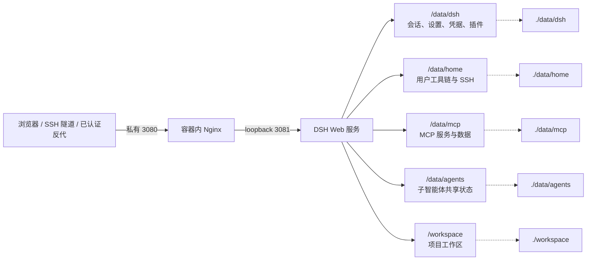

# dsh-docker

DeepSeek Harness 的本地 Docker 构建与持久化运行方案，提供可由 Agent 持续安装软件和开发的预制 Debian 13 环境。

[](https://www.kernel.org/)
[](https://www.microsoft.com/windows)
[](https://www.debian.org/releases/trixie/)
[](https://www.docker.com/)
[](LICENSE)

[简体中文](README.md) · [English](README.en.md)

## 运行配置建议

| 用法 | CPU / 内存 | 磁盘 | 说明 |
| --- | --- | --- | --- |
| 拉取预构建镜像（默认） | 1 vCPU / 2 GB | ≥ 10 GB | 不在本机编译 DSH，安装耗时基本等于下载耗时 |
| 长期给 Agent 折腾 | 2 vCPU / 4 GB | ≥ 20 GB | 容器内 apt 安装的工具链都留在同一个可写层 |
| 在本机构建镜像 | ≥ 4 vCPU / 8 GB | ≥ 25 GB | `pnpm install` 加 TypeScript 编译是单线程重负载 |

内存低于 2 GB 的机器请使用预构建镜像，并配置 swap：在 1 vCPU / 1 GB 的 VPS 上本机构建会持续换页，`pnpm run build:official` 常超过 20 分钟，也可能被 OOM 终止。镜像解包后约 3.3 GB。

### 镜像来源

安装器的第一个问题是 Debian 13 镜像来源：

1. **预构建（默认）**：拉取 `ghcr.io/univers629/dsh-docker:latest`，同一个多架构清单覆盖 `linux/amd64` 和 `linux/arm64`。
2. **本机构建**：用当前工程的 `Dockerfile` 编译。

拉取失败时安装器会自动退回本机构建，并把实际来源写进 `.env` 的 `DSH_IMAGE` 与 `DSH_IMAGE_SOURCE`。非交互安装用 `--image-source prebuilt|build`，自定义引用用 `--image REF`；Windows 对应 `-ImageSource` 和 `-Image`。

镜像由 [.github/workflows/publish-image.yml](.github/workflows/publish-image.yml) 在 GitHub 原生 amd64 与 arm64 runner 上分别构建后合并成多架构清单，手动触发时可以指定要编译的 DSH 上游分支。发布镜像是某一时刻的快照；之后用 WebUI 的“DSH 环境”页或 `./dsh.sh update` 在容器内更新 DSH 本体。

首次发布后需要手动把 GitHub Packages 里的 `dsh-docker` 包可见性改成 public（仓库 → Packages → Package settings → Change visibility）。GHCR 新建的包默认私有，服务器上匿名拉取会得到 `denied`，安装器随后会退回本机构建。

## 安装与配置

安装器会询问本次操作、访问保护方式、反向代理位置、域名和端口绑定，并自动写入 `.env`。选择内置 Basic Auth 时，密码只以 bcrypt 哈希保存到 `data/auth/htpasswd`。DSH 和 Agent 固定使用容器内 root，以便直接通过 apt 管理开发工具；这不会授予宿主机 root、Docker socket 或特权容器权限。

Linux：

```bash
curl -fsSL https://raw.githubusercontent.com/univers629/dsh-docker/main/install.sh | bash
```

Windows PowerShell（需要 Docker Desktop，并切换到 Linux containers）：

```powershell
irm https://raw.githubusercontent.com/univers629/dsh-docker/main/install.ps1 | iex
```

Linux 和 Windows 安装器都会获取项目、准备 Debian 13 镜像（默认拉取预构建镜像）并启动同一套容器运行时。Windows 安装器会在需要时自动启动 Docker Desktop Linux Engine。

无人值守安装示例：

```bash
curl -fsSL https://raw.githubusercontent.com/univers629/dsh-docker/main/install.sh | bash -s -- install --access local --image-source prebuilt --non-interactive
```

在已下载的工程目录中执行 `bash install.sh --help` 可查看 Linux 参数；Windows 可直接运行 `powershell -ExecutionPolicy Bypass -File .\install.ps1`。

## 日常管理

首次安装后，日常只需要管理同一个容器：

```text
Linux: ./dsh.sh [start|update|stop|restart|logs|status|shell|remove]
Windows: .\dsh.bat [start|update|stop|restart|logs|status|shell|remove]
```

`start` 只在容器尚不存在时准备 Debian 13 镜像（按 `.env` 记录的来源拉取或构建）；之后只启动原容器。`stop`、`restart` 和容器内 Agent 执行的 `apt install` 都保留在同一个容器可写层。`remove`/`down` 会删除容器可写层，只有 `/data` 和 `/workspace` 绑定挂载会保留。不要把 `update` 当成项目或镜像更新，它只是从容器内源码构建并替换 DSH。

如需在服务器上彻底清空本项目后重新安装，请在工程目录中重新运行安装器并选择“删除”（菜单第 8 项），或执行：

```bash
./install.sh delete
```

Windows PowerShell：

```powershell
powershell -ExecutionPolicy Bypass -File .\install.ps1 -DshAction delete
```

删除会精确清理 `dsh` 容器、DSH 镜像（`dsh:*` 以及 `.env` 记录的预构建引用）、本项目挂载和网络、全局 Docker 构建缓存以及工程目录；需要输入 `DELETE` 确认。不会使用 `name=dsh` 子串筛选，也不会删除外部共享网络（例如 `dpanel-local`）。无论在工程目录内还是在它的上一级目录执行，安装器都会先把自己复制到临时目录再删除，脚本文件和当前目录不会因为位于被删目录内而中断删除。

## 公网访问与认证

DSH 本身不提供登录认证。安装器默认将 3080 绑定到 `127.0.0.1`，公网访问必须经过 HTTPS 和认证入口；不要使用 `0.0.0.0`、`::` 或其他通配绑定。

安装器提供三种访问模式：

1. `local`：仅本机或 SSH 隧道访问。
2. `trusted-proxy`：由 Cloudflare Access、dPanel、宿主机 Nginx、私有 VPN 或其他外层入口负责认证；安装器可记录 trusted hosts 和外部 Docker 网络。
3. `basic`：由容器内 Nginx 使用 bcrypt 密码文件认证。它不提供 MFA，公网部署仍应在外层启用 HTTPS。

Cloudflare Access/OIDC + MFA 的安全能力高于单纯 Basic Auth。Caddy、Nginx 和容器内 Nginx 的反代性能差异对 DSH 使用场景可以忽略。

宿主机 Nginx 示例（证书路径替换为实际文件；认证配置按所选模式补充）：

```nginx
server {
    listen 443 ssl;
    server_name dsh.example.com;
    ssl_certificate /path/to/fullchain.pem;
    ssl_certificate_key /path/to/privkey.pem;

    location / {
        proxy_pass http://127.0.0.1:3080;
        proxy_http_version 1.1;
        proxy_set_header Upgrade $http_upgrade;
        proxy_set_header Connection "upgrade";
        proxy_set_header Host $host;
        proxy_set_header X-Forwarded-Host $host;
        proxy_set_header X-Forwarded-For $proxy_add_x_forwarded_for;
        proxy_set_header X-Forwarded-Proto $scheme;
        proxy_read_timeout 3600s;
    }
}
```

使用 Docker 面板反代时，在安装器中选择 Docker 容器/面板并填写反代容器所在的网络名（dPanel 通常是 `dpanel-local`），上游使用 `http://dsh:3080`。宿主机反代或 SSH 隧道使用 `http://127.0.0.1:3080`。

外部网络必须先存在，Compose 不会代建。如果反代面板还没部署，直接填一个新名字（例如 `dsh-proxy`），安装器会征求同意后创建它；之后部署反代时执行 `docker network connect dsh-proxy <反代容器名>` 接入同一网络即可。`dsh-private` 是 DSH 自己管理的内部网络名，不能填成外部网络。

## 架构与持久化



持久化目录：

这些目录通过绑定挂载持久化。Debian 系统本身（包括 `/usr`、`/etc`、`/var`）留在容器可写层中，不使用覆盖系统目录的 overlay；因此同一个容器停止、启动或重启后，Agent 安装的 apt 软件和系统配置仍在。

| 容器路径 | 宿主机路径 | 内容 |
| --- | --- | --- |
| `/data/dsh` | `data/dsh` | 会话、设置、凭据、profile 和内置插件 |
| `/data/home` | `data/home` | 用户家目录、SSH、npm/uv 工具链和缓存 |
| `/data/mcp` | `data/mcp` | 自定义 MCP 源码、虚拟环境和数据 |
| `/data/agents` | `data/agents` | 子智能体共享状态 |
| `/workspace` | `workspace` | Agent 工作区 |
| `/usr`、`/etc`、`/var` | 容器可写层（不单独挂载） | Debian 系统、Agent 用 `apt` 安装的软件、配置和 apt 缓存；`/bin`、`/sbin`、`/lib` 在 Debian usr-merge 下跟随 `/usr` |

删除容器（`docker rm` 或 `docker compose down`）会删除这部分系统可写层；重新 `start` 会得到初始 Debian 13 系统。`/data`、`/workspace` 和 Docker 镜像本身不因此自动删除。

## 项目特殊处理

<details>
<summary>展开查看内置控制、权限和稳定性说明</summary>

### 内置控制插件

镜像自带 `dsh-docker-control`，首次启动空 profile 时自动恢复。它在设置窗口左侧导航新增“DSH 环境”页（与“通用设置 / 模型 / 插件 / Agent 预设”同级），显示当前与最新 DSH 版本，提供“检查更新”“立即更新”，以及“电脑 UI / 手机 UI”布局选择器。打开设置不会自动联网，只有按下“检查更新”才会查询上游分支；手机布局把设置面板改为全屏、左侧导航改为可横向滑动的顶部标签条，并把首页侧边栏改成抽屉：收起时完全让位给对话区，左上角的浮动按钮负责展开，展开后浮在对话之上而不是挤压它。首次访问按浏览器 UA 自动选择布局。更新在容器内拉取源码、应用当前补丁、编译并原子替换，失败时保留旧版本，不需要 SSH。更新和“重启 DSH”都只替换 Supervisor 管理的 DSH 子进程，不重启 Debian 容器或 Nginx。设置窗口顶部还提供 WebUI 配置文件编辑器，编辑器固定读写 `/data/dsh/settings.yaml`，保存前校验 YAML 并保护并发修改。

容器内 Agent 应使用 `manage-dsh-plugin` 安装、更新或删除插件。它会在 `/data/dsh/profiles` 下创建同卷临时 profile，允许 pnpm 执行插件所需的构建脚本，通过配置、入口解析和实际导入验证后再原子替换正式 profile。正常结束会立即删除临时 profile 和本次 pnpm Git 构建临时目录；断电或强制终止留下的事务和旧备份会在下一次 DSH 启动或插件操作时自动恢复、清理。pnpm 的内容寻址 store 是 `/data/home` 下有意保留的下载缓存，可在需要释放空间时执行 `pnpm store prune`。

### WebUI 与反代稳定性

配置编辑器使用独立 portal 和固定高度滚动区域，避免设置页闪烁、输入框高度跳动和白屏。内置 WebSocket keepalive 补丁用于降低空闲反代断开导致的 UI 假死。

通过公网域名访问时，容器 Nginx 只在请求已经通过内置 Basic Auth 或可信外层认证后，将请求转为 DSH 的内部回环访问。`DSH_TRUSTED_HOSTS` 只校验浏览器 authority，不等同于登录认证，也不会自动打开插件的远程设置写权限；此类授权仍由对应插件设置页明确控制。

### 权限边界

DSH 和 Agent 固定使用容器内 `root`，入口脚本会保护凭据和 SSH 私钥权限。容器不启用 privileged、不挂载 Docker socket，容器内 root 也不获得宿主机管理员权限。

### 插件与工具链

插件安装、会话管理和 MCP 部署所需的 `/data` 写权限已纳入沙箱。通过 `apt` 安装的软件写入标准 Debian 路径并持久化在该容器的可写层；Python/Node 工具链分别放在 `/data/home/.local` 和 `/data/home/.npm-global`。容器启动时会根据实际系统、架构和权限变量渲染 `container-environment` skill。

</details>

## 许可证

[MIT License](LICENSE)
