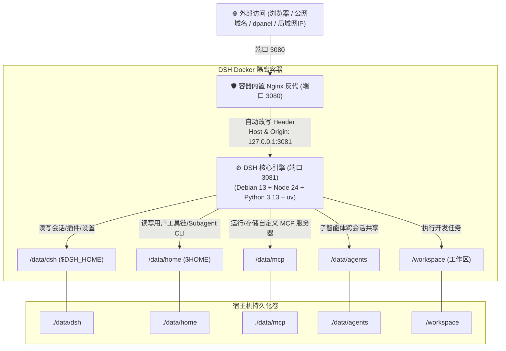

<div align="center">

# 🤖 DeepSeek Harness Docker (DSH-Docker)

<p align="center">
  <b>DeepSeek Harness 生产级 Docker 容器化本地构建与自主数据治理方案</b><br>
  一行流极速安装 · 本地一键构建 · 全数据持久化 · 反代免隧道 · Debian 13 + Python 3 + uv/MCP
</p>

[]()
[](https://opensource.org/licenses/MIT)
[-A81D33?style=flat-square&logo=debian&logoColor=white)](https://www.debian.org/)
[-339933?style=flat-square&logo=node.js&logoColor=white)](https://nodejs.org/)
[](https://www.python.org/)
[](https://astral.sh/uv)
[-2496ED?style=flat-square&logo=docker&logoColor=white)](https://www.docker.com/)
[](https://github.com/univers629/dsh-docker-dev/pulls)

<p align="center">
  <a href="README.md"><b>简体中文</b></a> | <a href="README.en.md"><b>English</b></a>
</p>

</div>

---

> [!NOTE]
> **免责声明 (Disclaimer)**：本项目为社区独立维护的 DeepSeek Harness 生产级容器化运行环境（Unverified Community Edition），与 DeepSeek 官方无官方直接隶属关系。代码基于官方开源仓库构建，遵循 MIT 开源协议。

---

## ⚡ 一行流极速安装 (推荐)

无需手动克隆完整仓库，复制单行命令即可全自动安装、本地构建并启动服务：

### 🪟 Windows (PowerShell)
```powershell
irm https://raw.githubusercontent.com/univers629/dsh-docker-dev/main/install.ps1 | iex
```

### 🐧 Linux / 🍏 macOS (Bash)
```bash
curl -fsSL https://raw.githubusercontent.com/univers629/dsh-docker-dev/main/install.sh | bash
```

> [!TIP]
> **⏱️ 构建耗时提示 (Build Duration Note)**：
> - **初次全新构建**：由于需要从官方源码全量编译 Monorepo、前端产物及原生扩展，在普通 VPS 或 ARM 实例（如 Oracle ARM）上耗时通常约为 **300 ~ 360 秒（5~6 分钟）**，请耐心等待构建完成；
> - **后续日常启动与重启**：得益于 BuildKit 完整缓存和持久化卷，后续启动 **仅需 1 ~ 3 秒即可极速就绪**！

---

## 💡 设计理念 (Design Philosophy)

本项目旨在为 **DeepSeek Harness (DSH)** 提供一个极其稳固、开箱即用且高度自主的生产级运行底座，核心遵循四大设计准则：

1. **不可变系统与两根持久化 (Immutable OS & Two-Root Persistence)**：
   - 操作系统、基础运行库（Debian 13 + Node 24 + Python 3.13 + uv + procps）封装为不可变容器层；
   - 用户的所有资产与数据仅集中在 `./data`（环境/会话/配置/MCP/子智能体）与 `./workspace`（项目代码）中，宿主机无任何散碎系统垃圾，备份迁移只需打包两个目录。
2. **纯本地自主闭环构建 (100% Local Self-Contained Build)**：
   - 彻底摆脱对第三方镜像仓库的依赖，本地 Docker 自动抓取官方最新源码、自动注入沙箱补丁并完成编译，确保代码链路 100% 纯净可审计。
3. **无感回环安全反代屏障 (Transparent Loopback Shield)**：
   - 容器内部内置轻量级反代机制，自动将外部域名/IP 请求头伪装为合法的本地回环（`127.0.0.1`），彻底消除公网访问时设置空白与凭据受限问题。
4. **智能体全权限数据治理与安全守护 (Agent Governance & Security Guard)**：
   - 容器启动自动纠正数据卷属主权限（`gosu node` 降权安全运行），严格守护 `.credentials.yaml`（`600`）与 SSH 密钥权限，预装 `procps`（`pkill`/`pgrep`），沙箱白名单完全放行持久化目录。

---

## 🏗️ 整体架构与请求流向



---

## 🚦 用户场景分流指引

| 用户场景 | 操作系统 | 推荐操作 | 说明 |
|---|---|---|---|
| **一行流极速安装** | **Windows** | `irm https://raw.githubusercontent.com/univers629/dsh-docker-dev/main/install.ps1 \| iex` | 自动下载、本地编译镜像、启动容器并自动打开浏览器 |
| **一行流极速安装** | **Linux / macOS** | `curl -fsSL https://raw.githubusercontent.com/univers629/dsh-docker-dev/main/install.sh \| bash` | 自动下载并后台启动容器 |
| **日常管理 (启动/停止/日志)** | **Windows** | 双击 **`dsh.bat`** 或 `.\dsh.bat [start\|stop\|logs]` | 统一高颜值管理 CLI |
| **日常管理 (启动/停止/日志)** | **Linux / macOS** | `./dsh.sh [start\|stop\|logs\|status]` | 统一高颜值管理 CLI |
| **同步官方最新源码** | **全平台** | `.\dsh.bat update` 或 `./dsh.sh update` | 在线拉取官方最新 Commit，秒级重新编译，自动清理垃圾缓存 |
| **面板反代管理 (dpanel/1Panel)** | **全平台** | 目标填写 `http://127.0.0.1:3080` | 走宿主机静态映射端口，容器无论如何更新重建，**反代永远不失效** |

---

## 📂 项目层级结构

```text
dsh_docker/
├── 📄 docker-compose.yml     # 容器编排定义（固定端口、持久化挂载、健康检查）
├── 📄 Dockerfile             # Debian 13 + Python 3 + uv + procps + 多阶段编译
├── 🚀 dsh.bat                # Windows 统一管理脚本（双击默认启动并打开浏览器）
├── 🚀 dsh.sh                 # Linux / macOS 统一管理脚本
├── ⚡ install.ps1            # Windows 一行流安装器
├── ⚡ install.sh             # Linux / macOS 一行流安装器
├── 📂 bin/
│   ├── dsh                   # DSH 核心 CLI 包装脚本
│   └── entrypoint.sh         # 容器入口（权限守护、密钥600保护、SSH守护、降权启动）
├── 📂 dsh-home/
│   ├── cordis.patch.yml      # 机器级网络与服务覆盖配置
│   └── skills/               # 预置技能库（内置 container-environment SOP）
├── 📂 nginx/
│   └── dsh-nginx.conf        # 容器内轻量回环伪装反向代理配置
├── 📂 data/                  # 💾 核心数据持久化目录（Git 忽略数据内容）
│   ├── dsh/                  # 会话历史 (sessions/)、插件 (profiles/)、.credentials.yaml、settings.yaml
│   ├── home/                 # Linux 用户家目录 (~/.local, ~/.npm-global, ~/.ssh, ~/.cache)
│   ├── mcp/                  # 🌟 自定义 MCP 服务器源码、独立虚拟环境与数据
│   └── agents/               # 智能体共享存储与记忆
└── 📂 workspace/             # 💻 Agent 项目开发工作区（挂载宿主代码）
```

---

## 🔐 生产级权限保护与进程管理实战总结

在长期的生产环境部署中，本项目积累并预置了以下核心防御措施：

### 1. 密钥安全断言守护（Mode 600 严格隔离）
- **官方断言机制**：DSH `@deepseek-ai/dsh-credentials-local` 对 `/data/dsh/.credentials.yaml` 实施了严格的安全断言，如果文件权限超出所有者可读写（例如 `660`），系统将**硬性拒绝启动**以防密钥泄漏；
- **自动纠偏锁**：[`bin/entrypoint.sh`](bin/entrypoint.sh) 在容器每次启动时，会自动对全盘 `/data` 进行属主纠正的同时，**强制锁定所有的 `*credentials*.yaml` 为 `600`**，既保证了多用户挂载不冲突，又完全满足官方严苛的安全断言。

### 2. 安全的插件生命周期管理
- 容器内置 `procps` 供诊断使用，同时提供 `/usr/local/bin/manage-dsh-plugin`，负责安装、更新、删除插件和校验 profile 配置。
- 脚本会显示包管理与配置校验的阶段性中文信息，并在当前 Agent 回复持久化完成后精确、优雅地重启 DSH，避免只看到红色的“工具结果未知”。

---

## 🔧 核心技术解密：公网/反代下插件与设置页面空白的根治方案

### 1. 痛点根源
DeepSeek Harness 官方前端在 `packages/client/ui-settings/lib/client.js` 中包含一段回环检测逻辑：
```javascript
// 官方原生判断：
settingsScope: connection.isLoopback ? "host" : "memory"
```
当通过 **公网域名、外部 IP 或面板反向代理** 访问时，`connection.isLoopback` 返回 `false`，导致设置作用域被强制降级为纯内存态（`"memory"`）。
- **严重影响**：设置页面直接白屏/空白、输入的 API Key 无法持久化保存、插件配置面板无法加载。

### 2. 本项目的“双保险”根治方案
1. **代码级持久化补丁（Code-level Patch）**：
   在 `Dockerfile` 构建阶段自动将前端产物中的 `connection.isLoopback ? "host" : "memory"` 强制修正为 `"host"`，确保任何网络环境下设置均落盘至 `/data/dsh/settings.yaml`；
2. **网络级回环伪装屏障（Network-level Reverse Proxy）**：
   容器内置 Nginx 将外部请求无感伪装为 `Host: 127.0.0.1:3081` 与 `Origin: http://127.0.0.1:3081`，使得后端核心引擎的安全断言 100% 通过。

---

## 🛡️ 沙箱权限模式与插件报错解决机制

在 `docker-compose.yml` 中：
```yaml
environment:
  DSH_PERMISSION_MODE: "danger-full-access"
```
- **原生沙箱痛点**：官方原生在 `workspace-write` 模式下仅允许写入 `/workspace` 和 `/tmp`，导致 Agent 自主安装插件（写入 `/data/dsh/profiles`）或管理历史会话时抛出 `PermissionDenied` / `not strictly wider` 异常；
- **底层穿透保障**：本项目在构建时已深度打通了底层沙箱白名单（将 `/data` 原生纳入合法写权限集合）。即使切换为标准 `workspace-write` 模式，**插件安装、会话清理、MCP 部署也依然 100% 畅通无阻**。

---

## 🔌 子智能体 CLI 与 MCP 服务器扩展指南

### 1. 安装子 Agent CLI 工具（容器重建不丢失）
容器内置全局 PATH：`$HOME/.local/bin` 与 `$HOME/.npm-global/bin`。
- **Python 工具 (如 aider, goose)**：`uv tool install aider-chat` 或 `pip install --user <pkg>`，生成命令持久保存在 `/data/home/.local/bin`；
- **Node 工具 (如 claude-cli)**：`npm install -g <pkg>`，生成命令持久保存在 `/data/home/.npm-global/bin`；
- **子 Agent 状态与记忆**：存放在专用挂载点 `/data/agents/`。

### 2. 运行 MCP（Model Context Protocol）服务器
- **开源/标准 MCP（通过内置 uvx / npx 秒级启动）**：
  ```bash
  uvx mcp-server-fetch
  uvx mcp-server-sqlite --db-path /data/mcp/sqlite.db
  npx -y @modelcontextprotocol/server-filesystem /workspace
  ```
- **本地编写的独立 MCP 服务**：
  直接放在挂载目录 `./data/mcp/<服务名>/` 下（内含专属 `venv` 或 `node_modules`），在 DSH 配置中直接调用，升级构建永不丢失。

---

## 🌐 反向代理与 dpanel 固化配置指南

### 1. dpanel / 宝塔 / 1Panel 转发“重建后失效”的根治方案

在各种 Docker 管理面板中添加反向代理时：
- **强烈推荐做法**：代理目标直接填写 **`http://127.0.0.1:3080`**（宿主机本地回环与静态端口）；
- **原理**：本项目已固化宿主机映射端口 `3080:3080`。容器无论怎么重建、销毁、升级，宿主机端口永远固定，**面板反代一次配置终身有效**！

> 💡 **dpanel 专属一键连网命令**：若使用 `dsh.pod.dpanel.local` 并在重构容器后遇到 502，只需执行单行命令立即打通网桥：
> ```bash
> sudo docker network connect --alias dsh.pod.dpanel.local dpanel-local dsh
> ```

### 2. 标准 Nginx 反向代理配置

```nginx
server {
    listen 80;
    server_name dsh.yourdomain.com;
    client_max_body_size 0;

    location / {
        proxy_pass http://127.0.0.1:3080;
        proxy_http_version 1.1;
        proxy_set_header Upgrade $http_upgrade;
        proxy_set_header Connection "upgrade";
        proxy_set_header Host $host;
        proxy_set_header X-Forwarded-Host $host;
        proxy_set_header X-Forwarded-For $proxy_add_x_forwarded_for;
        proxy_set_header X-Forwarded-Proto $scheme;
        proxy_read_timeout 3600s;
    }
}
```

---

## 🔒 公网访问安全加固指南

> [!WARNING]
> DeepSeek Harness 原生未设登录鉴权，若将 3080 端口直接暴露在公网，存在被他人调用的风险。建议采用以下安全方案之一：

- **方案 A：Cloudflare Zero Trust Tunnels（推荐）**
  - 将 Tunnel 指向 `http://localhost:3080`；
  - 开启 Access 策略，通过 GitHub / Google OAuth 或邮箱验证码验证访问。
- **方案 B：Host Nginx HTTP Basic Auth**
  - 在宿主机反代配置中启用账号密码保护（`auth_basic`）。
- **方案 C：Tailscale / WireGuard 私有内网**
  - 不对外开放任何公网端口，仅限 Tailscale 组网内设备访问。

---

## 🧩 智能体插件自主安装 SOP

本项目内置了 `container-environment` 专属技能。在 Web 界面中，您可以直接对 Agent 说：

> 💬 *“帮我安装会话管理插件，并清理无用的归档会话”*

Agent 会自动遵循预置 SOP：
1. **安装**：自动在 `$DSH_HOME/profiles/web/package.json` 添加依赖并安全执行安装；
2. **配置校验**：自动校验 `cordis.patch.yml` 语法有效性；
3. **数据管理**：直接进入 `/data/dsh/sessions/` 对过期归档文件执行清理；
4. **生效**：向用户发出中文完成通知；当前回复结束后自动优雅重启 DSH，使插件组合变更生效。

---

## 📄 开源许可证

本项目基于 [MIT License](LICENSE) 协议开源。
