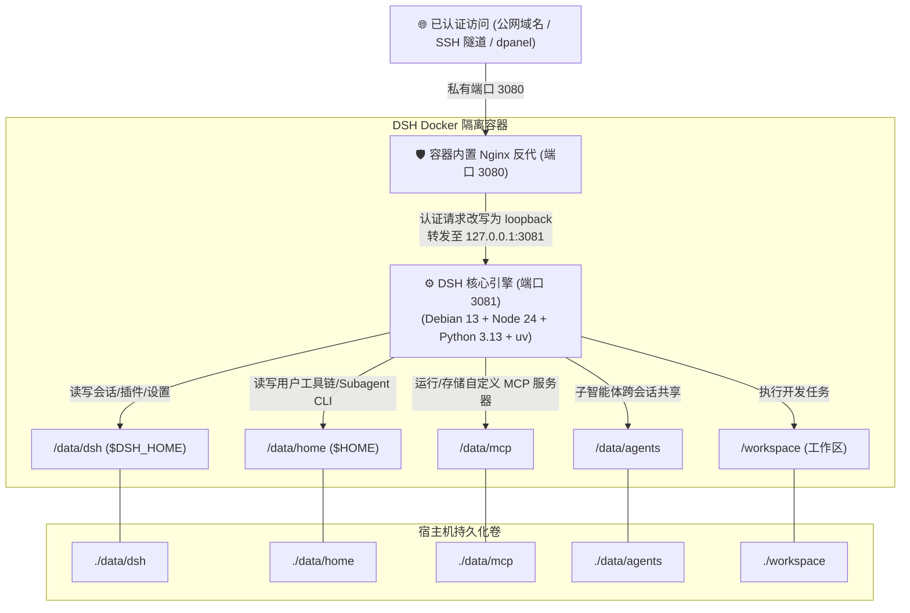

<div align="center">

# 🤖 DeepSeek Harness Docker (DSH-Docker)

<p align="center">
  <b>DeepSeek Harness 生产级 Docker 容器化本地构建与自主数据治理方案</b><br>
  一行流极速安装 · 本地一键构建 · 全数据持久化 · 反代免隧道 · Debian 13 + Python 3 + uv/MCP
</p>

[]()
[](https://opensource.org/licenses/MIT)
[-A81D33?style=flat-square&logo=debian&logoColor=white)](https://www.debian.org/)
[-339933?style=flat-square&logo=node.js&logoColor=white)](https://nodejs.org/)
[](https://www.python.org/)
[](https://astral.sh/uv)
[-2496ED?style=flat-square&logo=docker&logoColor=white)](https://www.docker.com/)
[](https://github.com/univers629/dsh-docker-dev/pulls)

<p align="center">
  <a href="README.md"><b>简体中文</b></a> | <a href="README.en.md"><b>English</b></a>
</p>

</div>

---

> [!NOTE]
> **免责声明 (Disclaimer)**：本项目为社区独立维护的 DeepSeek Harness 生产级容器化运行环境（Unverified Community Edition），与 DeepSeek 官方无官方直接隶属关系。代码基于官方开源仓库构建，遵循 MIT 开源协议。

---

## ⚡ 一条命令完成安装、配置与管理

安装器会逐项询问本次操作、容器内权限、访问保护方式、反向代理位置和公网域名，并自动生成 `.env`。选择内置 Basic Auth 时，密码只以 bcrypt 哈希写入 `data/auth/htpasswd`，不会保存明文。

### 🪟 Windows（PowerShell）

```powershell
irm https://raw.githubusercontent.com/univers629/dsh-docker-dev/main/install.ps1 | iex
```

### 🐧 Linux / 🍏 macOS（Bash）

```bash
curl -fsSL https://raw.githubusercontent.com/univers629/dsh-docker-dev/main/install.sh | bash
```

以后再次执行同一条命令，即可选择更新、启动、停止、重启、日志、状态或重新配置。默认使用容器内普通用户 `node`；Linux 可在向导中切换到容器内 root，但不会获得宿主机 root、Docker socket 或特权容器权限。

无人值守环境仍可使用参数，例如：

```bash
curl -fsSL https://raw.githubusercontent.com/univers629/dsh-docker-dev/main/install.sh | bash -s -- install --user --access local --non-interactive
```

完整参数可执行 `bash install.sh --help` 查看。

> [!TIP]
> **⏱️ 构建耗时提示 (Build Duration Note)**：
> - **初次全新构建**：由于需要从官方源码全量编译 Monorepo、前端产物及原生扩展，在普通 VPS 或 ARM 实例（如 Oracle ARM）上耗时通常约为 **300 ~ 360 秒（5~6 分钟）**，请耐心等待构建完成；
> - **后续日常启动与重启**：得益于 BuildKit 完整缓存和持久化卷，后续启动 **仅需 1 ~ 3 秒即可极速就绪**！

---

## 💡 设计理念 (Design Philosophy)

本项目旨在为 **DeepSeek Harness (DSH)** 提供一个极其稳固、开箱即用且高度自主的生产级运行底座，核心遵循五项设计准则：

1. **不可变系统与两根持久化 (Immutable OS & Two-Root Persistence)**：
   - 操作系统、基础运行库（Debian 13 + Node 24 + Python 3.13 + uv + procps）封装为不可变容器层；
   - 用户的所有资产与数据仅集中在 `./data`（环境/会话/配置/MCP/子智能体）与 `./workspace`（项目代码）中，宿主机无任何散碎系统垃圾，备份迁移只需打包两个目录。
2. **纯本地自主闭环构建 (100% Local Self-Contained Build)**：
   - 彻底摆脱对第三方镜像仓库的依赖，本地 Docker 自动抓取官方最新源码、自动注入沙箱补丁并完成编译，确保代码链路 100% 纯净可审计。
3. **认证后的公网本地模式 (Authenticated Public-Local Mode)**：
   - 公网入口必须使用 HTTPS，并由 Cloudflare Access、内置 Basic Auth、面板认证或私有隧道完成鉴权；容器内部再以 `127.0.0.1` 访问官方 DSH。这样所有官方设置、凭据和插件页面都使用同一套 host 持久化逻辑，不修改官方后端权限集合。
4. **智能体全权限数据治理与安全守护 (Agent Governance & Security Guard)**：
   - 容器启动自动纠正数据卷属主权限（`gosu node` 降权安全运行），严格守护 `.credentials.yaml`（`600`）与 SSH 密钥权限，预装 `procps`（`pkill`/`pgrep`），沙箱白名单完全放行持久化目录。

5. **内置 Docker 控制与稳定 WebUI**：
   - 设置面板内置“重启 DSH”和“打开配置文件”按钮，不依赖插件市场；配置编辑器固定读写 `/data/dsh/settings.yaml`，保存前校验 YAML、使用修订值防止覆盖并发修改。
   - 配置编辑器使用独立 portal 和固定高度编辑区域，避免设置页的 backdrop 与滚动容器叠加造成输入框高度跳动、闪烁或页面白屏。
   - 内置 WebSocket keepalive 补丁，降低公网或空闲反代断开事件流导致的 UI 假死概率。

---

## 🏗️ 整体架构与请求流向



---

## 🚦 日常管理

优先重复运行上面的一行命令，通过菜单完成所有操作。进入工程目录后也可直接使用：

```text
Linux/macOS: ./dsh.sh [start|update|stop|restart|logs|status]
Windows:     .\dsh.bat [start|update|stop|restart|logs|status]
```

更新会同步本项目并重新拉取官方 DSH 源码构建；数据、插件、会话和工具链仍保留在持久化目录中。

---

## 📂 项目层级结构

```text
dsh_docker/
├── 📄 docker-compose.yml     # 容器编排定义（固定端口、持久化挂载、健康检查）
├── 📄 Dockerfile             # Debian 13 + Python 3 + uv + procps + 多阶段编译
├── 🚀 dsh.bat                # Windows 统一管理脚本（双击默认启动并打开浏览器）
├── 🚀 dsh.sh                 # Linux / macOS 统一管理脚本
├── ⚡ install.ps1            # Windows 一行流安装器
├── ⚡ install.sh             # Linux / macOS 一行流安装器
├── 📂 bin/
│   ├── dsh                   # DSH 核心 CLI 包装脚本
│   └── entrypoint.sh         # 容器入口（权限守护、密钥600保护、SSH守护、降权启动）
├── 📂 dsh-home/
│   ├── cordis.patch.yml      # 机器级网络与服务覆盖配置
│   └── skills/               # 预置技能库（内置 container-environment SOP）
├── 📂 nginx/
│   └── dsh-nginx.conf        # 容器内保留请求边界的反向代理配置
├── 📂 data/                  # 💾 核心数据持久化目录（Git 忽略数据内容）
│   ├── auth/                 # 可选的内置 Basic Auth bcrypt 密码文件
│   ├── dsh/                  # 会话历史 (sessions/)、插件 (profiles/)、.credentials.yaml、settings.yaml
│   ├── home/                 # Linux 用户家目录 (~/.local, ~/.npm-global, ~/.ssh, ~/.cache)
│   ├── mcp/                  # 🌟 自定义 MCP 服务器源码、独立虚拟环境与数据
│   └── agents/               # 智能体共享存储与记忆
└── 📂 workspace/             # 💻 Agent 项目开发工作区（挂载宿主代码）
```

Linux 还会启用 `docker-compose.system.yml`，把 Debian 包安装保存在标准容器路径对应的宿主目录：

| 容器路径 | 宿主机路径 |
| --- | --- |
| `/usr/bin`、`/usr/lib`、`/usr/share` | `data/system/usr/bin`、`data/system/usr/lib`、`data/system/usr/share` |
| `/usr/include`、`/usr/libexec`、`/usr/games` | `data/system/usr/include`、`data/system/usr/libexec`、`data/system/usr/games` |
| `/etc`、`/var/lib`、`/var/cache` | `data/system/etc`、`data/system/var/lib`、`data/system/var/cache` |

`/usr/local` 和 `/usr/sbin` 保留在镜像/运行时层；Docker 的 `/sbin/docker-init` 依赖 `/usr/sbin` 的注入路径，不能用外置目录覆盖。清空这些 `data/` 目录会删除插件、工具链和 apt 软件，但不会删除 `data/dsh/sessions/` 中的会话记录，除非手动删除该目录。

---

## 🔐 生产级权限保护与进程管理实战总结

在长期的生产环境部署中，本项目积累并预置了以下核心防御措施：

### 1. 密钥安全断言守护（Mode 600 严格隔离）
- **官方断言机制**：DSH `@deepseek-ai/dsh-credentials-local` 对 `/data/dsh/.credentials.yaml` 实施了严格的安全断言，如果文件权限超出所有者可读写（例如 `660`），系统将**硬性拒绝启动**以防密钥泄漏；
- **自动纠偏锁**：[`bin/entrypoint.sh`](bin/entrypoint.sh) 在容器每次启动时，会自动对全盘 `/data` 进行属主纠正的同时，**强制锁定所有的 `*credentials*.yaml` 为 `600`**，既保证了多用户挂载不冲突，又完全满足官方严苛的安全断言。

### 2. 安全的插件生命周期管理
- 容器内置 `procps` 供诊断使用，同时提供 `/usr/local/bin/manage-dsh-plugin`，负责插件安装、更新、删除和校验 profile 配置。
- 脚本会显示包管理与配置校验的阶段性信息，并在当前 Agent 回复持久化完成后精确、优雅地重启 DSH。输出会明确区分“已写入 profile”“配置可解析”“已安排重启”和“重启后前端尚待验证”，不会把通用配置校验误报成某个插件已经出现设置页或按钮。

---

## 🔧 核心技术解密：公网/反代下插件与设置页面空白的根治方案

### 1. 权限边界
DeepSeek Harness 官方前端在 `packages/client/ui-settings/lib/client.js` 中根据连接是否回环选择设置作用域：
```javascript
// 官方原生判断：
settingsScope: connection.isLoopback ? "host" : "memory"
```
回环访问可以使用 DSH 官方的 host settings。公网访问只有在内置 Basic Auth 或可信外层认证、源站限制和私有 3080 同时成立时，才会由容器 Nginx 转换为内部 loopback；浏览器通过 `DSH_PUBLIC_LOCAL_MODE=1` Cookie 选择同一套 host settings 镜像。Cookie 不是认证凭据，后端仍只接受容器内部的 loopback 请求。

Vision Router 的配置页通过自身的受控 RPC 显示能力与权限状态；这与 DSH 通用 settings API 是两条不同的权限边界。插件无需单独适配公网域名。

安装向导会自动填写 `DSH_TRUSTED_HOSTS`；手动配置时可参考 `.env.example`。该变量支持逗号分隔的多个 `host[:port]`，例如 `agent.example.com,admin.example.com`。这里的 trusted host 只解决浏览器请求的 authority 校验，不会自动开启插件的远程写设置权限；Vision Router 的“允许可信 Host 远程修改设置”仍由其设置页中的安全开关控制。仅通过回环地址访问时可以留空。

`allowRemoteSettings` 是用户授权项。Agent 不会替用户打开或关闭它；请通过运行 DSH 机器的回环地址或 SSH 隧道端口转发，在 Vision Router 设置页中明确操作。插件更新或 DSH 重启后若页面仍显示旧状态，请先关闭旧页面并重新加载最新页面，再确认该开关的写入结果。

### 3. 内置控制插件的初始化

内置 `dsh-docker-control` 在镜像中随 `/opt/dsh-docker-control` 交付。容器首次启动时，入口脚本会在空的 `/data/dsh/profiles/web` 下自动创建官方 `web` profile 清单，再把控制插件加入 bundle；因此删除持久化配置后重建，也会恢复设置页按钮和配置编辑器。用户已有 profile manifest 时不会覆盖其自定义 bundle 顺序。

---

## 🛡️ 沙箱权限模式与插件报错解决机制

在 `docker-compose.yml` 中：
```yaml
environment:
  DSH_PERMISSION_MODE: "danger-full-access"
```
- **原生沙箱痛点**：官方原生在 `workspace-write` 模式下仅允许写入 `/workspace` 和 `/tmp`，导致 Agent 自主安装插件（写入 `/data/dsh/profiles`）或管理历史会话时抛出 `PermissionDenied` / `not strictly wider` 异常；
- **底层穿透保障**：本项目在构建时已深度打通了底层沙箱白名单（将 `/data` 原生纳入合法写权限集合）。即使切换为标准 `workspace-write` 模式，**插件安装、会话清理、MCP 部署也依然 100% 畅通无阻**。

---

## 🔌 子智能体 CLI 与 MCP 服务器扩展指南

### 1. 安装子 Agent CLI 工具（容器重建不丢失）
容器内置全局 PATH：`$HOME/.local/bin` 与 `$HOME/.npm-global/bin`。
- **Python 工具 (如 aider, goose)**：`uv tool install aider-chat` 或 `pip install --user <pkg>`，生成命令持久保存在 `/data/home/.local/bin`；
- **Node 工具 (如 claude-cli)**：`npm install -g <pkg>`，生成命令持久保存在 `/data/home/.npm-global/bin`；
- **子 Agent 状态与记忆**：存放在专用挂载点 `/data/agents/`。

### 2. 运行 MCP（Model Context Protocol）服务器
- **开源/标准 MCP（通过内置 uvx / npx 秒级启动）**：
  ```bash
  uvx mcp-server-fetch
  uvx mcp-server-sqlite --db-path /data/mcp/sqlite.db
  npx -y @modelcontextprotocol/server-filesystem /workspace
  ```
- **本地编写的独立 MCP 服务**：
  直接放在挂载目录 `./data/mcp/<服务名>/` 下（内含专属 `venv` 或 `node_modules`），在 DSH 配置中直接调用，升级构建永不丢失。

---

## 🌐 反向代理与 dpanel 固化配置指南

### 1. dpanel / 宝塔 / 1Panel 转发“重建后失效”的根治方案

在各种 Docker 管理面板中添加反向代理时：
- **Docker 版 dpanel**：将 dsh 接入 dpanel 使用的 Docker 网络，并把代理目标设置为 **`http://dsh:3080`**（或该网络中的固定别名）。如果不能改网络，才使用宿主机网关地址；此时 `.env` 中设置 `DSH_BIND_HOST=172.17.0.1`，不能设置 `0.0.0.0`。
- **宿主机直接运行的 Nginx/SSH 隧道**：代理目标填写 **`http://127.0.0.1:3080`**。
- **原理**：3080 只监听私有接口，公网流量必须先通过认证反代；容器重建只替换 dsh 镜像，不替换 `data/` 与 `workspace/`。

> 💡 **dPanel 网络连接**：在向导中选择“Docker 容器/面板”，再填写 dPanel 的网络名（通常为 `dpanel-local`）。Compose 会持久化该网络关系，重建后不需要手动执行 `docker network connect`。

### 2. 标准 Nginx 反向代理配置

证书路径替换为实际文件；若选择 `trusted-proxy`，还需在这一层配置 Access、`auth_basic` 或其他认证。

```nginx
server {
    listen 443 ssl;
    server_name dsh.yourdomain.com;
    ssl_certificate /path/to/fullchain.pem;
    ssl_certificate_key /path/to/privkey.pem;
    client_max_body_size 0;

    location / {
        proxy_pass http://127.0.0.1:3080;
        proxy_http_version 1.1;
        proxy_set_header Upgrade $http_upgrade;
        proxy_set_header Connection "upgrade";
        proxy_set_header Host $host;
        proxy_set_header X-Forwarded-Host $host;
        proxy_set_header X-Forwarded-For $proxy_add_x_forwarded_for;
        proxy_set_header X-Forwarded-Proto $scheme;
        proxy_read_timeout 3600s;
    }
}
```

---

## 🔒 公网访问安全加固指南

> [!WARNING]
> DeepSeek Harness 原生未设登录鉴权。向导默认让 3080 只绑定 `127.0.0.1`；公网访问必须经过 HTTPS 和认证反向代理，不要把 `DSH_BIND_HOST` 设置为 `0.0.0.0`。

安装向导中的访问保护选项对应如下：

1. **仅本机/SSH 隧道**：选择 `local`，适合本机浏览器或 SSH 端口转发。
2. **已有 Cloudflare Access、dPanel、Nginx 或私有 VPN**：选择 `trusted-proxy`，向导会记录 trusted hosts 和可选的外部 Docker 网络；认证仍由外层入口负责。
3. **内置 Basic Auth**：选择 `basic`，向导会生成 bcrypt 密码文件。它只负责用户名密码，仍建议在外层反代启用 HTTPS；Basic Auth 不提供 MFA。

Cloudflare Access/OIDC + MFA 的安全能力高于单纯 Basic Auth；Caddy、Nginx 和内置 Nginx 在配置正确时性能差异可以忽略。

---

## 🧩 智能体插件自主安装 SOP

本项目内置了 `container-environment` 专属技能。在 Web 界面中，您可以直接对 Agent 说：

> 💬 *“帮我安装会话管理插件，并清理无用的归档会话”*

Agent 会自动遵循预置 SOP：
1. **安装**：自动在 `$DSH_HOME/profiles/web/package.json` 添加依赖并安全执行安装；
2. **配置校验**：自动校验 `cordis.patch.yml` 语法有效性；
3. **数据管理**：直接进入 `/data/dsh/sessions/` 对过期归档文件执行清理；
4. **生效**：向用户发出中文完成通知；当前回复结束后自动优雅重启 DSH，使插件组合变更生效。

若需要单独重启 DSH，向 Agent 明确提出“重启 DSH”即可；内置 skill 会调用 `manage-dsh-plugin restart`，在当前回复结束后只重启 DSH 主进程，不会重启其他 Docker 容器。

---

## 📄 开源许可证

本项目基于 [MIT License](LICENSE) 协议开源。
