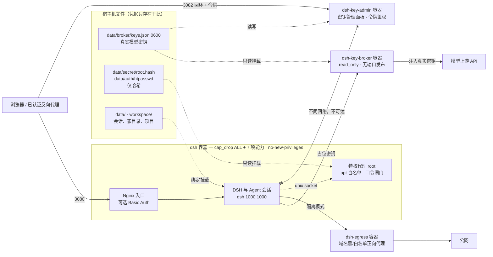

# dsh-docker

在 Docker 里运行 DeepSeek Harness：预制 Debian 13 环境，Agent 可以持续用 apt 安装工具链并长期开发，模型密钥保存在容器之外。

[](https://www.kernel.org/)
[](https://www.microsoft.com/windows)
[](https://www.debian.org/releases/trixie/)
[](https://www.docker.com/)
[](LICENSE)

[简体中文](README.md) · [English](README.en.md) · [安全模型详解](docs/security.md)

## 特性

- **一行命令安装**：Linux 与 Windows 使用同一套交互菜单，配置写入 `.env`。
- **工具链持久化**：Agent 用 apt 安装的软件保留在容器可写层，启动、停止、重启和 DSH 更新都不重建容器。
- **模型密钥不进容器**：真实密钥只存在于宿主文件和独立的代理容器中，DSH 侧填占位串。
- **非特权运行**：DSH 与 Agent 以 `dsh`（1000:1000）身份运行，`cap_drop: ALL` 后只补回 7 项常规能力，apt 依旧可用。
- **可选出站黑/白名单**：容器出网强制经过独立正向代理，按域名黑名单或白名单放行。
- **多架构预构建镜像**：`ghcr.io/univers629/dsh-docker:latest` 覆盖 `linux/amd64` 与 `linux/arm64`，拉取失败时自动改为本地构建。

> DSH 本体在容器内更新即可（WebUI 的“DSH 环境”页，或 `./dsh.sh update`），不需要重建容器或跟随镜像更新。

## 安装

起步配置 1 vCPU / 2 GB 内存 / 10 GB 磁盘；长期让 Agent 在容器内安装工具链建议 2 vCPU / 4 GB 内存 / 20 GB 磁盘。

Linux：

```bash
curl -fsSL https://raw.githubusercontent.com/univers629/dsh-docker/main/install.sh | bash
```

Windows PowerShell（需要 Docker Desktop 并切换到 Linux containers）：

```powershell
irm https://raw.githubusercontent.com/univers629/dsh-docker/main/install.ps1 | iex
```

> 上面这条 Linux 一行命令**连 TTY 都没有时会直接走「一键安装」**：Basic Auth + 随机用户名 `dsh` + 随机密码 + 随机容器 root 密码，模型密钥代理与出站隔离保持默认关闭，零提问。安装结束时会在终端打印访问地址和这些随机凭据（只显示这一次）。要自定义（选镜像来源、访问模式、反代、出站策略、填模型密钥）就开一个交互终端跑同一行命令，或在无 TTY 时显式加 `--non-interactive` 走旧的参数化模式。「一键」也随时可显式启用：`bash install.sh --quick`。

安装器依次询问操作类型、镜像来源、访问保护方式、反向代理位置、域名与端口绑定、模型密钥代理的上游密钥、容器出站模式，并写入 `.env`。模型密钥那一步只问上游名字和密钥（自建网关多问一个 base_url），API 形态、模型清单、请求头都由安装器推断或向上游查询。模型密钥可以留空跳过，之后用菜单第 9 项或 `./install.sh model-key` 补填，该操作不重建容器。容器 root 密码仅以 sha512crypt 哈希写入 `data/secret/root.hash`，Basic Auth 密码仅以 bcrypt 哈希写入 `data/auth/htpasswd`，两者都不写入 `.env`。安装过程不使用特权容器、不挂载 Docker socket、不授予宿主机 root。

| 菜单项 | 作用 |
| --- | --- |
| 1 全新安装 | 工程目录已存在时改为“重新配置并重建容器（保留挂载数据）” |
| 2 更新 | 进去再分：更新容器内 DSH（`update`），或换新镜像重建（`upgrade`） |
| 3 启动 / 4 停止 / 5 重启 | 只操作已有容器，不重建，保留 apt 安装的工具链 |
| 6 查看日志 / 7 查看状态 | 转发到 `./dsh.sh logs` 与 `status` |
| 8 删除 | 先选数据范围（可保留会话、工作目录和插件），输入 `DELETE` 确认后清理容器、镜像、挂载、网络、构建缓存与工程目录 |
| 9 补填模型 API 密钥 | 为已有部署写入密钥并启动密钥代理容器，不重建 `dsh` |
| 10 模型密钥管理面板 | 浏览器里填密钥、拉模型列表，不重建 `dsh` |

只有第 1 项会询问镜像来源，其余各项直接作用于现有容器。

非交互安装：

```bash
curl -fsSL https://raw.githubusercontent.com/univers629/dsh-docker/main/install.sh | bash -s -- install --access local --image-source prebuilt --non-interactive
```

命令行上的密码会进入 shell 历史与 `ps`，建议改用环境变量：

```bash
DSH_ROOT_PASSWORD='至少12位的密码' bash install.sh install --access local --non-interactive
```

完整参数见 `bash install.sh --help`；Windows 对应 `powershell -ExecutionPolicy Bypass -File .\install.ps1`。

### 受限网络下构建镜像

直连 Debian 与 npm 官方源不稳定时，可以换成本地镜像再构建。构建参数是 Dockerfile 提供的，
安装器不需要改动：

```sh
docker build \
  --build-arg APT_MIRROR=https://mirrors.aliyun.com/debian \
  --build-arg NPM_REGISTRY=https://registry.npmmirror.com \
  -t dsh:local .
```

- `APT_MIRROR`：替换 Debian 源。构建期会先用明文 HTTP 取回 CA 证书包（此时镜像里还没有证书，
  HTTPS 源必然验签失败），随后切到 HTTPS 安装其余包——部分网络会截断明文通道上的大文件，
  表现为单个 .deb 反复 500。
- `NPM_REGISTRY`：替换 npm 源，并写入镜像配置，容器内安装插件时同样生效。

构建期还统一开启了 apt 与 npm 的重试（`Acquire::Retries`、`fetch-retries`），
网络抖动不再直接导致构建失败。

## 日常管理

```text
Linux:   ./dsh.sh  [start|update|stop|restart|logs [服务]|status|shell|root-shell|verify|keys|key-panel|egress|remove]
Windows: .\dsh.bat [start|update|stop|restart|logs [服务]|status|shell|root-shell|verify|keys|key-panel|egress|remove]
```

- `start` 只在容器不存在时准备镜像，之后复用同一个容器；`stop`、`restart` 与容器内的 `apt install` 都保留可写层。
- `update` 只在容器内重装 DSH 的 npm 包，不是项目或镜像更新；`remove` 会删除容器可写层，绑定挂载保留。
- 菜单第 2 项是"更新"，进去再分两支：更新容器内的 DSH（等同 `./install.sh update`，容器和镜像都不动），或换成新镜像并重建容器（等同 `./install.sh upgrade`）。后者沿用现有 `.env`，不重问配置，会话、插件、`workspace/` 与模型密钥全部保留，只有容器可写层里 `apt` 装的系统包要重装；收尾按项目标签回收换下来的悬空镜像、残留容器与空网络，不碰宿主上其他项目。
- `shell` 进入非特权 `dsh` 账户，`root-shell` 是宿主机侧的管理通道（容器内部无法以此提权）。
- `verify` 在容器内运行整套加固自检，`keys` 与 `egress` 打印密钥代理和出站代理的状态，`key-panel` 打印密钥管理面板的地址与访问令牌。
- 健康检查同时探测 Nginx 入口与 DSH 自身端口，DSH 崩溃循环时容器状态为 `unhealthy`。
- 容器内更新会在替换 `/app/dsh` 之前预检 profile 插件的兼容性：DSH 会禁用 peer 范围不满足新版本的插件，这种禁用不会让进程起不来，存活检测和回滚都看不到，所以预检结果写进容器日志与更新状态。升级到新 DSH 版本前的准备见 [DSH 0.2.0-rc.2 迁移说明](docs/dsh-0.2.0-rc.2-migration.md)。

### 删除

彻底清空本项目：在工程目录运行菜单第 8 项，或执行 `./install.sh delete`（Windows：`powershell -ExecutionPolicy Bypass -File .\install.ps1 -DshAction delete`）。删除按精确名称清理本项目的容器、镜像、挂载、网络和工程目录，不使用子串匹配，也不会删除外部共享网络。

删除会先问数据范围，最后才让人输入 `DELETE` 确认：

- 全部删除：容器、镜像、`.env`、模型密钥、root 密码哈希，以及 `data/` 和 `workspace/` 里的一切。
- 保留会话、工作目录和插件：只留下 `workspace/`、`data/dsh/sessions/`、`data/dsh/profiles/`，其余照样删干净（含项目源码与 `data/home` 里的工具链），目录里留下一个 `.dsh-preserved` 说明文件。重新安装到同一个目录时，安装器认得这个文件，会自己把项目源码取回来，这三样原地接着用。属主由容器启动时重新对齐，不需要手工 `chown`。

脚本化删除可以用环境变量 `DSH_DELETE_KEEP=1` 选中"保留"这一支（删除本身仍要求交互确认）。

## 公网访问与认证

DSH 自身不提供登录认证，安装器默认把 3080 绑定到 `127.0.0.1`。公网访问必须经过 HTTPS 与认证入口，不要使用 `0.0.0.0`、`::` 等通配绑定。

### 访问模式

安装器提供四种访问模式：

1. `local`：仅本地或 SSH 隧道访问。
2. `trusted-proxy`：由 Cloudflare Access、Docker 面板、宿主机 Nginx、VPN 等外层入口负责认证，可记录 trusted hosts 与外部 Docker 网络。**该模式下容器内不做认证：直连源站 IP 并让请求被转发进 DSH 容器时，外层认证完全不参与，等同于无锁。** 自检：`curl -k -i -H "Host: <你的域名>" https://<源站IP>/` 返回 `200` 即为可绕过。该模式必须叠加一层不依赖 IP 与 Host 判断的凭据（Cloudflare Tunnel，或改用 `basic`），详见 `docs/security.md` 的「trusted-proxy 模式的边界与自检」。注意 `DSH_TRUSTED_HOSTS` 只是 cookie 绑定键，**不是访问白名单**。
3. `basic`：容器内 Nginx 使用 bcrypt 密码文件认证，不含 MFA，公网部署仍需外层 HTTPS。这是唯一不依赖来源 IP 与 Host 判断的应用层锁。
4. `password`：内置认证网关（`dsh-auth`）承担登录，支持账户注册、TOTP 两步验证与通行密钥。多用户模式固定使用这一项；单管理员想用图形登录页也可以选它。

无论是否公网暴露，都建议设置 `DSH_AUTH_INGRESS_TOKEN`（入口与认证网关的共享密钥，`openssl rand -hex 32` 生成）。设置后认证网关的 `/__dsh_auth/verify` 判定端点只接受携带同一值的请求，容器网络里的其他组件无法凭一个会话 Cookie 换出身份头；留空时只靠网络边界防护。

### 多用户模式

自定义安装向导的访问保护方式选第 4 项（或在命令行加 `--multi-user`）会部署多用户模式：**账户注册 + 每个账户一个独立的 DSH 容器**。会话、文件与模型上下文按账户隔离，只有初始管理员能进入管理面板与模型密钥面板。

它比单管理员模式多三个容器：

| 容器 | 职责 |
| --- | --- |
| `dsh-auth` | 认证网关。提供登录页、注册页、实例等待页，并回答入口的 `auth_request` 判定 |
| `dsh-instances` | 实例编排。**唯一持有 `docker.sock` 的组件**，按需创建/启停/删除每个账户的容器 |
| `dsh-ingress` | 七层入口。按会话身份把请求转发到该账户自己的实例，并负责登出重定向与唤醒跳转 |

- **认证方式**：Argon2id 口令、TOTP 两步验证与恢复码、通行密钥（Passkey）。多用户模式把访问模式固定为 `password`（认证在网关侧，容器内 Nginx 不再做 Basic Auth）。Passkey 需要固定 HTTPS 域名，设置 `DSH_PUBLIC_ORIGIN` 后启用。
- **资源**：每实例默认内存上限 200MB；闲置 30 分钟后自动停用（内存归零、数据保留），用户回来时页面会显示等待页并在 10–30 秒内拉起。可用 `DSH_INSTANCE_MEMORY_MB` 与 `DSH_IDLE_TIMEOUT_SECONDS` 调整。
- **注册门槛**：`DSH_REGISTER_GATE=open` 对能访问入口的任何人开放；`invite` 需要一个单次邀请码（安装结束打印一次，也可在管理面板里轮换）。
- **账户数据**：`data/users/<uid>/`，属主为该实例 uid。删除账户可在管理面板里连带清理数据。
- **管理面板**：`http://<绑定地址>:<端口>/admin`，仅初始管理员可访问，可停用/删除账户、重置口令、轮换邀请码、查看审计与实例水位。
- **运维边界**：`dsh-instances` 持有 Docker socket 是这一模式的固有代价，因此它不含用户数据、不跑 Agent，且只在控制面内网接受带令牌的调用；用户实例不发布任何宿主端口。威胁模型与自检见 `docs/security.md` 的「多用户模式」一节。

从单管理员切换到多用户只需重跑向导改选：原有 dsh 容器成为管理工作台（网络别名 `dsh-admin`），管理员数据原地保留，新用户走注册。反向切换会停用全部用户实例，需二次确认。

#### 人机验证（防批量注册）

多用户模式开放注册时，批量建号会消耗磁盘与内存配额。认证网关内置人机验证开关，在登录与注册表单上要求完成验证后才能提交：

- 在管理面板（`/admin`）的「人机验证」里选择服务商并填入密钥对（site key / secret key），保存即生效，无需重启。密钥以 AES-256-GCM 封存后落盘，`state.json` 里只有密文。
- 支持三家：Cloudflare Turnstile、hCaptcha、reCAPTCHA v2（代码内置清单）。开关状态随 `/api/auth/status` 公开给登录页，登录页会据此自动加载对应服务商的脚本；未开启时表单与现在完全一样。
- 验证在网关侧完成（服务端向服务商的 siteverify 端点核验 token），Agent 容器读不到密钥。

#### 每用户模型开放

多用户模式下，哪些上游对普通用户开放由管理员决定：管理面板的「模型开放」为每个账户勾选可用的上游，保存后写入 `data/auth/broker-grants.json`（按实例令牌的 SHA-256 摘要识别调用者）。未被开放上游的账户发起的模型请求会被代理直接拒绝。

- 用户侧不需要配置：账户被开放的上游会在其实例创建时自动写进 DSH 的 `settings.yaml`（走密钥代理的占位地址），登录后在工作台的「设置 → 模型」里直接可见、可用。之后管理员再调整开放范围时，实例在下次闲置回收重建后跟随新授权。
- 单管理员（非多用户）模式没有这张表：所有已配置的上游对唯一用户全部可用。
- 停用或删除账户会立即重算授权表，被撤销的实例令牌随即失效。

### 反向代理配置

宿主机 Nginx 反代示例：

```nginx
server {
    listen 443 ssl;
    server_name dsh.example.com;
    ssl_certificate /path/to/fullchain.pem;
    ssl_certificate_key /path/to/privkey.pem;

    location / {
        proxy_pass http://127.0.0.1:3080;
        proxy_http_version 1.1;
        proxy_set_header Upgrade $http_upgrade;
        proxy_set_header Connection "upgrade";
        proxy_set_header Host $host;
        proxy_set_header X-Forwarded-Host $host;
        proxy_set_header X-Forwarded-For $proxy_add_x_forwarded_for;
        proxy_set_header X-Forwarded-Proto $scheme;
        proxy_read_timeout 3600s;
    }
}
```

使用 Docker 面板反代时，在安装器中填写反代容器所在的外部网络名，上游用 `http://dsh:3080`；宿主机反代或 SSH 隧道用 `http://127.0.0.1:3080`。外部网络必须已存在，或由安装器在征得同意后创建。

## 架构


```mermaid
flowchart LR
    client["浏览器 / 已认证反向代理"]

    subgraph hostfs["宿主机文件（凭据只存在于此）"]
        keys["data/broker/keys.json 0600<br/>真实模型密钥"]
        hashes["data/secret/root.hash<br/>data/auth/htpasswd<br/>仅哈希"]
        mounts["data/ · workspace/<br/>会话、家目录、项目"]
    end

    subgraph dsh["dsh 容器 — cap_drop ALL + 7 项能力 · no-new-privileges"]
        nginx["Nginx 入口<br/>可选 Basic Auth"]
        agent["DSH 与 Agent 会话<br/>dsh 1000:1000"]
        helper["特权代理 root<br/>apt 白名单 · 口令闸门"]
    end

    broker["dsh-key-broker 容器<br/>read_only · 无端口发布"]
    admin["dsh-key-admin 容器<br/>密钥管理面板 · 令牌鉴权"]
    egress["dsh-egress 容器<br/>域名黑/白名单正向代理"]
    upstream["模型上游 API"]
    internet["公网"]

    client -->|3080| nginx --> agent
    client -->|3082 回环 + 令牌| admin
    agent -->|占位密钥| broker -->|注入真实密钥| upstream
    agent -->|隔离模式| egress --> internet
    agent -.->|unix socket| helper
    keys -.->|只读挂载| broker
    keys -.->|读写| admin
    hashes -.->|只读挂载| helper
    mounts -.->|绑定挂载| agent
    agent x-- 不同网络，不可达 --x admin
```

上图是单管理员模式的拓扑（多用户模式另有 `dsh-auth`、`dsh-instances`、`dsh-ingress` 三个容器，见「多用户模式」）。真实密钥只在宿主文件、`dsh-key-broker` 与 `dsh-key-admin` 之间流动，这三者和 `dsh` 容器之间没有共享卷；面板与 `dsh` 也不在同一个 Docker 网络上，因此 `dsh` 容器内既没有密钥字面值，也打不到持有密钥的面板。

持久化目录：

| 容器路径 | 宿主机路径 | 内容 |
| --- | --- | --- |
| `/data/dsh` | `data/dsh` | 会话、设置、凭据、profile 与内置插件 |
| `/data/home` | `data/home` | 家目录、SSH、npm/uv 工具链与缓存 |
| `/data/mcp` | `data/mcp` | 自定义 MCP 源码、虚拟环境与数据 |
| `/data/agents` | `data/agents` | 子智能体共享状态 |
| `/workspace` | `workspace` | Agent 工作区 |
| `/usr`、`/etc`、`/var` | 容器可写层 | Debian 系统与 apt 安装的软件；删除容器才会丢失 |

Debian 系统目录留在容器可写层，不使用 overlay 覆盖，因此同一个容器停止再启动后 apt 安装的软件和系统配置仍然存在。

## 安全模型

分层控制，从最有效到最边缘：**可信输入 > 密钥外置 > 出站白名单 > 逃逸加固**。

| 层 | 实现 | 覆盖的风险 |
| --- | --- | --- |
| 密钥外置 | 独立 `dsh-key-broker` 容器注入密钥，剥离客户端认证头，路径白名单、限速与每日配额 | 提示注入或任意命令执行导致的密钥外泄 |
| 出站控制 | 隔离模式下容器只接内部网络，出网经域名黑/白名单代理，并校验 DNS 解析结果 | 数据外发到任意地址、绕过密钥代理 |
| 运行身份 | DSH、Agent 与 Nginx worker 以 1000:1000 运行；仅 PID 1、Nginx 主进程和特权代理为 root | 容器内直接以 root 运行进程 |
| 能力收敛 | `cap_drop: ALL` 后只补回 `CHOWN`、`DAC_OVERRIDE`、`FOWNER`、`FSETID`、`SETGID`、`SETUID`、`KILL`，保持 `no-new-privileges`，不放开 seccomp 与 AppArmor | `CAP_SYS_ADMIN` 挂载逃逸、cgroup `release_agent`、内核模块加载、跨进程 ptrace |
| 隔离面 | 不使用 privileged、不挂载 Docker socket、不共享宿主 PID/network/IPC namespace、设置 `pids_limit` | Docker API 逃逸、宿主进程可见性、fork 炸弹 |
| 提权闸门 | apt 经白名单包装脚本；其他特权命令需容器 root 口令，失败会触发递增延迟与锁定 | 容器内从 `dsh` 到 root 的任意提权 |
| 启动链完整性 | 入口脚本、Supervisor、特权代理与包装脚本为 root 独占写；运行时依赖的包禁止卸载 | 容器内破坏启动链导致服务无法恢复 |
| 逃逸影响面 | 支持宿主机 user namespace remap，并提供 `install.sh --userns-preflight` 预检与属主对齐 | 内核或运行时漏洞逃逸后落到宿主 root |

已知限制：

- 容器与宿主共享内核，内核和容器运行时漏洞无法在容器内加固层面拦住，需要升级宿主内核与 Docker。
- 默认免密 apt 意味着容器内可以通过白名单代理取得容器 root；收紧方式是 `DSH_PRIVILEGED_APT=password`。
- 密钥代理只保证密钥字面值不进入容器，不保护额度和数据，需要靠请求限额与出站白名单限制损失。
- 出站白名单按域名判定且不做 TLS 中间人，放行域名下的任意路径都可访问。
- 出站黑名单是启发式清单，只降低顺手滥用的概率，自建域名的隧道挡不住；真正的边界只有白名单。
- 第一道防线仍然是不把不可信内容交给 Agent，上述各层只缩小注入成功后的后果。

威胁模型、每层的具体配置、密钥代理的 `keys.json` 结构、出站白名单细节、user namespace remap 与 rootless Docker 的取舍，见 [docs/security.md](docs/security.md)。

## 模型密钥

真实密钥只写入宿主的 `data/broker/keys.json`（0600），以只读方式挂给 `dsh-key-broker`，不挂进 DSH 容器。DSH 侧的供应商配置由安装器按官方格式写进 `data/dsh/settings.yaml`（base_url 指向 `http://dsh-key-broker:8080/u/<上游名>`，api key 是占位串），装完在 WebUI 的「设置 → 模型」里直接选模型即可。

- 安装时配置：向导每个上游只问名字和密钥（不回显）；`deepseek`、`openai`、`anthropic`、`google`、`nvidia` 这类内置上游连 base_url 都不问。API 形态按上游名推断，固定请求头默认不加，模型清单在保存前向上游查一次。也可以用 `--model-keys-file` 指向一份 0600 的 `keys.json`。
- 非交互指定形态与请求头：`--model-api NAME=PROFILE`、`--model-header NAME=HEADER=VALUE`（可重复），例如 Codex 客户端需要的 `originator` / `version` / `User-Agent`。形态决定认证头、放行端点，以及写进 DSH 的协议，详见 [docs/security.md](docs/security.md)。
- 模型清单：上游名命中 DSH 内置目录（`deepseek`、`openai`、`anthropic`、`google`、`nvidia` 等）时沿用目录里的整份清单。目录外的自建网关必须至少有一个模型 id，否则 DSH 会拒收整条供应商配置、模型页上不出现卡片，所以安装器会先用密钥请求上游的 `/models` 自动填一份；拉不到时会打印原因，用 `--model-id NAME=ID[,ID]` 或在管理面板里补。`--no-model-settings-seed` 可以跳过写配置，改为在 WebUI 里自己加。
- `deepseek` 上游配置的是 DSH 自带的 DeepSeek 供应商（`llm-deepseek`），模型页上不会多出一行；旧版安装器写下的重复 `llm-pi-ai.providers.deepseek` 会在下次写配置时自动删掉。
- 上游名字：小写字母开头，之后只能是小写字母、数字和单个短横线，最多 32 个字符，与 DSH「添加自定义提供方」的规则一致。不合规的名字会被 DSH 静默丢弃，表现就是模型页上没有卡片。
- base_url：填真实上游地址，带上版本段（OpenAI 兼容网关一般是 `https://<域名>/v1`，Anthropic 兼容的一般不带）。DSH 侧填什么由安装器自己算，两边都补一次会变成 `/v1/v1/...`。内置目录里的上游直接回车用默认值即可。忘了写版本段时，安装器和面板会在拉取模型清单时发现并自动补上——OpenAI 兼容客户端不会自己补这一段，不补的话每个请求都落在上游根路径上。
- 装完后补填：`./install.sh model-key`（Windows：`.\install.ps1 -DshAction model-key`），只新增代理容器，不重建 `dsh`。
- 查看状态：`./dsh.sh keys` 输出上游、配额、今日用量与放行/拒绝计数，不输出密钥。

### 密钥管理面板

不想在终端里填密钥就用管理面板：浏览器里增删上游、填密钥、选 API 形态、勾选模型清单与每个模型的能力和推理档位、设固定请求头、设请求限额，还能按上游拉一次模型列表；保存后同时写 `data/broker/keys.json` 与 DSH 的 `settings.yaml`、`.credentials.yaml`，两边都是热加载，不用重启任何容器。面板还管容器的出站策略（见「出站模式」）。

- 开启：新装向导会问；已有部署执行 `./install.sh key-panel`（Windows：`.\install.ps1 -DshAction key-panel`），它只新增 `dsh-key-admin` 容器，不重建 `dsh`。关闭用 `--no-key-admin`。
- 访问：默认 `http://127.0.0.1:3082/`，访问令牌在 `data/broker/admin.token`（0600）。远程用 SSH 隧道：`ssh -N -L 3082:127.0.0.1:3082 <用户名@宿主地址>`。地址与端口由 `DSH_KEY_ADMIN_BIND_HOST`、`DSH_KEY_ADMIN_HOST_PORT` 决定。
- 面板刻意不做进 DSH 的 WebUI：那个页面运行在 DSH 容器内，填进去的密钥就落在 Agent 能读的地方。面板作为独立容器只接入 `dsh-admin` 网络，`dsh` 容器不在其上；安装器会从 `dsh` 容器内实测这条连接必须失败，否则安装失败。
- 令牌连续输错会触发递增延迟与锁定；面板容器自身 `read_only`、`cap_drop: ALL`、以 1000:1000 运行，只能读写 `data/broker` 与 `data/dsh`。
- 模型清单与逐模型的档位：面板的「模型清单」是一张表，左边勾上的模型才会保存进 `keys.json`，也才会写进 DSH 的 `settings.yaml`（保存时整份清单以表里的为准，所以在表里取消勾选就等于从 DSH 的供应商配置里去掉这个模型；内置目录里的上游一个都不勾就退回目录里的整份清单）。表里每行带着这个模型自己的调用能力（`文本` 是默认能力、只作展示，`图像` 勾上才写 `input: [text, image]`）和推理强度档位（`off`、`minimal`、`low`、`medium`、`high`、`xhigh`、`max`；`off` 的 wire 值是 `null`）。这两件事本来就是逐模型的：同一个网关里 `gpt-5` 吃 `reasoning_effort`，图像模型不吃。一行都不勾 = 不声明，DSH 的模型页对该模型就不出现「推理强度」下拉，所以给不支持 `reasoning_effort` 的模型勾档位会被上游拒绝——按上游实际支持的勾。表头那排是批量操作，作用于勾选的行（一个都没勾时作用于当前筛选出来的行）。
- 请求限额：每分钟请求上限 + 每日请求配额（UTC 零点清零），数的是请求次数，不是 token 也不是金额，撞到上限时代理返回 429。`0` 表示不限，留空表示沿用现值。按 token 或金额限额需要逐家解析用量字段并维护价格表，面板不做；要按钱卡住就在上游平台后台给这把密钥单独设额度。
- 空的 `keys.json` 是合法状态：安装时可以先不填密钥，这期间模型请求返回 503，等在面板里填完第一把密钥即可。
- 代理托管的上游不要在 DSH 的 WebUI 卡片里填密钥：那个密钥框是 `type=password`，浏览器的密码管理器会自动往里填一个保存过的密码，随手保存一次就把它明文写进容器里的 `.credentials.yaml`。面板每 30 秒会把这类值换回占位串并在日志里点名（提醒轮换），但填进去的那把仍应视为已经进过容器。
- 跳过密钥代理和面板时，WebUI 直填密钥仍然可用，代价是失去这一层保护。

### 模型页没出现卡片

DSH 的模型页只渲染配置里真实存在的供应商，配置被拒收时页面不报错，只是少一张卡片。按顺序查：

1. 宿主上 `cat data/dsh/settings.yaml`，看 `llm-pi-ai.providers` 下有没有这个上游。没有就是配置没写进去，看 `docker logs dsh-key-admin`（面板保存）或安装器输出里的警告（向导）。
2. 有这个上游但 `models` 是空的：目录外的上游必须至少有一个模型 id，DSH 会因此丢掉整条路由。补一个模型 id 再保存。
3. 上游名字不合规（大写、下划线、开头是数字）也会被丢掉，改名重存。
4. DeepSeek 那张卡片走的是 DSH 自带的第一方供应商，永远存在，不是新增出来的。
5. 打开设置页时密钥输入框里已经有内容、复制出来正好是自己填过的密钥：这是浏览器密码管理器的自动填充。DSH 从不回填已存的密钥，输入框始终是空的。

### 对话报 403 或「API key is invalid」

模型页里能选到模型、面板里也能拉到模型清单，但一发对话就报 403 或密钥无效，通常是 base_url 少了版本段：面板拉清单时会同时试 `<base>/models` 和 `<base>/v1/models`，第二个成功就显示成功，而 DSH 发请求时不补版本段，于是请求落到上游根路径上。

- 面板的上游列表会把这种上游标出来，点「编辑」再保存一次即可自动改对。
- 想确认 403 是哪一侧返回的：`docker logs dsh-key-broker`，`event:"deny"` 是代理按放行端点拒的，`event:"forward"` 带的 `status` 是上游返回的。

## 出站模式

`.env` 中的 `DSH_EGRESS_MODE` 决定容器如何出网：

- `open`（默认）：容器直连公网，配置简单，但被注入的 Agent 可以把数据发到任意地址。
- `blocklist`：容器只接入无网关的内部网络，出网必须经过 `dsh-egress` 正向代理，默认放行，只拒绝黑名单里的域名；内置黑名单是常见的一键公网隧道服务（cloudflared 快速隧道、ngrok、cpolar 等），它们能把容器里的端口发布到公网。Agent 的网页访问、搜索接口、第三方下载都照常可用。
- `allowlist`：同样只经 `dsh-egress` 出网，但只放行白名单里的域名；内置白名单覆盖 Debian、npm、PyPI、GitHub、GHCR 等 15 个域名。白名单外的域名一律 403，包括 Agent 要访问的网页与搜索接口。

模式与两份清单存在 `data/egress/policy.json`（面板可写，代理只读，按修改时间热加载）。`blocklist` 与 `allowlist` 之间的切换、清单的增删改都在密钥管理面板的「容器出站策略」里做，5 秒生效；只有 `open` 与隔离模式之间的切换要重跑安装器，因为那要改 compose 叠加。三种模式都不影响模型请求：那条路由由 `dsh-key-broker` 独立出网。

## 镜像发布

预构建镜像由 [.github/workflows/publish-image.yml](.github/workflows/publish-image.yml) 在原生 amd64 与 arm64 runner 上分别构建后合并为多架构清单，三种触发方式：每天 03:17 UTC 检查 npm 上 `@deepseek-ai/dsh` 的 `latest` 并在缺少对应标签时构建、Actions 页面手动指定版本或 dist-tag、推送 `v*` 标签。每次发布打上 `latest`、`dsh-<DSH 版本>` 和 `<日期>-<提交>` 标签；上游改动导致补丁锚点失效时构建直接失败，不会发布未打补丁的镜像。新建的 GHCR 包默认私有，首次发布后需要在 Package settings 中改为 public，否则匿名拉取返回 `denied`。

## 许可证

[MIT License](LICENSE)
